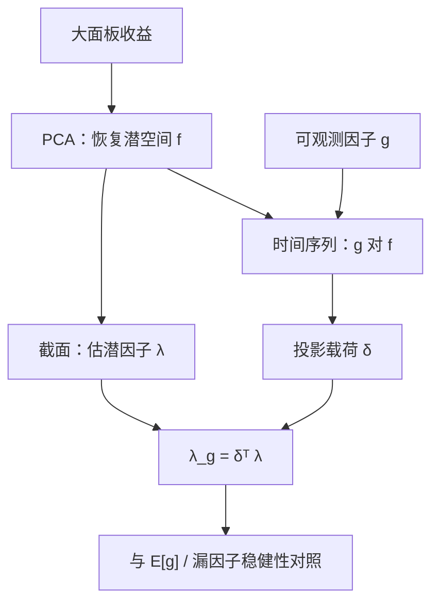

# Giglio-Xiu 潜因子

    
可观测因子的风险溢价，等于它在由资产收益张成的潜因子空间上的投影所对应的溢价；只要这个空间被主成分一致地恢复，漏掉若干真实因子并不妨碍给手头这条因子定价。

    <footer>—— Giglio & Xiu, Asset Pricing with Omitted Factors, Journal of Political Economy, 2021</footer>

线性模型里，漏掉一个被定价的因子，留在回归里的那些因子的 λ 会有偏：载荷被投影到错误的张成上，风险价格跟着歪。实务中没人敢说「因子已经穷尽」，于是每一条宏观或可交易因子的溢价估计都像在赌模型。Stefano Giglio 与 Dacheng Xiu 的三步法把问题改写：先用大面板的主成分把**共同收益空间**恢复出来，在这个空间里给潜因子定价，再把可观测因子投影上去。本篇写识别来自哪里、三步各自做什么、以及弱因子与「根本不在空间里」的宏观序列会如何让方法失效。

## 问题

标准两步 [Fama–MacBeth](/quant/fama-macbeth) 假定右侧因子是完整的。若真模型是 $E[R]=\beta_g\lambda_g+\beta_h\lambda_h$，而你只回归 $g$，则 $\hat\lambda_g$ 混进 $h$ 的贡献，符号都可以反。宏观因子尤其脆弱：工业产出意外、通胀意外测量误差大，还可能只是真因子的噪声代理。统计 PCA 能抓共同变动，但旋转不唯一，前几个主成分没有名字，难以写成「通胀溢价多少个基点」。

Giglio–Xiu 要的不是给 PC1 起名，而是给**有名字的可观测因子**一个在漏因子下仍然一致的溢价。关键观察：任意可观测因子 $g_t$ 的风险溢价，只取决于它与被定价的潜空间的协方差；正交于该空间的部分不被资产持有、也就没有价格。因此只要潜空间估计对，投影对，λ_g 就对，哪怕你从未把 $h_t$ 写进回归。

### 识别靠空间，不靠旋转

设收益由 $k$ 个潜因子生成，$R_t=\beta f_t+e_t$，$E[R]=\beta\lambda$。主成分给出旋转后的 $\hat f$ 与 $\hat\beta$，风险溢价 $\hat\lambda$ 跟着旋转，但 $\hat\beta\hat\lambda$ 作为预期收益不变。对可观测 $g_t$，时间序列回归 $g_t=\delta^\top f_t+\eta_t$ 得到载荷 $\delta$；定义

$$
\lambda_g=\delta^\top\lambda.
$$

这正是 $g$ 在潜空间上投影的溢价。旋转 $f$ 时 $\delta$ 与 $\lambda$ 反旋转，乘积不变。漏掉的若是空间内的线性组合，PCA 仍张成同一空间；漏掉的若是弱因子或根本不驱动这组检验资产的冲击，投影是零，方法会诚实地说「这条因子没有被这组资产定价」，而不是给出一个被省略变量污染的假 λ。

「潜因子」在这里不是又一个可交易风格。它是面板的共同成分。把 PC1 当成市场、PC2 当成价值去写故事，是旋转解释，不是 Giglio–Xiu 的识别策略。他们要的是 λ_g，不是给特征向量命名。

## 方法

三步对应三个回归。第一步：在 $N$ 个检验资产、$T$ 期的超额收益面板上做 PCA（或因子个数估计后的截断），取前 $k$ 个主成分 $\hat f_t$，以及载荷 $\hat\beta$。$N$ 要大，资产要足够分散，弱因子才不会被特质噪声淹没；检验资产通常用行业、双排序组合、或个股的可交易子集，而不是只用五因子自己的构造组合。

第二步：用 $\hat\beta$ 对平均收益做截面回归（或对逐期收益做 Fama–MacBeth），得到潜因子风险溢价 $\hat\lambda$。这一步与普通 FM 相同，只是因子是统计的。第三步：把可观测因子（宏观意外、可交易风格、投资组合收益）对 $\hat f_t$ 做时间序列回归，得到 $\hat\delta$，再令 $\hat\lambda_g=\hat\delta^\top\hat\lambda$。标准误需要把三步的估计误差叠进去，作者给出解析与自助法；只把第三步当普通 OLS 会低估不确定性。

$$
\hat\lambda_g=\hat\delta^\top\hat\lambda, \qquad g_t=\delta^\top f_t+\eta_t.
$$

若 $g$ 本身可交易，还应核对 $\lambda_g$ 是否接近 $E[g]$：可交易因子的溢价被自身均值钉住，三步法给出的是它在大面板上的投影溢价，两者差反映测量误差或该因子未被这组资产完全张成。

### 因子个数、强因子与可观测代理

$k$ 选太小，空间没张满，投影有偏；$k$ 选太大，后面的主成分是噪声，λ 的截面一步过拟合。信息准则、特征值比、或对定价误差的交叉验证比「解释 90% 方差」更贴近目标。强因子假设要求载荷在截面上有足够能量；某个宏观冲击若只驱动三五个行业，PCA 可能把它当特质丢掉，于是 λ_g 接近零——这不一定是「宏观没有溢价」，而是「你的检验资产没看见它」。换一组对通胀更敏感的资产（TIPS、商品、短端名义债），结论可以变。

## 机制

省略变量偏误来自载荷相关：若 $\beta_g$ 与 $\beta_h$ 在截面上不正交，漏 $h$ 时 $g$ 会替 $h$ 领功或背锅。潜空间方法等于先把所有被这组资产定价的共同风险找齐，再问 $g$ 分享了其中多少。$g$ 的特质部分 $\eta_t$——宏观测量误差、政策噪声、与股票面板无关的成分——被第三步残差丢掉，不进入 λ_g。这是优点也是边界：你得到的是「资产已经在交易的那部分 $g$」，不是「宏观定义上的 $g$ 全体」。

与纯统计风险模型不同，这里的目标是定价（均值），不是协方差预测。PC 可以很好地解释方差，却只有被定价的那些方向进入 λ。Giglio–Xiu 允许一部分主成分有零溢价：它们是风险，但没有价格。这与[统计风险 PCA](/quant/stat-risk-pca) 的工程目标分开——后者要的是 Σ，前者要的是 $E[R]$ 的张成。

### 和 IPCA、宏观因子集的关系

[IPCA](/quant/ipca) 用特征当载荷的工具，潜因子仍从收益里抽，但 β 被约束为特征的线性函数；Giglio–Xiu 的第一步通常是无约束 PCA。两者都承认「真因子不可尽列」，但 IPCA 还想回答哪些特征进入协方差，三步法只想给指定的 $g$ 一个稳健 λ。把[增长、通胀、流动性](/quant/macro-factor-set) 一条条送进第三步，得到的是它们在股票（或所选）面板上的投影溢价，不能直接写成全球宏观风险价格，除非检验资产已经覆盖债、商品与信用。

若 $g$ 与潜空间几乎正交，λ_g 接近零是方法在工作，不是程序写错。强行把宏观序列正交化后再丢进 Fama–MacBeth，会回到漏因子偏误。先问空间，再问名字。

## 边界与工程取舍

样本短、资产高度共线时，PCA 的旋转在子样本间跳动，δ 不稳，λ_g 的路径会看起来像「宏观溢价在变」，其实是特征向量在换号。应固定符号约定（例如与市场相关为正），并报告对 $k$ 的敏感性。个股面板特质方差大，需要先合成组合或用收缩；组合面板 $N$ 太小则强因子假设吃紧。

不要用五因子的六个构造组合去做 PCA 再给 HML 定价——空间被自己张成，第三步近乎恒等，漏因子问题被定义掉了。也不要把三步 λ_g 解释成可交易策略的期望收益：除非 $g$ 可交易且买卖得了投影组合。宏观意外不可交易，λ_g 是风险价格，要变成对冲还得去买那些对 $f$ 有载荷的资产。

真实出处：Giglio & Xiu, *Asset Pricing with Omitted Factors*, Journal of Political Economy, 2021。相关的推断与弱因子讨论见二人后续工作。不要把该方法标成「用 PCA 代替 Fama–French」，它是给可观测因子在漏因子下估 λ，不是宣布风格因子作废。

## 小结

- 可观测因子的溢价由其在潜因子空间上的投影决定；PCA 恢复空间后，漏因子不再自动污染 λ_g。
- 三步：面板 PCA、潜因子截面定价、可观测因子对潜因子的时间序列投影。
- 弱因子、检验资产覆盖不足、或 $g$ 与空间正交时，得到接近零的溢价是识别结果，不是失败。
- 旋转不唯一，但 δᵀλ 不变；不要靠给 PC 起名来讲宏观故事。
- 出处：Giglio & Xiu, Journal of Political Economy, 2021。
