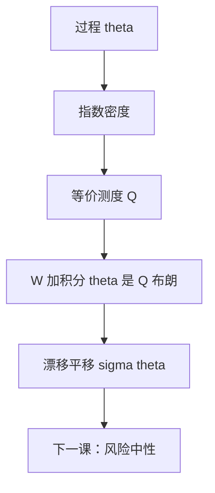

# Girsanov 测度变换

Girsanov 用指数鞅改布朗的漂移：在 $Q$ 下，$W^Q_t=W_t+\int_0^t\theta_s\,\mathrm d s$ 仍是布朗运动。

<footer>—— 据 Girsanov, Theory of Probability and Its Applications, 1960；Karatzas and Shreve, 1991, §3.5；Shreve, Stochastic Calculus for Finance II, 第 5 章整理</footer>

上一课[Radon–Nikodym 导数](/quant/radon-nikodym)给出抽象密度 $\xi$。缺口是布朗运动上的具体形状：要让 $\mathrm d S=\mu S\,\mathrm d t+\sigma S\,\mathrm d W$ 在新测度下变成 $\mathrm d S=r S\,\mathrm d t+\sigma S\,\mathrm d W^Q$，密度必须把漂移移动 $\theta=(\mu-r)/\sigma$。本课只给出这条变换，并留下 Novikov 条件；「为何选这个 $\theta$」是下一课风险中性的经济内容。

## 问题

RN 密度可以是任意正鞅。对布朗信息流，连续正鞅由随机指数给出。缺口是：选定过程 $\theta$，令

$$
\xi_t=\exp\Bigl(-\int_0^t\theta_s\,\mathrm d W_s-\tfrac12\int_0^t\theta_s^2\,\mathrm d s\Bigr),
$$

在 $\xi$ 为鞅时定义 $Q$，证明 $W^Q=W+\int\theta$ 在 $Q$ 下是标准布朗。没有这条，换测度只改期望权重，不改路径的漂移语言。

$\theta$ 叫市场的风险的市场价格（下一课才命名）。本课只把它当作漂移平移的旋钮。

### Girsanov 不改变波动率

二次变差是路径性质，$[W]_t=t$ 在等价测度下不变。因此 $\sigma$ 不随 $P\to Q$ 改变；变的只是 $\mathrm d t$ 项。把「风险中性」理解成「波动率换成别的数」，是把测度和模型校准混在一起。校准是[波动率是输入不是输出](/quant/vol-as-input)的事。

Novikov：$\mathbb E\exp(\tfrac12\int\theta^2)\lt \infty$ 则指数局部鞅是真鞅。实践中常对有界 $\theta$ 直接用；无界时要核验，否则 $Q$ 甚至不是概率。

## 方法

设 $\theta$ 适应、$\int_0^T\theta^2\lt \infty$ a.s.，且 $\xi$ 为 $P$-鞅。定义 $Q(A)=\mathbb E_P[\xi_T 1_A]$。则 $W^Q_t=W_t+\int_0^t\theta_s\,\mathrm d s$ 是 $Q$-布朗运动（至 $T$）。SDE $\mathrm d X=\mu\,\mathrm d t+\sigma\,\mathrm d W$ 改写为 $\mathrm d X=(\mu-\sigma\theta)\,\mathrm d t+\sigma\,\mathrm d W^Q$。多维时 $\theta$ 是向量，$\sigma\theta$ 是矩阵乘积；$\sigma$ 不满秩时不是任意漂移都能消掉——那是不全市场课的缺口。

Itô 公式在 $Q$ 下对 $W^Q$ 照常使用，因为 $W^Q$ 仍是布朗。密度过程满足 $\mathrm d\xi=-\theta\xi\,\mathrm d W$，无漂移，与上一课「密度是 $P$-鞅」一致。

## 机制

指数里的 $-\tfrac12\int\theta^2$ 又是 Itô 修正：$\mathrm e^{-\int\theta\,\mathrm d W}$ 单独不是鞅。Girsanov 的核心计算是：把 $W^Q$ 的特征函数在 $Q$ 下用 $\xi$ 写回 $P$，认出独立高斯增量。直观上，乘 $\xi$ 给那些沿 $\theta$ 方向走得更远的路径更大权重，等效于把均值平移。

波动率矩阵决定能平移的漂移子空间。$\theta$ 的个数不能超过独立布朗的个数——市场有多少噪声源，就能对冲多少风险溢价。本课只把线性代数接口留下。

## 边界

本课不证 Girsanov–Meyer 对半鞅的一般形式，不讨论无穷时间区间上的一致性。跳过程的 Esscher 变换是另一套密度，留给跳课预览。后课默认：改布朗漂移 = 选 $\theta$ 做指数鞅；$\sigma$ 不变。下一课[风险中性测度](/quant/risk-neutral-measure)把 $\theta$ 选成使贴现标的为鞅的那个。

## 小结

- Girsanov 用指数鞅平移布朗漂移，$W^Q=W+\int\theta$。
- 波动率（二次变差）在等价测度下不变。
- Novikov 把指数局部鞅升级为密度。
- $\mu\mapsto\mu-\sigma\theta$ 是 SDE 在 $Q$ 下的全部变化。
- 出处：Girsanov 1960；Karatzas–Shreve §3.5；Shreve SDE II 第 5 章。
