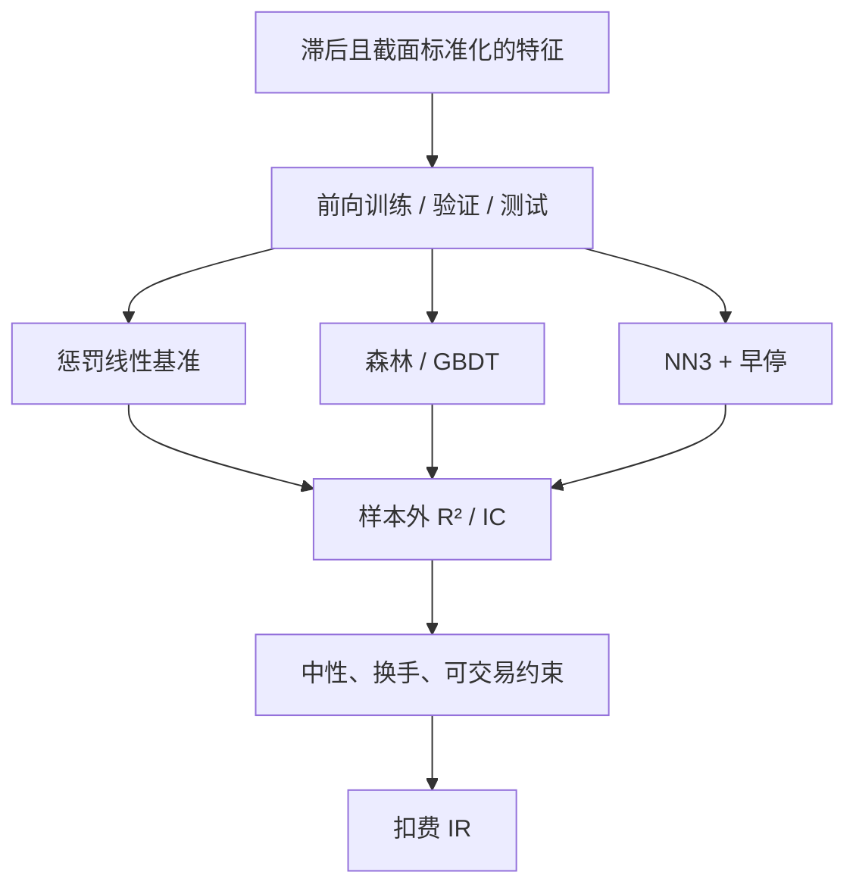

# Gu-Kelly-Xiu 与 NN3

机器学习方法能够改善线性模型对截面收益的样本外预测；其中浅层前馈网络在一组对照里经常位于最强之列，但经济约束会把可交易增益收窄。

<footer>—— Gu, Kelly and Xiu, Empirical Asset Pricing via Machine Learning, Review of Financial Studies, 2020</footer>

Gu、Kelly 与 Xiu（2020）把资产定价的预测问题写成高维截面回归：用预先可知的公司特征去预测下一期超额收益，并在同一套样本外协议下比较普通最小二乘、主成分与偏最小二乘、惩罚线性、随机森林、梯度提升树，以及一到五层的前馈网络（NN1–NN5）。三层网络（NN3）在他们的表里经常与树模型一起占据样本外 $R^2$ 的前列，因而成为后续复制与 A 股研究的默认非线性参照，而不是「越深越好」的许可证。Leippold、Wang 与 Zhou（2022）在中国股票上得到机器学习可预测性的同类图像。Avramov、Cheng 与 Metzker（2023）加上不可交易股票、换手与经济约束后，优势下降。本篇把 NN3 当作 **GKX 对照实验里的一个估计器**：它相对[正则线性](/quant/regularized-linear-alpha)多了什么、相对[GBDT](/quant/gbdt-alpha)少了什么，以及样本外 $R^2$ 如何（不）翻译成产品。

## 问题

线性模型假定特征对收益的效应是全局斜率。价值在极端分位更强、动量与波动交互、规模改变斜率，这些是网络可以用隐藏层近似的弯曲。问题仍是金融截面的信噪比：月频个股超额的可预测成分很小，样本外 $R^2$ 在 GKX 的表里往往只有几个百分点，有时为负——这是论文要读者习惯的数量级，不是实现失败。过拟合的通道包括：深度把个股特异路径记下来、用随机 K 折而不是时间切分选层数、以及把测试期拿来早停。

第二句话是比较公平性。NN3 的参数量远大于弹性网；若线性模型不用惩罚、网络却用早停、正则与集成，赢的是正则而不是深度。GKX 的贡献正在于给线性、树与网络同一套特征、同一套样本外窗口。复制若只训练一个 NN3、不报弹性网与森林，无法说明非线性值多少。

### 为什么是三层而不是五层

NN1 是带一层隐藏单元的浅网，近似能力有限；NN5 更深，方差更大。GKX 的设计里，第 $\ell$ 层宽度大致按 32、16、8、4、2 递减，激活为 ReLU，输出层为线性，以拟合连续收益。更深的网络在他们的样本里没有稳定地支配 NN3：增量拟合力被噪声吃掉，早停更频繁地停在浅有效深度。于是 NN3 应理解为**在该特征表与该正则预算下的有效容量**，而不是神经科学式的「三层定理」。换特征表、换日频、换 A 股涨跌停，有效深度可以变；应重新走验证，而不是把 NN3 当超参常数。

样本外 $R^2$ 对收益预测可以是很小的正数却仍对应可排序的截面。组合评价是另一步：分位多空、中性、扣费。用训练 $R^2$ 或用未中性的多空夏普去替代 GKX 的报告口径，不是复制。

## 方法

特征必须滞后且在 $t$ 可测，截面做标准化或 rank，见[特征滞后与 rank](/quant/cs-rank-features)与[时点基本面](/quant/point-in-time)。标签是未来一期超额，预测期与重叠见[标签重叠](/quant/label-horizon-overlap)。训练只用 $\mathcal{F}_t$ 可知的行；禁止用全样本均值做标准化再拿去预测过去。

时间切分按 GKX 的精神做成扩展窗口或滚动窗口：训练、验证（早停与层宽）、测试严格前向，验证与测试之间 [purge](/quant/purge-embargo)。超参（层宽、dropout、惩罚、学习率）只在验证上选。Walk-forward 见[滚动检验](/quant/walk-forward)；金融里的随机 K 折泄漏见[交叉验证泄漏](/quant/cv-leakage-finance)。

网络细节：全连接，ReLU，输出一个标量 $\hat r_{i,t+1}$。批量应尊重时间，不要把同一只股票的未来月份打进当前 batch 的归一化统计。集成（不同种子或不同窗口的平均）在 GKX 里有助于稳定 NN；报告时应说明集成是否进入「NN3」这个名字。评价：样本外 $R^2$、截面 IC、分位组合，再加 Avramov 一类约束：剔除难交易股票、惩罚换手、做行业与市值中性。

$$
R^2_{\mathrm{oos}}=1-\frac{\sum_{(i,t)\in\mathcal{T}}(r_{i,t+1}-\hat r_{i,t+1})^2}{\sum_{(i,t)\in\mathcal{T}} r_{i,t+1}^2}.
$$

分母用收益平方和而不用去均值，是 GKX 对「预测相对零」的口径；改用相对截面均值会改变数字，必须声明。

### 与树、线性的分工

弹性网在近线性、强共线的特征上更稳，换手更低。森林与 GBDT 对单调变换不敏感，交互用分裂表达，但重要性在共线族上不稳定。NN3 用连续隐藏单元逼近同一类交互，对特征尺度更敏感，必须标准化。把线性拟合残差再交给 NN3（或树），往往比单用深网更可审计：线性层吸收 beta 与规模，网络只申请非线性预算。这与 Friedman 梯度提升「在可解释均值上修残差」是同一纪律，只是第二段换成了浅网。

## 机制

隐藏层把 $x$ 映到一组非线性基，最后的线性层在这些基上回归收益。第一层常常学到近似单调的变换（对极端值压缩），更深的层才拼出交互。早停在验证损失转差时切断，防止后期去拟合不可预测残差——机制上与 GBDT 必须早停相同。Dropout 与权重衰减是把有效参数量按回信噪比；没有它们的 NN3 在截面上几乎总会过拟合。

可预测性的经济来源，GKX 并不在网络结构里识别：可以是风险（特征预测了载荷），也可以是误定价。要把 NN3 的分数接到定价，需要额外的步骤，例如对风险模型残差再预测，或把网络输出当作[IPCA](/quant/ipca) 式载荷的非线性版本——后者正是他们次年的自动编码器论文，见[条件因子模型](/quant/autoencoder-factor-model)。只报多空夏普，回答的是可预测，不是定价。

Israel、Kelly 与 Moskowitz（2020）问机器能否「学会金融」：学会的是相关，不一定是可交易的边际。把 GKX 的 OOS $R^2$ 写进 Kelly 公式当 $\mu$，是量纲错误。

### 中国市场

Leippold–Wang–Zhou 表明 A 股上 ML 可预测性存在，但涨跌停、T+1、会计与散户结构改变特征含义。验证损失必须把不可买入的涨停标签视为不可实现，否则网络会去学「涨停余波」。空头腿受[融券约束](/quant/cn-short-constraint)，多空夏普要拆开。日频 NN3 相对 GKX 的月频设定，标签重叠更严重，purge 更不可省。

## 边界与工程取舍

不要宣布 NN3 击败了成本与拥挤。不要用测试期做早停。不要把特征从 94 列无纪律扩到另类数据再沿用 GKX 的结论：增量 $R^2$ 应逐族加入，见[舆情](/quant/news-nlp-alpha)与供应链篇。计算上可以分块训练，但不能因此减少时间切分。给投资委员会的应是分位与分样本 IC，而不是三层权重矩阵。

出处：Gu, Kelly and Xiu, *Review of Financial Studies*, 2020；Leippold, Wang and Zhou, *Journal of Financial Economics*, 2022；Avramov, Cheng and Metzker, *Management Science*, 2023；Israel, Kelly and Moskowitz, *Journal of Investment Management*, 2020。NN 的一般近似理论不能替代这篇论文的样本外协议。

## 小结

- GKX（2020）在统一样本外协议下比较线性、树与 NN1–NN5；NN3 是其中经常领先的浅层网络，不是深度军备的终点。
- 样本外 $R^2$ 很小仍可能可排序；产品评价必须加中性、换手与可交易约束。
- 早停、惩罚与时间切分决定是否泄漏，层数本身不是 alpha。
- A 股复制须把涨跌停与 T+1 写进损失（Leippold–Wang–Zhou, 2022）。
- 出处：Gu–Kelly–Xiu, *RFS*, 2020；Leippold–Wang–Zhou, *JFE*, 2022；Avramov–Cheng–Metzker, 2023。
