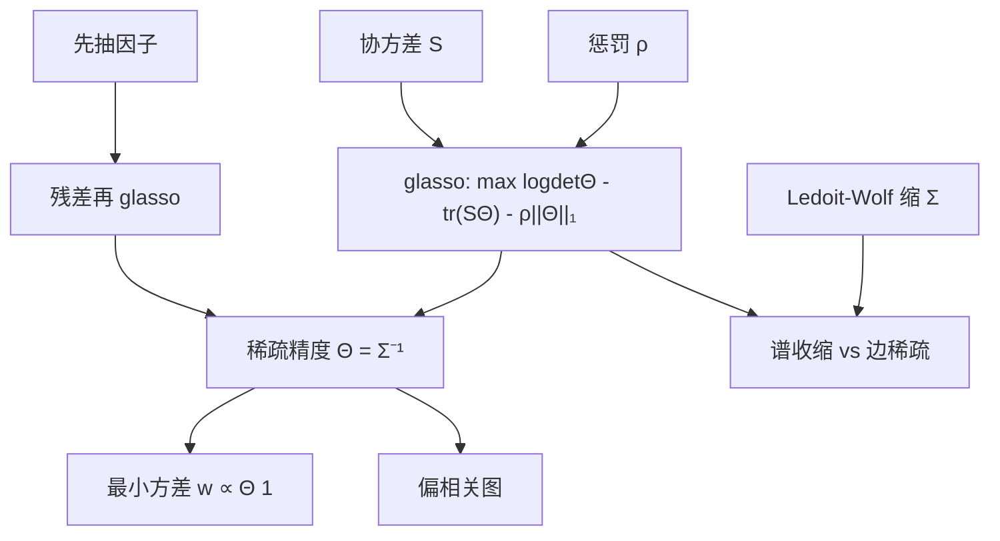

# 图形 Lasso 精度矩阵

    
高斯图模型里，精度矩阵的零意味着条件独立；用 L1 惩罚似然去估计一张稀疏的精度图，比直接把样本协方差求逆更适合高维、且需要可解释偏相关的场合。

    <footer>—— Friedman, Hastie and Tibshirani, Sparse inverse covariance estimation with the graphical lasso, Biostatistics, 2008</footer>

组合优化真正调用的常常是 $\Sigma^{-1}$，不是 $\Sigma$。样本协方差 $S$ 病态时，逆会放大噪声；[Ledoit–Wolf](/quant/ledoit-wolf) 从协方差一侧把 $S$ 拉向简单目标。[估计误差与收缩](/quant/cov-shrinkage) 把这条路放在收缩家族里。图形 Lasso（Graphical Lasso, glasso）走另一侧：直接估计精度 $\Theta=\Sigma^{-1}$，并让许多偏相关为零。Friedman、Hastie 与 Tibshirani（2008）给出协调下降算法，把 Yuan–Lin、Banerjee–El Ghaoui–d'Aspremont 的稀疏精度估计做成可计算的标准件。本篇写精度图的含义、惩罚似然怎么解、以及它在股票上何时比 LW / 因子模型更合适。

## 问题

多元正态下，$\Theta_{ij}=0$ 当且仅当 $i$ 与 $j$ 在给定其余变量后独立。偏相关 $\rho^{ij}=-\Theta_{ij}/\sqrt{\Theta_{ii}\Theta_{jj}}$ 描述的是净相关：去掉其他资产的线性影响之后还剩多少。这对网络、成对交易的残差结构、以及「谁与谁直接相连」的风险叙事有用。样本精度 $S^{-1}$ 在 $N\approx T$ 时稠密且吵，几乎每个偏相关都显著，图不可读，组合权重也炸。

需要一种估计：$\hat\Theta$ 正定、许多非对角为零、在高斯似然下不要太差。L1 惩罚把小的偏相关打到零，等价于在图上做边选择。问题是：收益不是正态、有共同因子时精度往往并不稀疏（一个市场因子会让残差精度稀疏、但原始收益精度稠密），惩罚参数 $\rho$ 选错会得到空图或几乎完全图。

### 稀疏的是边，不是特征值

LW 改善的是谱：把散开的特征值推回去。Glasso 改善的是支撑：哪些偏相关允许非零。两者都能让 $\hat\Sigma$ 可逆，机制不同。真实若是低秩因子加对角特异，精度是 Sherman–Morrison 意义下的稠密扰动，对原始收益做 glasso 会被迫留下许多小边，或为了稀疏而偏掉因子结构。更干净的顺序往往是：先抽因子，再对残差做 glasso 或对角。不要指望 glasso 自动发现「市场」。

Meinshausen–Bühlmann 的邻域选择对每个节点做 Lasso 回归，再对称化，也是在估精度图。Glasso 用联合似然，保证正定；邻域法更快、正定性要后处理。组合求逆需要正定，优先 glasso 或事后投影。

## 方法

高斯对数似然（忽略常数）为 $\log\det\Theta-\mathrm{tr}(S\Theta)$。图形 Lasso 解

$$
\max_{\Theta\succ 0}\ \log\det\Theta-\mathrm{tr}(S\Theta)-\rho\|\Theta\|_{1,\mathrm{off}},
$$

$\|\cdot\|_{1,\mathrm{off}}$ 通常不惩罚对角，以免把方差打到零。$\rho$ 越大图越稀。Friedman 等人用块坐标下降：对每一列把问题化成 Lasso，循环至收敛；这是「glasso」这个名字在软件里的含义。$\rho$ 用交叉验证（对数似然或样本外最小方差）、信息准则、或稳定性选择。组合场景下，直接用下一期已实现方差选 $\rho$，比用高斯似然更贴目标。

输入 $S$ 可以是样本协方差、EWMA 协方差或稳健协方差。Glasso 不修复厚尾；可以先对收益做稳健相关，再估精度。缺失数据应先补全。得到 $\hat\Theta$ 后，$\hat\Sigma=\hat\Theta^{-1}$ 用于风险；权重若是最小方差，可直接用 $\hat\Theta\mathbf{1}$ 而不显式求逆，数值更好。

### 与因子、LW 的叠放

三种正则可以排成栈：因子结构吸收共同运动 $\Sigma=BFB^\top+\Delta$；若允许残差相关，对残差协方差做 LW 或对残差精度做 glasso；对角 $\Delta$ 是最强的稀疏（残差图没有边）。股票截面上，残差 glasso 有时能抓到未被行业哑变量写尽的供应链对；边的稳定性必须跨窗口检查，否则是在拟合噪声链。指数增强里，用精度图做「谁可以对冲谁」的候选，再用经济审查删边，比把整个 $\hat\Theta$ 当真理更安全。

## 机制

L1 惩罚的机制与回归 Lasso 相同：小系数的最优解在零处有角点。似然项推动 $\Theta$ 去拟合 $S^{-1}$ 的大方向，惩罚项禁止为拟合噪声偏相关而付出的代价。于是估计的有效自由度变成「边的数量」，而不是 $N(N+1)/2$。条件数：稀疏正定精度的特征值被惩罚从两侧夹紧，但不像 LW 那样有显式的目标谱。$\rho$ 过大时 $\hat\Theta$ 接近对角，最小方差退回逆波动；$\rho$ 过小时回到病态的 $S^{-1}$。

非高斯时，零精度不再等于条件独立，但偏相关仍是线性净相关。估计器可以当高维逆协方差的稀疏收缩来用，不必坚持图模型的因果解读。MacKenzie 式的警告在这里同样适用：不要把估出来的边当成「传染渠道」的发现，除非在多种 $\rho$、多个窗口和经济学约束下重复出现。

精度图的边不是交易信号。两只股票之间稳定的偏相关，可能是共同的未建模行业，而不是可交易的配对。把 glasso 的边拿去自动做配对交易，是把风险估计器误用成 alpha 生成器。

### 计算与数值

$N$ 到几百时，标准 glasso 可接受；$N$ 上千需要对 $\rho$ 路径、近似算法或只对残差维做。$\rho$ 路径上应对 $\Theta$ 做热启动。对称性：算法应保持 $\Theta$ 对称正定，浮点误差要用特征值抬升修补。正则化参数若按日重估，边集会跳，组合换手会爆；应对 $\rho$ 或边集做时间平滑，与风险模型载荷「慢含义、快协方差」的原则一致。

## 边界与工程取舍

不要对未去市场、未去行业的原始收益声称「发现了稀疏信用网络」。不要用全样本 CV 选 $\rho$ 再报告同一样本的组合表现。不要在 $T<N$ 时把 $S$ 直接送进需要正定 $S$ 的实现而不检查；有的实现内部会处理奇异 $S$，有的不会。收益的波动聚类会让无条件 glasso 在危机里边数激增——那是体制切换，应用滚动窗或 DCC 一类条件相关再取精度。

审计：报告 $\rho$、边密度、最小特征值、以及与对角/LW/因子模型的样本外方差对比。若 glasso 只在样本内似然赢、样本外最小方差输给 LW，应放弃图叙事。监管与归因需要可命名因子时，[基本面风险模型](/quant/fundamental-risk-model) 仍是主模型，glasso 只适合残差层或研究用网络。

惩罚可以只加在预先禁止的边上（先验图）：例如禁止跨市场的边、允许同业边。这比完全数据驱动的稀疏更符合交易约束。无先验的 glasso 在股票上很容易画出无法执行的对冲边。

## 小结

- 图形 Lasso 用 L1 惩罚高斯似然估计稀疏精度矩阵，零元对应（高斯）条件独立 / 偏相关为零。
- Friedman–Hastie–Tibshirani（2008）的块坐标算法是标准实现；$\rho$ 应用样本外风险目标选择。
- 对原始股票收益，因子结构往往使精度不稀疏；更合理的是对残差做 glasso。
- 与 LW 互补：一个缩谱，一个选边；两者都服务于可逆的 $\Sigma^{-1}$，都不是 alpha。
- 出处：Friedman, Hastie and Tibshirani, *Biostatistics*, 2008；Yuan and Lin, *Biometrika*, 2007；Banerjee, El Ghaoui and d'Aspremont, *JMLR*, 2008；邻域选择见 Meinshausen and Bühlmann, *Annals of Statistics*, 2006。收缩总论见 [估计误差与收缩](/quant/cov-shrinkage)。
