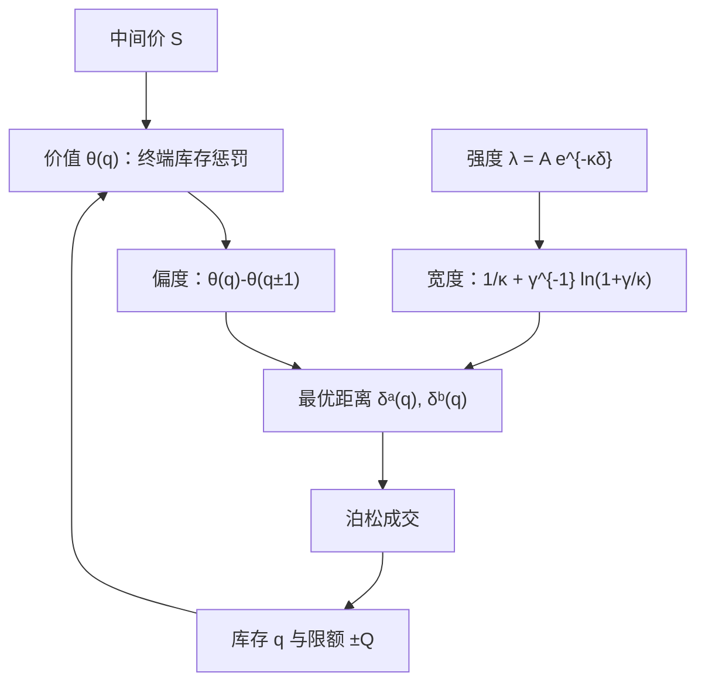

# Guéant-Lehalle-Fernandez-Tapia

    
把终端库存惩罚写进指数效用之后，做市的最优挂单距离有不显式依赖剩余时间的近似；库存偏度来自该项惩罚，价差来自强度与风险厌恶。

    <footer>—— Guéant, Lehalle and Fernandez-Tapia, Dealing with the Inventory Risk: A Solution to the Market Making Problem under Inventory Constraints, Mathematics and Financial Economics, 2013</footer>

[Avellaneda–Stoikov](/quant/avellaneda-stoikov) 在有限地平 $T$ 上把无差异价格写成 $s-q\gamma\sigma^2(T-t)$，最优价差含一项随剩余时间放大的库存风险。全天连续做市时，$T$ 是人为的收盘钟，参数随 $T-t$ 漂移，午盘与尾盘的报价公式看起来像两套策略。Guéant、Lehalle 与 Fernandez-Tapia（2013）把问题改写成：指数效用、指数到达强度、对终端库存的二次（或更一般）惩罚，并给出小库存下的闭式近似。结果是一组围绕公允价、随库存平移的最优距离，宽度主要由 $\gamma,\sigma,\kappa$ 与惩罚强度决定，而不必把「距收盘还有多久」当作状态的第一坐标。本篇写 GLFT 相对 AS 改了哪一条目标、近似解长什么样，以及库存硬约束如何进入。它仍是存货模块，不含毒性。

## 问题

做市商选择买、卖相对中间价的距离 $\delta^b,\delta^a$，成交为强度 $\lambda(\delta)=A e^{-\kappa\delta}$ 的泊松过程，中间价扩散系数 $\sigma$，绝对风险厌恶 $\gamma$。AS 的终端条件是在 $T$ 按中间价变现并承受扩散累积的库存方差，因此 $T-t$ 进入一阶条件。实务上交易日结束还有拍卖、隔夜缺口与库存限额，真正被执行的往往是**限额**而不是某个光滑的 $T$。GLFT 要回答：若目标改为「全天都在做市，但终端库存离开零要付罚」，以及库存不得越出 $[-Q,Q]$，报价如何写成 $(s,q)$ 的函数，能否得到可计算的近似，而不是每次解一遍带跳 HJB。

无库存风险时，竞争把距离推到补偿被捡走期权的水平。有惩罚时，多头必须更积极地卖、更保守地买，与 Ho–Stoll / AS 同一偏度逻辑。差别是惩罚可以是终端一次性的 $\ell(q_T)$，也可以在连续时间里用运行成本近似；硬约束 $q\in[-Q,Q]$ 则在边界上把一侧强度关掉——触及上限后不再买，这是限额而不是更大的 $\gamma$。

### 终端惩罚替代剩余时间

取指数效用 $U=-\exp(-\gamma x)$，价值函数可分离现金。对库存的终端罚若取二次型或与 AS 扩散项同构的形式，稳态（或长地平）下无差异价格的平移不再乘 $(T-t)$，而乘一个由惩罚系数、$\sigma$ 与 $\gamma$ 决定的常数。价差里仍有 $\frac{1}{\gamma}\ln(1+\gamma/\kappa)$ 这类强度项。于是同一套 $(\gamma,\kappa,A,\text{penalty})$ 可以在开盘与午盘共用，尾盘若真的要强平，再把惩罚系数随日历升高，而不是让整条公式跟着 $T-t$ 跑。

「不依赖时间」是近似的产品，不是市场定律。隔夜跳空、拍卖、宏观发布仍应把惩罚或 $\sigma$ 写成日历函数。GLFT 去掉的是 AS 里那个线性的剩余时间因子，不是所有非平稳。

## 方法

HJB 对价值函数 $\theta(q)$（分离中间价与现金之后）给出差分—微分方程：扩散贡献库存风险，买卖强度贡献对 $\delta$ 的一阶条件。指数强度下，最优距离有

$$
\delta^{a\star}(q)=\frac{1}{\kappa}+\frac{1}{\gamma}\ln\Bigl(1+\frac{\gamma}{\kappa}\Bigr)-\bigl(\theta(q)-\theta(q-1)\bigr)
$$

一类形式（买侧对称，符号随库存增量翻转）。$\theta(q)-\theta(q-1)$ 是再买（或再卖）一单位库存的无差异价格调整，即偏度。对小 $q$、二次惩罚，$\theta$ 近似二次，偏度对 $q$ 近似线性，宽度对 $q$ 近似常数——这就是实务里「线性 inventory skew + 波动目标价差」的理论原型。

**库存限额。** 在 $\pm Q$ 处，越界的那一侧 $\lambda$ 被设为零，HJB 变成边界条件。靠近限额时 $\theta$ 的差分变陡，偏度非线性放大，直到一侧撤出。这比把 $\gamma$ 调大更符合风控：限额是合规对象，$\gamma$ 是偏好。多资产版本里 $q$ 是向量，惩罚用协方差矩阵，$\theta$ 的差分给出交叉偏度——持有正相关的另一腿时，本腿也要 skew，即使本腿库存为零。

### 从 AS 到 GLFT 的参数迁移

AS 的 $\gamma\sigma^2(T-t)$ 在 $t$ 靠近 $T$ 时发散式变大，尾盘报价会宽到不再成交。GLFT 用固定惩罚代替，尾盘行为改由你是否显式升高惩罚或降低 $Q$ 来决定，成为可审计的日历规则。校准仍难：$A,\kappa$ 不是从一档深度读出的物理常数，而是填成对距离的弹性。应用自己的限价成交与取消数据估 $\kappa$，用库存方差与风险预算定惩罚，而不是从论文表格抄四个数字。费率应进入每笔跳的现金增量，见 [maker-taker](/quant/maker-taker)。

闭式近似依赖指数强度与指数效用。幂效用、线性强度、或填成依赖队列长度时，应回到数值 HJB 或把 GLFT 当初值。生产系统里「GLFT」多半指线性偏度加强度价差这一结构，不是原文 ODE 的逐日重估。

## 机制

报价仍是二维控制：宽度卖库存方差与被选中强度，偏度卖把 $q$ 拉回零（或拉离限额）。成交后 $q$ 跳一档，$\theta$ 的差分立刻变，原先远的一侧变近。没有新闻也要改价，这是存货驱动的修订。与 AS 相同，流是外生泊松，解释不了成交后价格朝成交方向跳的毒性；那要叠加短期 alpha 或逆向选择，见 [Cartea–Jaimungal](/quant/cartea-jaimungal) 与 [毒性流](/quant/toxic-flow)。

限额改变漂移。靠近 $Q$ 时买入强度被压制，库存过程变成有边界的受控跳过程，期望持有时间下降，价差收入也下降——做市在限额附近退化成单向减仓。最优 $Q$ 是风险资本：太窄则整天停在边界上赚不到双边价差；太宽则 $\theta$ 的曲率不够，库存像随机游走。这与 [库存偏度](/quant/inventory-skew) 的工程表述一致，GLFT 提供的是 $\theta$ 的来源。

### 多资产与对冲腿

协方差进入惩罚后，做市标的与对冲期货的库存应在同一 $\theta$ 里。现货多头加期货空头可以降低惩罚，偏度相对净风险而不是相对现货股数。漏记对冲腿会把已经中性的簿再 skew 一遍。交叉到达（买 A 的流与卖 B 的流相关）会再改强度；原文的基准设定往往是独立泊松，实务要按品种对估计，否则多资产闭式只是把 AS 的错误乘上矩阵。

## 边界与工程取舍

算术中间价、单位成交、无成本改价、无队列，与 AS 同一组理想化。FIFO 上每次改价丧失时间优先，连续距离控制高估了可重置性。涨跌停与拍卖要把强度模型换成机制特定的填成。隔夜库存的惩罚应大于日内，否则模型鼓励把风险堆到收盘后。

不要把 GLFT 的线性偏度当成对毒性的防御：知情流专门在你库存错误的一侧成交，线性 skew 可能加码亏损。也不要在多品种上共用一个 $\kappa$。校准应走滚动、点-in-time 的填成估计，禁止用全样本事后强度。公式不包含共同定位或撮合优先级；那些不是本模型的对象。

论文解决的是存货约束下的做市 HJB，标题里的 inventory risk 不是市场风险部的 VaR 限额说明书。把 $Q$ 直接写成合规限额可以，但 $\gamma$ 与惩罚系数仍须与该限额一致，否则 HJB 的内点解会先于限额被风控砍掉。

## 小结

- GLFT（2013）在指数效用与指数强度下，用终端库存惩罚得到可计算的做市距离，偏度来自 $\theta(q)$ 的差分。
- 相对 Avellaneda–Stoikov，宽度与偏度不必显式乘上剩余时间；尾盘行为改由惩罚与限额的日历规则承担。
- 库存硬约束在边界关闭一侧强度，靠近限额时偏度非线性变陡。
- 多资产惩罚应用净风险与协方差，而不是单腿股数。
- 仍无毒性、无队列成本；生产「GLFT」多半借用线性 skew 结构，而非逐日 ODE。
- 出处：Guéant, Lehalle and Fernandez-Tapia, *Mathematics and Financial Economics*, 2013；Avellaneda and Stoikov, *Quantitative Finance*, 2008；Ho and Stoll, *Journal of Financial Economics*, 1981。
