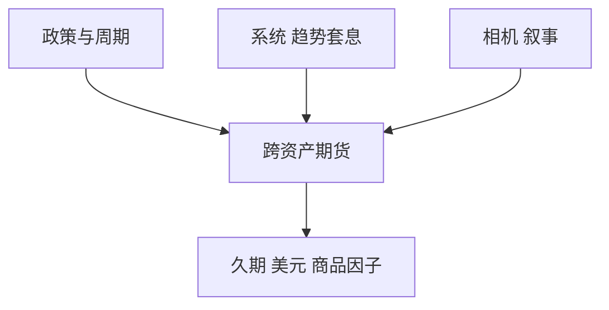

# 全球宏观

全球宏观交易的是政策与周期在资产类别之间的相对价格；杠杆用在流动性好的期货上，辨识风险在叙事而不是在借券。

<footer>—— 对照 Soros 的反身性叙述与机构宏观的风险预算实务；不是单一论文定义</footer>

[上一课](/quant/event-driven-overview)的催化剂是公司事件。全球宏观的缺口是**主权与政策时钟**：利率、汇率、商品、股指的方向与相对价值。主干 [债券趋势](/quant/bond-trend)、[外汇套息](/quant/fx-carry-mom) 已写可系统化的腿。本课给策略族位置：宏观可以系统（趋势/套息）也可以相机，共同的是跨资产杠杆与叙事风险。

## 问题

把宏观当「看对央行就能赚钱」，忽略：定价已经含预期、错误来自时机与仓位规模。系统宏观把趋势、套息、价值写成规则，IR 可检验；相机宏观把同一工具交给主观，评价要用后课业绩持续性，而不是用某一个十年的故事。问题是风险：宏观的亏损来自杠杆与相关（2013 taper、2022 股债双杀），不是来自单名挤仓。预算应用跨资产因子（久期、美元、油）而不是股票行业。

与相对价值宏观（后课固收 RV）：宏观常有净方向；RV 尽量对冲方向只留利差。两者在同一基金里常混，报告必须拆开。

### 流动性好不等于风险小

期货让宏观能迅速加到很大名义。冲击小，但缺口与保证金连环大，见 [期货保证金](/quant/futures-margin)。容量公式与股票多空不同：先满的是保证金与监管头寸限额，不是借券。

宏观叙事容易事后拟合。研究日志课要求事先写出政策函数；本课只要求策略地图上把「系统」与「相机」分开。

## 方法

工具：全球股指、国债、FX、商品期货。系统：趋势 + 套息 + 可选价值，波动瞄准。相机：明确的情景与失效条件。对冲：跨资产相关突变用情景，不用历史 $\Sigma$ 的 99%。与股票多空的相关要进总基金预算。

## 机制

政策改变贴现率与风险偏好，资产类别同时重估。宏观赚的是重估的一部分，付的是时机与拥挤（同类 CTA 同向）。反身性：仓位本身影响汇率与利率，大到一定规模就改变对象。

## 边界

新兴市场宏观还有可兑换、资本管制、NDF，见 [NDF](/quant/ndf)。本课不写如何交易未公开政策信息。

## 小结

- 宏观是跨资产方向与相对价格，风险在杠杆与相关突变。
- 系统与相机必须分报；勿用单一故事当持续性证据。
- 容量约束是保证金与限额，不是借券。
- 出处：趋势与套息见本栏对应课；宏观作为策略族见机构实务分类。
