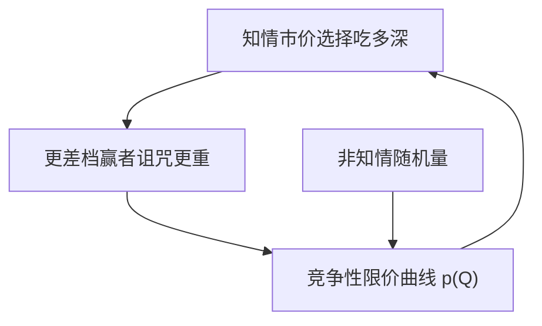

# Glosten 电子限价簿

若任何人都可以在任意价位提交竞争性限价单，电子公开限价簿可以成为不可避开的交易协议：各档深度由逆向选择决定，价差不必来自垄断专家。

<footer>—— Glosten, Is the Electronic Open Limit Order Book Inevitable?, Journal of Finance, 1994</footer>

[Roşu](/quant/rosu-dynamic-lob)用耐心排序生成动态形状。缺口是信息：在竞争性限价供给下，逆向选择如何决定**整条**价格–数量表，而不是一个 $\lambda$ 或一对 bid/ask。Glosten（1994）问电子公开限价簿是否「不可避免」：当限价单可以自由竞争时，专家的垄断报价能否被压到与簿相同的条件期望价格表。本课不重导单期 Kyle 线性深度，也不重画簿的几何。

## 问题

Glosten-Milgrom 的专家报一对单位价格。Kyle 的做市商报一个对总量线性的出清价。电子簿允许交易者在许多价位上留下限价，相当于一条供给曲线：$Q$ 单位市价买，成交均价沿曲线走。若挂单者竞争且风险中性，每一档的价格应等于「吃到这一档」时价值的条件期望，否则有人愿意在更优价位插入。问题是这条竞争性限价曲线是否存在、是否被知情市价单抽干，以及专家能否提供簿给不出的额外保险。

「不可避免」不是技术预言（世界上仍有批发商与暗池），而是机制比较：在公开、匿名、价格–时间优先的协议里，逆向选择被写进曲线斜率，专家不是逻辑必需。

### 筛与赢者的诅咒

市价单可以选择吃多深。知情者倾向于在价值偏离时吃得更深，于是更差的档位面对更严重的赢者诅咒。竞争性限价必须把更差档的价格设得更不利，曲线向上弯（对买方向）。这与 Kyle 线性是同族现象的非线性版本：边际深度越差，条件期望越极端。单期 $\lambda$ 是这条曲线在零点的导数近似，本课不把它再解一遍。

Seppi（1997）讨论专家与限价单并存：专家可以提供限价单不提供的剩余供给。Glosten 1994 的基准是纯限价市场。混合市场是边界，不是对「曲线由逆向选择定价」的否定。

## 方法

风险中性、竞争性的限价供给者；市价需求来自知情与非知情。公开簿上每一价格 $p$ 处的量，使供给者在被取时盈亏平衡：$p=E[V\mid$吃到该档的事件$]$。知情者选择最优吃量，非知情者因流动性吃随机量。均衡是曲线与吃量策略的固定点。无知情者时曲线平坦在 $E[V]$，价差可被竞争到栅格最小；有知情者时曲线开口，小单仍可能近乎有效价，大单付出越来越陡的冲击。

与单位 Glosten-Milgrom 对照：单位模型只有一个 ask，等于「下一笔是买」的期望；电子簿有许多 ask，等于「买到第 $k$ 档」的期望。学习沿深度发生，而不只沿笔数。

### 为什么专家可能仍被需要

若限价供给者不能条件于订单规模（只能提前挂好），大单把曲线抽空后，短期内没有人补，瞬时流动性缺口需要愿意事后议价或承担残差的人。Glosten 讨论这种「剩余」需求。电子化之后 HFT 做市用撤单与改价近似连续重新挂曲线，专家的制度角色下降，但残差在压力期仍出现——闪电崩盘课会回到供给撤退。

## 机制

公开限价簿把逆向选择**显示为形状**。厚而平坦的近端意味着小单信息含量低；远离 BBO 迅速变薄意味着大单被当成知情。交易者选择限价还是市价，是在这条曲线上选点：市价沿曲线付冲击，限价则试图成为曲线的一部分、赚价差、担诅咒。Parlour 的排队决定你能否成为曲线上的那一点；Glosten 决定这一点应该标什么价才盈亏平衡。

透明度：若曲线可见，非知情大单知道自己会沿曲线走，可能改拆单或走暗池，于是可见曲线面对的流更毒，开口更陡——透明与毒性的反馈，接上一课。

## 边界

竞争、风险中性、无库存，会低估价差、忽略 Ho–Stoll 偏度。离散 tick 使曲线变成阶梯，近端常钉死在一档，斜率不可估。隐藏单使可见曲线不是盈亏平衡曲线。跨市场时「公开簿」不是全部供给。1994 年问的是协议比较，不是预测所有资产都会上电子簿——债券与 FX 的电子化要到本课程最后一单元。

不要把「电子簿不可避免」读成「暗池不应该存在」。Glosten 的条件是公开竞争性限价；一旦大单能逃到不透明场所，曲线的信息集已经改变。

## 小结

- Glosten（1994）把电子公开限价簿写成竞争性限价供给曲线，各档价格是吃到该档时的条件期望。
- 知情者选择深度，赢者诅咒使曲线开口；线性 Kyle $\lambda$ 只是近端近似，本课不重推。
- 专家不是逻辑必需，但在限价来不及补给时可提供残差流动性。
- 出处：Glosten, *Journal of Finance*, 1994；单位报价对照 Glosten and Milgrom, 1985；并存见 Seppi, *Review of Financial Studies*, 1997。
