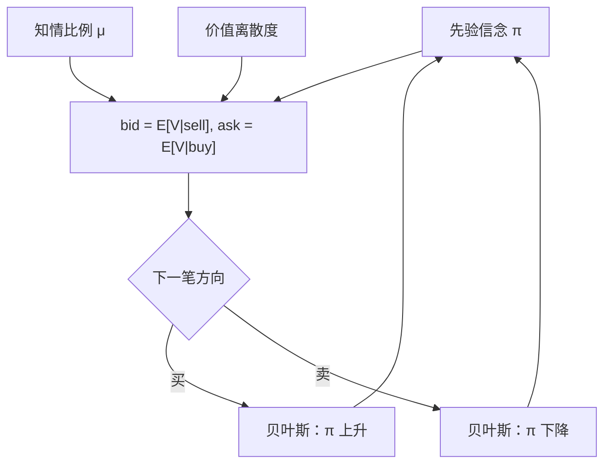

# Glosten-Milgrom

在有知情交易者的专家市场上，买卖报价等于资产价值在「下一笔是买」与「下一笔是卖」条件下的期望；价差可以完全来自逆向选择，而不需要处理成本。

<footer>—— Glosten and Milgrom, Bid, Ask and Transaction Prices in a Specialist Market with Heterogeneously Informed Traders, Journal of Financial Economics, 1985</footer>

Glosten 与 Milgrom 1985 年的模型回答：为什么即使做市没有经营成本、没有存货厌恶，买卖之间仍可以有价差。原因是对手在知情程度上不同质。专家（specialist）必须对随机到来的市价单给出可成交的买价与卖价；知情者只在对自己有利时成交，非知情者两边都可能出现。零利润且风险中性的专家，只能把卖价设成「来的是买单」时价值的条件期望，把买价设成「来的是卖单」时的条件期望。两者之差就是价差。O'Hara 把它作为序贯交易信息模型的核心章节来讲；Harris 从市场实践读同一件事：报价必须保护做市者免于总是输给知情流。本篇写序贯到达与贝叶斯更新，不把 [Kyle](/quant/kyle-model) 的批量冲击提前混进来。

## 问题

若所有交易者与专家一样无知，竞争会把买卖价都推到无条件期望价值 $E[V]$，价差为零（忽略处理成本）。引入知情者之后，专家的每一笔成交都可能是一次被选中的损失：价值高时更常被买走，价值低时更常被卖给。零利润要求：在仍然愿意成交的前提下，买和卖两笔的条件期望利润都为零。这不是把一个总加价平均摊到两边，而是两边各自对条件信息集公平。

序贯是问题的第二句话。交易一笔接一笔到来，每一笔方向都更新公众对 $V$ 的信念，下一笔的报价在新的信念上重算。价格发现因此发生在交易过程内部，而不是发生在交易之外的公告里。O'Hara 强调这一点：信息模型里的价格是信念的函数，信念的自变量是迄今为止的交易史。要解决的是：在只有方向、没有数量策略（相对 Kyle）的世界里，价差、报价更新与学习速度怎样由知情者比例和价值不确定性决定。

### 谁在交易、谁在报价

标准设定里有三类人。资产清算价值 $V$ 在期末实现，交易过程中未知。知情者知道 $V$（或知道一个更好的信号），非知情者（流动性交易者）由于外生需要买卖，专家不知道到来的是哪一类，只知道结构参数。每期至多来一笔单位市价单，买或卖。专家报出 bid 与 ask，对所有人一视同仁，成交后用方向做贝叶斯更新，再报下一对价格。专家竞争或可竞争到零期望利润，因此报价等于条件期望，而不是垄断加价。

单位交易、不能选择数量，是为了把问题收成方向上的逆向选择。数量上的隐藏与冲击是 Kyle 的对象。把 Glosten-Milgrom 的价差直接叫「$\lambda$」会混掉两个模型的观测。

## 方法

一个便于计算的版本：$V\in\{\overline{V},\underline{V}\}$，先验 $\pi=\mathrm{P}(V=\overline{V})$。知情者比例为 $\mu$，知情者在 $V=\overline{V}$ 时必买、在 $V=\underline{V}$ 时必卖。非知情者买、卖各半。于是

$$
\mathrm{P}(\text{buy}\mid V=\overline{V})=\mu+\frac{1-\mu}{2}=\frac{1+\mu}{2},\qquad
\mathrm{P}(\text{buy}\mid V=\underline{V})=\frac{1-\mu}{2}.
$$

买到达后，

$$
\pi'=\mathrm{P}(V=\overline{V}\mid\text{buy})=\frac{(1+\mu)\pi}{(1+\mu)\pi+(1-\mu)(1-\pi)}.
$$

卖到达则把 $\pi$ 朝下更新。卖报价（ask）是买到达时的条件期望，买报价（bid）是卖到达时的条件期望：

$$
a=E[V\mid\text{buy}]=\overline{V}\pi'+\underline{V}(1-\pi'),\qquad
b=E[V\mid\text{sell}].
$$

价差 $a-b$ 随 $\mu$ 与 $|\overline{V}-\underline{V}|$ 增加，随信念已极端（$\pi$ 接近 0 或 1）而缩小——没什么可学时，逆向选择减弱。无知情者 $\mu=0$ 时 $a=b=E[V]$。

### 学习沿交易史进行

每一笔成交之后用 $\pi'$ 替换 $\pi$，再计算下一对 $a,b$。一串买单把 $\pi$ 推向 1，ask 与 bid 一起上移，价差形态随剩余不确定性改变。公开信息可以把 $\pi$ 直接挪到新先验，而不经过成交。方法上，这是一个以交易方向为观测的隐马尔可夫更新；估计现实数据需要更多结构（例如未知的 $\mu$），那已超出原文的理论命题。原文要的是存在性与机制：逆向选择单独就能撑开价差，且价格会把信息逐步写进去。

## 机制

专家害怕的不是买或卖本身，而是买与高价值、卖与低价值之间的相关。报价等于条件期望，保证对这一笔成交的期望利润为零：赢非知情者的钱，刚好补知情者造成的损失。价差是保险费。信息进入价格的通道是方向：买单提高公众信念，卖单降低。即使知情者永远正确，只要 $\mu<1$，每一步都不能把 $V$ 完全揭示，学习是渐进的。这与 Roll 相反：Roll 的成交不更新 $V$，只在固定的 $V\pm s/2$ 上弹；这里 $V$ 的条件分布每一步都变，弹跳与漂移缠在一起。

非知情者提供了市场存在的理由。没有他们，专家知道对方几乎必为知情者，买卖价会张到接近 $\overline{V}$ 与 $\underline{V}$，交易冻结。$\mu$ 升高，价差加宽，非知情者的交易更贵，流动性下降。O'Hara 把这种反馈视为信息模型的一般性质：信息不对称伤害的是需要立即成交的人。Harris 从实务读：当市场认为「对面有人知道」，报价会退、深度会变薄，不一定先出现一笔大的公开新闻。

### 报价更新不是存货调整

成交后买卖报价通常朝成交方向移动，看起来像存货模型里的中点偏移。机制不同：这里专家风险中性、不在乎头寸，移动的是信念。存货模型即使没有知情者也会移动中点，为的是诱导反向成交。识别上，Glosten-Milgrom 预测价差本身随信息不对称变化，且更新是贝叶斯的、对买和对卖一般不对称（取决于当前 $\pi$）。存货模型预测中点与累积头寸相关。O'Hara 用整章对照这两条线，提醒不要看见「成交后中点动了」就声称发现了信息。

逆向选择价差是条件期望之差，不是在无条件期望上对称地加减一个常数。$\pi$ 靠近 0 或 1 时，买更新和卖更新的力度不同，bid、ask 相对中点可以不对称。

## 边界

模型是序贯、单位数量、市价对专家报价。限价单簿上，流动性提供者是分散的挂单者，他们还面临 [队列位置](/quant/cancel-queue-position) 与取消，不是对每一笔都承诺双向报价的单一专家。数量若可变，知情者会用大单表达更强信号，问题滑向 Kyle。多专家或多限价提供者竞争时，零利润仍是有用基准，但存货与抢入队会重新出现。连续时间里「下一笔」的定义依赖 [事件时间](/quant/event-time)；用时钟每秒强行更新信念，等于发明了没有发生的交易。

$V$ 二值、$\mu$ 常数、非知情者买卖对称，都是为了把贝叶斯写清楚。现实的信号是噪声的，知情者比例时变，非知情者可能聚集在一侧。原文不声称估计了某市场的 $\mu$。经验工作若要用「信息交易概率」一类对象，必须另设可估计结构，并且不应伪装成 1985 年论文里已经给出的统计量。暗池与隐藏单让专家看不见部分方向，条件信息集与模型不一致。处理成本与存货可以叠在逆向选择之上，那是 [价差分解](/quant/spread-decomposition) 的语言；本模型展示的是 $s_{\mathrm{as}}$ 可以单独为正。

Glosten-Milgrom（1985）写的是专家市场与异质信息交易者，不是限价簿仿真。把它当作电子盘的数据生成过程，需要承认映射是类比：挂单者扮演专家，市价方向扮演观测。

## 小结

- 买卖报价是价值在下一笔为卖或为买时的条件期望；价差可纯由逆向选择产生。
- 知情者比例与价值不确定性加宽价差；信念极端时价差收窄。
- 每一笔方向更新公众信念，价格发现内嵌于交易序列，应对齐事件时间。
- 非知情流是市场存续的条件；$\mu$ 过高则价差驱逐流动性交易。
- 中点随成交移动在此是学习，不是存货；与 Roll 的无信息弹跳、Kyle 的数量冲击相区别。
- 单位市价、单一专家、可见方向构成边界；限价簿、可变数量与隐藏场所需另建映射。
- 出处：Glosten and Milgrom, *Journal of Financial Economics*, 1985；综述语境见 O'Hara, *Market Microstructure Theory*，市场解读见 Harris, *Trading and Exchanges*。
