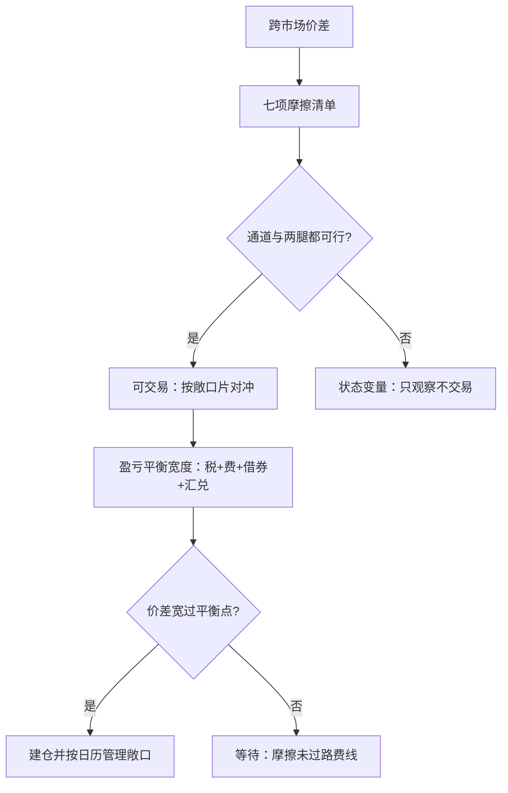
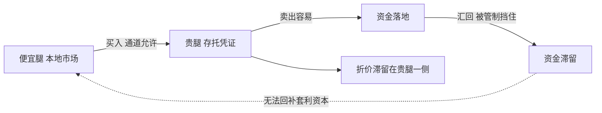

# 跨市场套利的制度约束

同一种资产在两个市场的价差，先别叫非理性：时钟、日历、税、资本与结算各收一道过路费——价差是摩擦的定价，能把过路费算清的人才轮得到谈收敛。

<footer>—— 据 Froot and Dabora, Journal of Financial Economics, 1999；Makarov and Schoar, 2020；Gromb and Vayanos, 2010 整理</footer>

[上一课](/quant/gm-tax-costs)把税写成行为的函数。本课把前面所有机制拧到同一个问题上是：同一风险资产在两个制度下的折溢价——存托凭证对本地股、ETF 对一篮子、南北向对本地、跨所加密对。套利理论说价差该被抹平；本课程前八课列出的每一条制度，恰好都是抹平机器上的一颗砂。本课把砂粒收成一张可操作的摩擦清单。

## 问题

折溢价文献的老结论先摆正：贴近到只差国界的双上市价差可以长期存在且随情绪波动（Froot and Dabora 1999），资本管制下的跨所加密价差在管制期持续且宽（Makarov and Schoar 2020）——「一价律」的失效不是 anomalies 清单上的怪事，而是制度摩擦的常规输出。缺口是操作面的：拿到一个跨市场价差，先判断它是机会还是状态变量。判据不是价差宽度，而是摩擦清单能否通过。清单七项：一，时钟重叠——两边不同时开市，价差在任一时点只对一边可执行；二，日历——假日错位天是纯敞口天（[香港市场](/quant/gm-hongkong)的通道错位是标准样本）；三，结算差——周期不同步把敞口拉长（[清算与结算](/quant/gm-clearing-settlement)的周期差口径）；四，税与预扣——往返两腿的税负从价差里直接扣（[税与交易成本](/quant/gm-tax-costs)的三层账）；五，资本通道——额度、许可与汇兑限制决定「钱能不能过去」，通道关闭时价差失去收敛机制；六，做空可得性——空腿借不到，价差只能单边收；七，数据时戳——两边「收盘」的定义不同，用对方收盘对本方开盘对齐时，把过时价差误当信息。

先核通道，再核价差：资本管制下的「便宜腿」在你无法把钱汇过去时不是机会，是别人价差表的注释——五、六两项决定价差可不可以做，前三项决定做了要背多少敞口。

「机会还是状态变量」可以想象成天气：一张台风警报前的低价机票，对能改签的人是折扣、对不能改签的人是陷阱。同一个折价数字，随你手里有没有「通道与借券」这些伞而改变性质——所以清单第一问永远不是「价差多宽」，而是「我能过吗」。

## 方法

建模上把价差对摩擦回归，而不是对情绪回归。做法：对每一对配对腿建七项摩擦的时变表（通道开闭、借券费、税费、日历、时戳规则），把折溢价作为被解释变量；通过项数与摩擦成本能解释的份额，才是留给「行为」的部分。敞口管理上按「两边同时可交易且都已最终结算」的时间片计持仓，日历错位天用期货或近似腿替代对冲并单列替代误差。执行上把摩擦成本折成盈亏平衡价差宽度：价差必须宽过「税 + 借券费 + 两腿成本 + 汇兑与提币摩擦」的往返总和才开始有意义——这与费用调整后的经济价差是同一算法（[maker-taker](/quant/maker-taker)），只是腿加到了两条以上。

数字实例：设 A 股市场价 102、B 市场价 100。往返要付：卖出腿印花税 0.1%、两腿各 0.05% 佣金、借券费年化 6% 折 3 天约 0.05%、汇兑与提币摩擦 0.3%，合计约 0.55%，即约 0.55 元。价差只有 2 元里能落袋约 1.45 元，再扣掉日历错位天的对冲误差——表面 2% 的价差可能只值半个百分点。

## 机制

摩擦的机制特点是方向性与状态性。方向性：多数摩擦只挡单程——买入便宜腿容易、把钱汇回来难，于是价差在「容易的方向」先收敛、在「难的方向」滞留，折溢价呈现持续偏移而不是对称噪声。状态性：通道与借券是状态变量，价差的「可交易性」随状态翻转——同一个折价数字，通道开时是套利、通道关时是陷阱，这正是套利限制理论（Gromb and Vayanos 2010）的制度版：摩擦大时，收窄价差的资本本身被摩擦挡在门外。时戳的机制最隐蔽：跨时区对齐永远在做「用旧信息对新信息」的配对，回归出的领先滞后一部分是制度时差的机械产物。不这么做会错在哪：把折溢价直接当均值回复信号做回归，样本里的「回复」可能全部来自通道重开事件——回复的不是价格是状态。

「钱能进不能出」这条单向阀如何制造持续折价，回答的是「价差为什么偏向一侧滞留」：

常见误区：初学者容易把折溢价收窄直接当成「均值回复信号」做统计套利。实际上样本里的每次回复可能都对应一次「通道重开」的政策事件——回复的是通道状态，不是价格本身有引力。通道关闭期间加仓，等于在单向阀堵住时继续往里灌水。

## 边界

本课不写监管套利与规避通道——把合规通道的额度绕开的做法不在允许集里，与另类数据课对「违规信息」的口径一致。外汇对冲的成本与基差不展开（货币侧另有课程）。加密腿的提币与法币腿的 T+n 不是同一时间单位，配对时按保守侧取敞口。

## 小结

- 跨市场折溢价的第一分类是「机会还是状态变量」，判据是七项摩擦清单。
- 通道与做空可得性决定可不可以做；时钟、日历、结算差决定背多少敞口。
- 盈亏平衡宽度把税、费、借券与汇兑折成一条过路费线，价差宽过它才有意义。
- 摩擦有方向与状态：价差收敛可能来自通道事件，不是均值回复。
- 出处：Froot and Dabora, *Journal of Financial Economics*, 1999；Makarov and Schoar, 2020；Gromb and Vayanos, *Annual Review of Financial Economics*, 2010。
