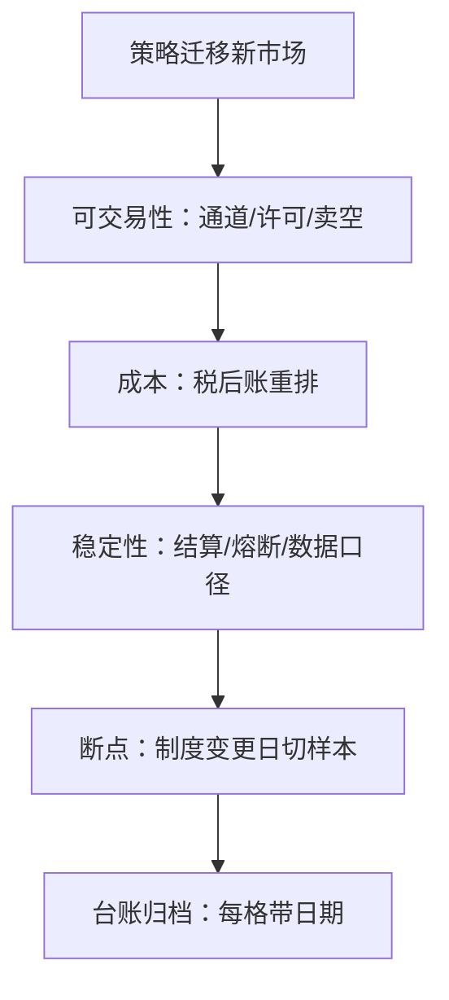

# 对照案例与收束

策略不是公式，是公式加一套制度假设；迁移失败很少死于信号失效，多数死于把环境常量当成了普适真理——收束就是把常量清单写出来，标上日期。

<footer>—— 据 Harris, Trading and Exchanges, 2003；Foucault, Pagano and Röell, Market Liquidity, 2013 及本课程各课整理</footer>

[上一课](/quant/gm-arb-constraints)把跨市场价差翻译成七项摩擦清单，判断「机会还是状态」。本课是全球市场制度对照的收束：前九课每课产出一张市场或机制的清单，本课把它们并成一张迁移前检查单与两个迁移案例，回答最后的问题——策略进新市场，先查什么、按什么顺序查。本课程到此收束。

## 问题

十个市场的课读下来，条目很多，但检查的顺序只有一个：按钱的顺序。先问可不可交易（通道、许可、卖空的可得性——做不了，后面全免）；再问贵不贵（费用与税的税后账——做得了但亏，也免）；再问稳不稳（结算、熔断、数据口径——能盈利的账要在后链成立）；最后问久不久（制度参数何时变过——历史绩效的样本要按制度断点切）。缺口在于真实流程常常倒着走：先看绩效图，再补合规，税费在上线当周才算清。倒序的成本与前两课的复盘口径相同：错误在第一周可见，只是没人被要求去看。

制度变更日是事件日：印花税调整、结算周期迁移、撮合引擎更换——把参数更新静默写进数据，等于让回测在不存在的制度里跑；每个清单项都要能回答「这一格上次是什么、何时变的」。

## 方法

收束成三张表。第一张是维度表：行是维度（会话与时钟、tick 与手数、价格限制与熔断族、卖空制度、费用与税、清算与结算、数据与披露、合规报备），列是市场（美国、欧洲、日本、香港、印度、加密），每格一句话并指回对应课——美国格写订单保护与 [市场分割与 NBBO](/quant/market-fragmentation) 的参照口径，欧洲格写最佳执行与豁免，日本格写午休与値幅制，香港格写收市竞价 VCM 与双边印花税，印度格写 T+1 与交付拍卖，加密格写无保护与托管对手。第二张是案例表：两个小案例走一遍顺序——高频做市从美股到港股，第一关就是税负敏感性（[税与交易成本](/quant/gm-tax-costs)的双边印花税排序翻转），顺序对了当天放弃、学费是一份测试；统计套利从美股到印度，卡在卖空可执行性（[印度市场](/quant/gm-india)的 SLB 与拍卖惩罚），空腿重建后再谈容量。第三张是失败模式表：订单保护幻觉（把美国的保护当成普适）、税后排序不重算（把税前列当结论）、结算日历敞口（把配对簿的周期差当零）——每条死法都能在前九课找到机制出处。

## 机制

对照表的机制价值在于把「环境常量」显式化：微观结构课程教的是在给定制度下如何交易，本课程教的是制度本身如何给定。环境常量改变时，历史绩效的预测力以断点为界——引擎迁移、印花税调整、结算周期变更、监管框架落地，每一处都是样本的分段点；回测按断点切、参数按当期读，绩效报告必须能指认「这段绩效是在哪套制度参数下生成的」。这与[美国市场结构](/quant/gm-us-structure)一课对数据口径（SIP 与直连）的声明是同一种纪律：制度口径不声明，绩效数字没有解释。不这么做会错在哪：把六套制度压成一个「国际市场」假设，组合里每个市场各漏一笔账，压力日一起兑付——摩擦有相关性，因为它们同源（资本、清算、税制的联动）。

## 边界

本表是快照：税率、周期、带值与监管框架滚动变化，表格必须带生成日期，任何一格失效都按当期文本重读而非凭记忆修订。本课程不给合规与法律意见；跨境运营的许可问题在通道课只写了「先核通道」，具体申请不在口径内。深钻层到此为止，制度对照不接附录。

## 小结

- 迁移检查按钱的顺序：可交易性、税后成本、后链稳定性、制度断点，顺序不可倒。
- 三张表收束全课程：维度表指回各课、案例表演示顺序、失败模式表收录三种死法。
- 制度变更日按事件日处理：样本切段、参数重读、绩效标注生成口径。
- 环境常量显式化是本课程的全部产出：策略等于公式加制度假设，两者都要进台账。
- 出处：Harris, *Trading and Exchanges*, 2003；Foucault, Pagano and Röell, *Market Liquidity*, 2013；本课程各课所引公开规则与文献。
