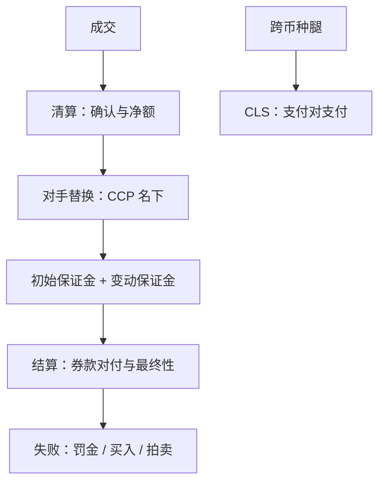
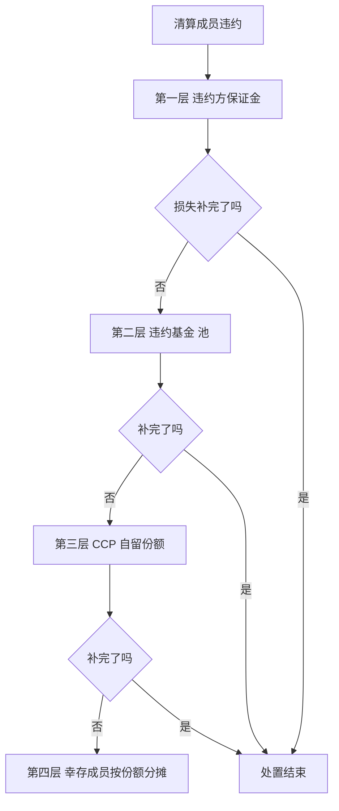

# 清算与结算

执行课程到成交为止，制度课还差一半：中央对手把散乱的对手关系收成一个节点，结算周期决定你暴露在这个节点外多久——后链的结构是前台的隐形参数。

<footer>—— 据 Duffie and Zhu, Review of Asset Pricing Studies, 2011；Pirrong, The Economics of Central Clearing, 2011；BIS/CPMI 报告口径整理</footer>

[上一课](/quant/gm-crypto-regime)用加密市场把「成交不等于拿到资产」推到极致。法币市场把成交之后的链条整体制度化：清算（确认、净额、对手替换）与结算（券款对付、最终性）。前面六课各写了一个市场的场所层，本课起转入机制单元：把这条后链拆开，写它如何进入策略的资金账与风险账。

## 问题

第一缺口是中央对手（CCP）改变风险形状：对手替换（novation）把对每个经纪商的散乱敞口收成对 CCP 的单一敞口，多边净额压缩名义义务——净额收益取决于参与者结构与违约相关性（Duffie and Zhu 2011 的问题设定），而 CCP 自己成为系统重要性节点，违约瀑布（违约方保证金、违约基金、自留份额、逐级分摊）把尾部风险重新分配给成员。第二缺口是周期：现货从 T+2 向 T+1 迁移已成趋势——美股 2024 年起 T+1，欧盟、日本等相继排期，印度已全面 T+1；周期决定资金与券的占用窗口、失败交割的处置窗口、以及跨市场配对簿基差敞口的长度。第三缺口是外汇腿：跨币种结算存在时区错切的赫斯塔特风险，持续联结结算（CLS）以支付对支付消除它——不做跨币种的策略感受不到这条约束，做了马上遇到。

「中央对手」翻译成大白话：清算所站到每笔交易的中间，对买方它当卖方、对卖方它当买方。你不再需要担心「对面那家经纪商会不会倒」，改为统一担心「清算所的缓冲够不够」——把 N 个对手风险打包成一个，这就是对手替换的含义。

配对簿的基差敞口长度由两边结算周期差决定：一边 T+1 一边 T+2 时，券已到手的一侧与钱未付出的另一侧错开一天——对冲比率再准，也压不住结算日历多暴露的这一天。

数字实例：T+1 意思是成交日后下一个工作日钱券交割。假设周一成交买入美股，T+2 制度下周三上午你的券才可动用，期间卖出现金腿的资金周三才到账；迁到 T+1 后敞口窗口从约 48 小时压到约 24 小时，但隔夜对账、失败纠正只剩几个小时——红利与压力来自同一个压缩。

## 方法

机制清单四项。对手结构：逐经纪商归档其清算路径（自营清算还是代清算）、CCP 归属与违约瀑布分摊条款——对手限额按清算结构而非名义持仓设。保证金：初始与变动保证金的口径、追缴时点与压力期上调历史入表，资金计划按「追缴早于你的收款」的错位情景做。周期与日历：每个市场记 T+n、结算货币、CSD（DTC、Euroclear 与 Clearstream、CCASS、JASDEC、印度的两家并存）与交收截止时点，配对策略按「两边都已最终结算」的日历计敞口。失败处理：各市场的失败罚金、强制买入或拍卖纪律入成本模型——[印度市场](/quant/gm-india)的拍卖是其中最硬的一档，欧盟 CSDR 的罚金与买入安排是另一档。

## 机制

净额的机制是把双边敞口折叠：同名下轧差后，名义交易量巨大而实际义务很小；代价是风险集中——CCP 同时承担清算成员的违约与流动性压力，保证金是其主要缓冲，压力期上调保证金本身会放大市场资金紧张（2020 年 3 月的教训）。周期缩短的机制是把信用敞口窗口从三天压到一天：资本效率上升、失败风险窗口变短，但对账与公司行动的处理窗口同步压缩——周期红利只落到后链跟得上的机构手里。DvP 与最终性定义「什么时候真正换了手」：最终性之前，一切持仓都是过程态，风险与融资模型要用过程态口径记。CLS 的机制是把跨币种两腿同时交付：错切敞口从按天变成按秒。不这么做会错在哪：只用场所层的价差与费用建账，后链的保证金错位、周期差敞口与失败惩罚会以「偶发亏损」的形式回流——偶发但可预测，且集中在压力日。

一家清算成员违约时，损失按什么顺序被谁吸收，这条违约瀑布回答的是「我作为无辜成员会不会被摊到」：

直觉类比：违约瀑布像大楼的消防系统分级——先烧违约者自己房间里的灭火器（其保证金），再动用全楼共用的消防水箱（违约基金），然后是物业自备的储备（自留份额），最后才向每家住户收分摊费。你交违约基金，买的就是「不必用到第四层」的优先级。

## 边界

本课写现货链；衍生品组合的净额与 XVA 定价在利率信用课程已写，不重复。证券借贷的定价与召回动态、CSDR 买入条款的执行细则不展开。各市场的周期与截止时点以当期规则为准——这正是本课的论点：后链参数是会变的制度常量，清单要带日期。

## 小结

- CCP 用对手替换与多边净额重排对手风险，代价是风险集中与违约瀑布分摊。
- 结算周期决定占用与失败窗口：T+1 迁移是趋势，红利只到后链跟得上的机构。
- 配对簿的基差敞口按「两边都已最终结算」的日历计，周期差直接加敞口天数。
- 跨币种腿的错切风险由 CLS 类支付对支付机制消除，不做跨币种也要知道它在哪。
- 出处：Duffie and Zhu, *Review of Asset Pricing Studies*, 2011；Pirrong, *The Economics of Central Clearing*, 2011；BIS/CPMI 与各 CSD 公开口径。
