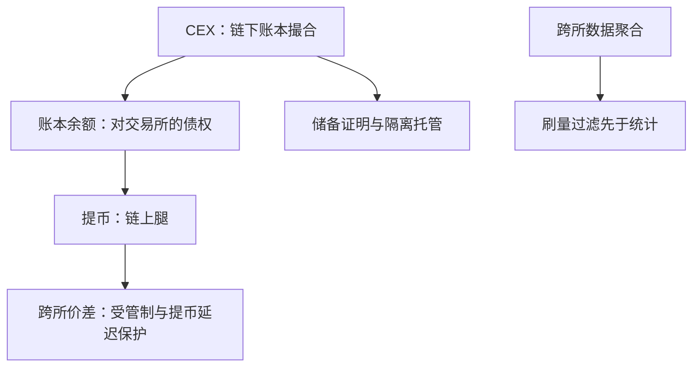

# 加密市场的制度

法币市场的制度回答两个问题——谁保护订单、谁保证结算；加密市场把两个答案都交还给交易者自己：跨所价差可以长期存在，账本余额不等于手里的资产。

<footer>—— 据 Makarov and Schoar, Journal of Financial Economics, 2020；MiCA 公开文本口径整理</footer>

[上一课](/quant/gm-india)把结算纪律写成现金流。加密市场走到这套对照的边界上：结算极快、制度极薄。区域单元到此结束，本课是「区域」的最后一站——它不是第六个法币市场，而是前五个市场每条规则的否定式：没有订单保护、没有统一磁带、没有中央托管，托管本身就是对手风险。本课写这套「薄制度」的运行机制与尽职调查清单。

## 问题

第一个缺口是场所碎片化的极端版：几百个场所各自撮合，价格可以长期不一致。法币市场的碎片化有订单保护兜底，跨所价差被机械规则压住；加密没有这层兜底，价差由资本管制与提币延迟保护——管制时期某些市场对美元的溢价可以持续存在且幅度可观（Makarov and Schoar 2020 的核心发现）。第二个缺口是数据：没有监管口径的统一磁带，跨所聚合完全自建，而且聚合前要先过刷量过滤——交易所报告的成交量含大量自成交与激励刷出的水分（Cong 等对加密交易量水分的估计）。第三个缺口是托管：CEX 的成交发生在链下账本，你的「资产」是对交易所的债权；储备证明与客户资产隔离因此成为与费率同级的尽调项，而不是合规装饰。第四个缺口是结算腿：法币出入金与稳定币通道各有自己的信用与延迟，波动最剧烈时恰恰最不可用。

「成交即结算」在加密市场是直觉错误：链下账本的成交要在链上提币才算拿到资产，而提币排队与链上费用在剧烈波动时最贵——把账本余额当头寸，是把 IOU 当资产记。

## 方法

清单四项，全部自建。数据：多所聚合要带时戳对齐与异常剔除，刷量过滤先于任何统计量——直接用交易所报告量做的「流动性」研究基本不可比。场所与费用：CEX 的 maker-taker 分层与量档折扣在结构上与法币市场同构，费用调整后的最优同样不等于展示最优（[maker-taker](/quant/maker-taker) 的口径原样适用）；DEX 的池价是另一套机制，滑点与池深代替价差。托管与对手：储备证明、隔离条款、提币演练按对手方归档，头寸上限按对手风险而非市场风险设限。监管口径：欧盟以 MiCA 建立成体系框架，美国的口径长期停在执法与个案，同一策略在不同辖区面对的许可与披露要求不同——按运营主体所在辖区归档。

## 机制

薄制度把两类风险从「尾部」提回「常态」。其一，对手风险常态化：托管混同或挪用不是极端情形而是历史上的重复事件，主要交易所倒闭后客户资产全额取回并不保证——对手限额与多所分散是仓位管理的一部分，不是运维偏好。其二，套利即流动性提供：跨所价差的收窄者承担提币延迟与链上费用，价差宽度反映的是这两项成本加管制约束，不是「非理性」；把价差当免费午餐，等于把保护价差的摩擦当零。其三，七乘二十四无收盘重构了日内结构：没有官方开盘收盘，「日内季节性」由资金费率时点与全球交易时段重构，按法币市场日历做的日内统计要整体重写。不这么做会错在哪：用法币市场的「制度兜底」假设交易加密资产，三个缺口同时敞开——价差误判、数据失真、对手敞口无界。

## 边界

本课不写代币定价与链上数据工程（另课对象），不写各辖区的合规报备细节；MiCA 落地细则在滚动执行，清单按当期文本重读。稳定币作为结算工具的信用风险单列，不与法币清算混谈——后者是下一课的对象。

## 小结

- 加密制度是法币规则的否定式：无订单保护、无统一磁带、无中央托管。
- 跨所价差受资本管制与提币延迟保护，是摩擦的定价而非免费机会。
- 交易所报告量含刷量水分，聚合研究先过滤再统计。
- 账本余额是对交易所的债权；储备证明、隔离与对手限额是仓位管理的一部分。
- 费用分层与法币市场同构，费用调整后的最优照旧替代展示最优。
- 出处：Makarov and Schoar, *Journal of Financial Economics*, 2020；Cong 等（Crypto Wash Trading）；MiCA 公开文本口径。
