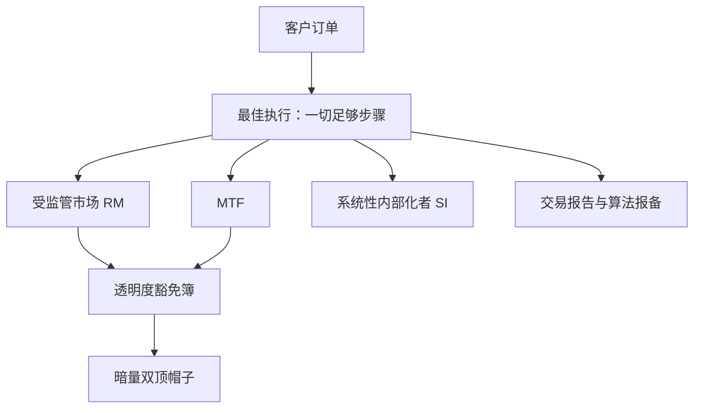

# 欧洲 MiFID 体系

美国用一条机械规则保护订单，欧洲把同一组问题交给行为义务：交易所在透明度上竞争，中介为「足够步骤」的执行负责——读欧洲先读义务与豁免，再读簿。

<footer>—— 据 MiFID II / MiFIR 公开文本；Foucault, Pagano and Röell, Market Liquidity, 2013 整理</footer>

[上一课](/quant/gm-us-structure)把美国收成「订单保护加费用竞争」的系统：Reg NMS 用机械规则把分散报价拼成 NBBO。欧洲刻意不这么做：没有跨场所的 trade-through 禁令，也没有长期可用的单一磁带；多场所竞争照样存在，但秩序由另一组工具维持——场所分类、透明度义务与豁免、中介的最佳执行义务。本课写这套体系的结构与对策略的含义，衔接方式沿用上一课的清单法。

## 问题

欧洲股权交易同样分散在受监管市场（RM）、多边交易设施（MTF）与系统性内部化者（SI）之间，缺口的起点是一个义务而非一条规则：中介为客户执行时要采取「一切足够步骤」争取最优结果。这个义务不指定场所，于是「最优」落在机构的执行政策与场所比较表里，而不是落在监管拼装的参照价里。第二个对象是透明度：MiFID II 对场内挂牌设有前置透明要求，同时开了一族豁免——参照价豁免、协商成交豁免、大单豁免等——豁免簿里的流动性可见但不挂牌，暗量另有双顶帽子约束总量。把豁免簿当普通簿读深度，会把「看得见但不排队」当成「排得上队」。

双顶帽子按滚动口径限制暗池份额，历史上多次触发、又被监管多次按市况暂停——暗侧容量不是自由变量，做市与暗侧执行策略要按帽子的预算周期排程。

## 方法

清单换成欧洲版。其一，场所分类决定簿的形态：RM 与 MTF 挂牌撮合，SI 以自有账户对客户成交、对活跃品种有量化报价义务，两者的价差含义不同——对 SI 的成交没有簿可言。其二，逐场所归档透明度状态与豁免类型，研究里把「展示深度」按豁免与否分层报告。其三，合规侧的算法交易义务：算法要向监管报备，做测试、留 kill switch、持续做市要签做市协议——这是立项前置项，不是上线后补丁。其四，研究分拆：经纪研究不能默认用交易佣金支付，数据与研究的采购要单独走预算，投研成本结构因此与美国不同。其五，tick 按流动性分层给出，跨所比较价差时先对齐 tick 制。

## 机制

豁免是一笔交换：拿走前置透明，换来机构大单有处可去、执行概率上升；帽子再反过来防止暗份额无界增长。于是欧洲的「价差」要在三个状态上分别读——挂牌全透明、豁免簿可见、SI 无簿——混在一起平均会把结构差异抹平。SI 的量化报价义务把内部化准场所化：它有义务持续报价，但没有对手保护，最优结果仍由执行政策兜底。不这么做会错在哪：把美国的「最优价必然成交」直觉带进欧洲，会高估展示报价的可成交性；把豁免簿的挂单当排队深度，回测的成交概率会系统性偏乐观。

与上一课对照的机制价值在于：两条路线对同一份订单流给出不同的可执行集——美国的保护覆盖价格，欧洲的义务约束过程；策略迁移时，重新校准的正是这个「执行结果由谁保证」的假设。

## 边界

欧洲没有统一的合并磁带，跨所比较要自建包络，而且这个包络没有订单保护的法律含义——[市场分割与 NBBO](/quant/market-fragmentation) 对「自建最优」的警告在这里加倍成立。英国脱欧后形成两个监管区，同一家机构在两侧要分别报备，场所格局与流动性格局都被重新切过。磁带与上市规则的修订在滚动落地，清单要按当期文本重读；结算周期等后链差异留到清算结算课统一写。

## 小结

- 欧洲的秩序来自行为义务：中介的最佳执行「足够步骤」，不是机械的订单保护。
- 场所三分：RM、MTF、SI；SI 有量化报价义务但无簿，成交口径完全不同。
- 透明度豁免与大单、参照价、协商豁免是流动性形态的一部分，深度必须分层读。
- 算法报备、测试、kill switch 与研究分拆是立项前置合规项。
- 自建跨所包络没有保护含义，脱欧后的两个监管区要分开处理。
- 出处：MiFID II / MiFIR 公开文本；Foucault, Pagano and Röell, *Market Liquidity: Theory, Evidence, and Policy*, 2013。
