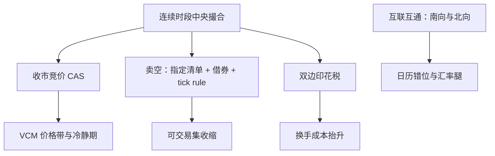

# 香港市场

港股是「单主场、高税费、硬约束」的组合：没有订单保护，卖空要过清单，双边印花税先于价差入账——在港股，策略的第一道门槛是一道税负题。

<footer>—— 据 HKEX 公开交易规则（收市竞价 CAS 与 VCM 条文、卖空指定证券安排）及印花税条例口径整理</footer>

[上一课](/quant/gm-japan)写日本如何把快引擎与旧参数表放进同一张订单。香港回单主场结构：一家交易所承接绝大多数现货，场所间竞争问题几乎不存在；真正约束策略的是三件事——尾盘的波动控制、卖空的清单化、以及双边印花税对换手成本的抬高。本课写这套组合拳的机制含义，并交代互联互通通道带来的日历问题。

## 问题

港股的第一缺口在成本结构：名义价差之外，买卖双边各有一道印花税，近年来先调高后调减——对高频与高换手策略，税费常大于价差本身，「价差即成本」的直觉在这里直接失效。第二缺口在尾盘：收市竞价（CAS）重启后以波动控制机制（VCM）框住竞价价格带，触发即冷静期，收盘价的生成过程被制度化——尾盘执行的基准与「最后几分钟随便打」的假设不同。第三缺口在做空：只有指定清单内的证券可卖空，卖空须先借券（covered），且受不得低于最优买价的 tick rule 约束——卖空从权利变成逐日维护的清单与借券管理。第四缺口在通道：南北向互联互通让同一只股票有两个可交易日历与两种货币腿，通道任一侧休市时，另一侧的持仓风险无人对冲。

交易日历错位是港股特有的一阶风险：南向或北向任一侧假日，通道闭市，而标的的基本面信息不会等日历——配对簿要在「两边同时可交易」的日历上对齐，只在时钟上对齐是不够的。

## 方法

清单法照旧，四项入表。撮合与尾盘：连续时段进中央撮合簿，收盘经收市竞价生成；VCM 的带内监测与冷静期写入尾盘执行模型——尾盘 TCA 的基准是「带约束的竞价收盘」，不是理论末价。港交所近年还把部分场外配对收进受监管的撮合设施（OMP 一类），让交易所簿外的成交也留下更完整的磁带痕迹——数据覆盖口径要跟着扩。费用：印花税、平台费、结算费逐边入表，任何换手敏感的回测先做税负敏感性。卖空：可用集按「指定清单、借券可得、tick rule」三重过滤，借券费与可用量随时间变动，作为状态变量建模。通道：南北向的标的范围、额度与汇率腿单列，通道关闭日按不可交易处理。

## 机制

三个机制的共同点是把「自由变量」变成「状态变量」。VCM 把尾盘从市价单竞赛改写成带内排队加冷静期：收盘价更稳，但尾盘流动性的时间分布改变，把执行算法的尾盘参数从美股搬来会系统性错配。卖空的清单化改变截面：不可卖空的「贵」证券缺乏纠偏力量，多空组合的空腿要在清单内重新定义——「模型说空」与「制度允许空」是两个集合。印花税的机制效果最直接：双边比例税等价于对换手率征线性惩罚，策略在美股样本的费后排序不能平移到港股，必须重排（税的一般机制在税与交易成本课展开）。通道的机制效果是同一风险资产的分割定价：两边的资金结构与约束不同，折溢价成为常态，通道状态（开、闭、额度）是定价状态的一部分。

## 边界

港股通标的与本地全市场的可交易集不同，用哪个集合回测要先声明；权证与牛熊证的流通量提供者报价义务不等于正股流动性，衍生权证市场不进本课口径。IPO 结算平台、大宗机制等发行侧制度不写。具体税率、带值与时段以 HKEX 与税例当期文本为准。

## 小结

- 港股的第一道成本是双边印花税，换手敏感策略先过税负敏感性。
- 收盘价由带 VCM 约束的收市竞价生成，尾盘执行与 TCA 按此基准。
- 卖空是「指定清单、先借券、tick rule」的三重过滤状态，不是默认权利。
- 南北向通道带来双日历与汇率腿，敞口要在两边同时可交易的日历上对齐。
- 出处：HKEX 公开交易规则（CAS 与 VCM、卖空指定证券安排）；印花税条例口径；据本课程执行与费用各课整理。
