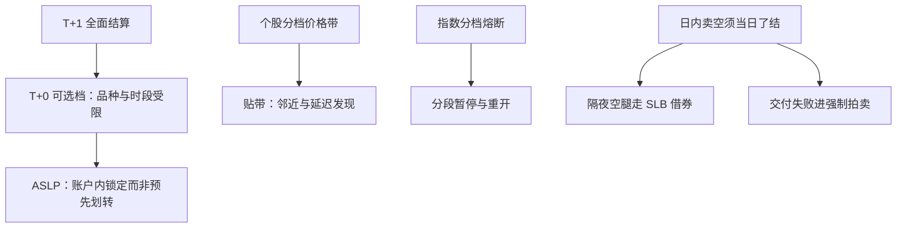

# 印度市场

印度把两件相反的事放在一起：结算周期跑到全球最前，价格限制与交付纪律却是最老式的一档——资金效率与失败惩罚绑在同一笔交易上，制度在这里不是背景板而是现金流。

<footer>—— 据 SEBI 与 NSE / BSE 公开规则（结算周期、T+0 可选框架、交付失败拍卖）整理</footer>

[上一课](/quant/gm-hongkong)把港股的账算到税费与通道。印度把这个方向推到底：现金市场全面 T+1 结算、再向品种受限的 T+0 可选档推进，同时保留个股价格带、指数分档熔断与交付失败的强制拍卖。两件事相乘，策略的可行集由「合规纪律」逐日决定。本课写印度的结算、限制与卖空三件套。

## 问题

第一缺口是结算周期对资金与操作链的含义：T+1 把信用敞口窗口压到一天，全球最短的结算周期之一意味着保证金与资本效率上升，但对账、公司行动、跨境托管的处理窗口同步压缩——后链跟不上，前台的周期红利会被失败率吃掉。T+0 可选档进一步把「成交与结算同日」变成现实，但品种与时段受限，且预资金问题换了一种形态：资金不再提前划给券商，而是在投资者账户内被锁定（ASLP 一类的锁定机制），结算时才动用——理解错这个机制，资金占用与可用额度的计算就会错。第二缺口是限制族：个股按分档价格带限价、指数分档熔断，贴带的邻近效应与延迟发现照旧成立。第三缺口是卖空纪律：现金段日内可卖但须当日平结，隔夜卖空走借券（SLB），卖空未交付直接进拍卖补券——不是罚款了事。

交付失败的拍卖纪律是印度制度里最硬的一条：回测里「允许卖空」不等于「卖空可执行」，可执行性要按借券可得性与失败拍卖的价格惩罚建模——按权利建模、按纪律受罚，是印度空腿的经典死法。

## 方法

清单四项。场所与结构：NSE 与 BSE 并存、NSE 在指数衍生品上占绝对主导，衍生品与现金段的约束分开归档。结算与资金：按 T+1 为基线、T+0 档为特例建模；资金模型用「锁定非划转」口径，额度管理按锁定余额算。税费：STT 分边分品种（现金与衍生品、交收与日内各档），费后账单独列——它与港股印花税同为换手税，机制放到税课展开。限制与卖空：价格带带值按品种分档且可调整，「带收紧日」当事件处理；贴带邻近作为状态进入特征与风控，处理方式与[涨跌停邻近效应](/quant/cn-limit-proximity)同族；空腿按 SLB 可得性与拍卖惩罚做可行性过滤。

## 机制

结算周期与交付纪律是一对齿轮。周期缩短的机制收益是信用与占用下降；机制代价是所有后链动作跟着压缩，于是印度策略的真实约束从「资金成本」迁移到「操作纪律」。拍卖机制把失败成本变成价格发现的一部分：拍卖价相对市价的惩罚是空腿成本函数的一项，忽略它的高估收益在压力日集中兑现。价格带与熔断的机制与前面各课同构：贴带截断发现、熔断把流量切到重开——不同点在带值分档且会被调整，制度参数本身有事件性。ASLP 的机制意义是把预资金从「转移」改成「锁定」：占用的是额度而不是余额，日内资金周转的计算口径随之改变。

不这么做会错在哪：把 T+0 档当普通加速器、按「划转」算资金，会在额度上高估可交易规模；把卖空当权利、忽略拍卖惩罚，回测收益会在交付失败集中发生的时段归零。

## 边界

本课不写印度散户衍生品热度的行为解释，不写 FPI 框架下的资本进出细节——跨境通道的摩擦统一放到跨市场套利课。带值、档位、STT 税率与 T+0 档范围都在滚动调整，清单按 SEBI 与交易所当期文本重读。

## 小结

- 印度的对象是「最短结算周期加速度交付纪律」：T+1 全面化、T+0 档受限推进。
- 资金占用按「账户内锁定」口径（ASLP 一类）计算，不是预先划转。
- 价格带分档可调，贴带与熔断按事件与状态处理，邻近效应同族适用。
- 空腿可行性由 SLB 可得性与交付失败拍卖惩罚决定，不是由「允许卖空」决定。
- 出处：SEBI 与 NSE / BSE 公开规则（结算周期、T+0 框架、交付失败拍卖）；价格限制实证传统见 Kim and Rhee, 1997。
