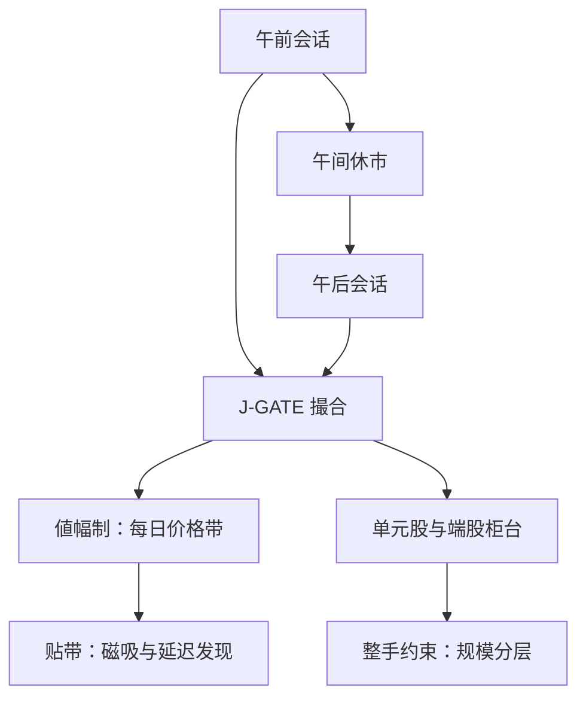
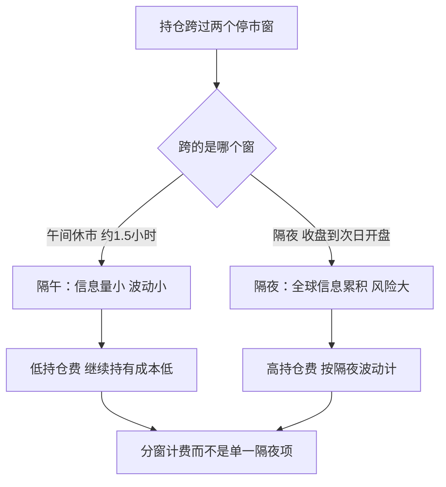

# 日本市场

日本把撮合引擎推到全球最快的一档，又把午间休市、单元股和每日价格带这些老制度原样保留——现代吞吐量与旧参数表住在同一张订单里，迁移策略要同时读两半。

<footer>—— 据 JPX / 东京证券交易所公开交易规则与 J-GATE 技术资料整理</footer>

[上一课](/quant/gm-eu-mifid)写欧洲如何用义务与豁免代替机械保护。日本是另一个方向：几乎没有欧美式的场所碎片化问题——东京证券交易所一家独大，多场所竞争被压到极小——它的难点是把最现代的撮合基础设施与最老的一组制度残余放进同一张参数表。本课写东证的会话、引擎、价格带与卖空约束，沿用前两课的清单口径。

## 问题

在日本落地策略，缺口集中在四个被别处视为「已解决」的假设上。其一，连续性：现货交易分午前与午后两段，中间有午间休市——日内季节性、隔午的量价关系、休市前后的库存处理都按两段重组，把「全天连续」写死的日内模型在午休边界直接失真。其二，股数：单元股制度下多数品种按整手交易，不足单元走券商柜台的风险较少（risk-less principal）撮合——高价股的最小参与金额被整手放大，规模分层与再平衡精度都要按整手重排。其三，价格带：値幅制（每日价格限制）至今在用，价格贴带时的可成交性与发现延迟与涨跌停市场同族。其四，引擎与历史数据：撮合已统一到 J-GATE 家族——衍生品先迁移、现货后迁——吞吐与撮合语义一起换掉，迁移日前后的微观结构统计不可直接混用。

「单元股」给个数字感觉：一只股价 8000 日元的股票若按 100 股一手，最小买一手就是 80 万日元（约几万人民币）；美股同价位可以买 1 股。组合优化若要配 0.3% 的目标权重，可能凑不齐一手，只能取整到 0.5% 或 0——这就是「再平衡颗粒度被整手放大」的含义，不足一手的部分则由券商柜台风险较少地撮合。

引擎迁移把撮合语义与容量一起更换：以迁移日为断点切样本是硬要求；把迁移前测出的撤单率、队列衰减参数直接搬进迁移后，是日本数据里最常见的静默错误。

## 方法

清单法继续，按参数表逐项核对。会话与时钟：按两段会话重写日内季节性与尾盘逻辑，休市时长作为参数入表。tick：按价格带查表，高价股与低价股的价距不同，报价逻辑要按档位切换。价格带：值幅制的带值按品种与价格档给出，贴带邻近状态进入特征与风控——磁吸与延迟发现的实证传统来自东京市场本身（Kim and Rhee, 1997），与 A 股涨跌停的邻近效应同一族逻辑，处理方式可参照[涨跌停邻近效应](/quant/cn-limit-proximity)。卖空：有不得低于最新成交价的卖空价格约束与交付义务，借券可得性决定可执行集。数据侧：东证官方统计、PTS（私设交易系统）份额的口径差异要分开报告，自建包络与官方口径不可混。

「値幅制」可以类比成游乐园的身高线：每天开盘前按昨收价算出一条「今日允许的价格走廊」，价格走到走廊边缘就进不去更远的区间。它和涨跌停的区别是走廊按价格档分档给出（贵一点的股票带宽比例更窄），且具体带值是查表得到的制度参数，不是统一的 10%。

## 机制

四个约束的机制各管一段。午休把「隔夜效应」切成「隔夜」与「隔午」两类：隔午的不确定性远小于隔夜，持有决策的持仓费要分窗计算；混为一个隔夜项会把波动预测的日历写错。整手约束把最小调整量变成价格的函数，高价股的再平衡颗粒度变粗，组合优化的换手成本要加一层取整损失。値幅制作为硬边界截断发现过程：贴带时均衡价可能在带外，次日重开继续走——把带内收盘当均衡价，回测会把配给当成交。J-GATE 的机制意义是场内竞争转向延迟与 PTS：交易所内撮合足够快之后，竞争转移到接入质量与场外系统，份额统计要跟着走。

一天的持仓风险在东京该怎么分窗——隔午与隔夜的不确定性量级不同，这条分窗图回答的是「持仓费为什么要按窗口分别计」：

常见误区：初学者容易把贴带日的收盘价当「市场最终意见」。实际上値幅制贴带时，真实均衡价很可能在带外，买卖被制度配给了——收盘价只是「带内能成交的价格」。把配给当成交写进回测，策略在贴带日的绩效会系统性失真。

不这么做会错在哪：把美国式「连续、碎股、无价格带」的假设整体搬进日本，四个假设同时失效而表面指标正常——最危险的一类迁移错误。

## 边界

本课不写日股的因子与公司治理专题，不写 PTS 的内部撮合细节。带值、时段与整手的具体参数以 JPX 当期规则为准——这套制度处于渐进改革中（整手品种逐步放开、时段延长），清单必须带日期重读。结算周期与后链放到清算结算课统一对照。

## 小结

- 日本的对象是「快引擎加旧参数表」：午休、整手、値幅制与 J-GATE 共存。
- 日内结构按两段会话重写，隔夜与隔午分开计持仓费。
- 值幅制贴带状态是特征与风控项，带内收盘不等于均衡价。
- 卖空受价格约束与交付义务限制，可执行集由借券可得性决定。
- 引擎迁移日是硬断点，迁移前的微观结构参数不得静默沿用。
- 出处：JPX / 东证公开交易规则与 J-GATE 资料；Kim and Rhee, *Journal of Finance*, 1997（东京价格限制与价格发现）。
