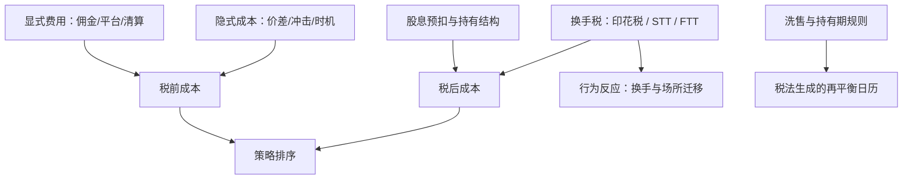

# 税与交易成本

价差是市场给的，税是设计出来的：交易税的目的本来就是改变行为——所以把它当价差的加法项建模是错的，它改变的是换手、持有期与场所选择本身。

<footer>—— 据 Umlauf, Journal of Finance, 1993；Campbell and Froot, 1994 的交易税实证传统整理</footer>

[上一课](/quant/gm-clearing-settlement)把成交之后的链条写成制度常量。本课把账单写全：显式费用（佣金、平台、清算）与隐式成本（价差、冲击、时机）在执行课程的 TCA 口径里已处理；剩下的最大一笔是税——它在不同市场取完全不同的形态，且只对行为起作用。本课写税作为成本与约束的机制，继续机制单元的对照口径。

## 问题

同一策略在五个市场的排序可以仅因税不同而翻转：港股与 A 股的印花税按边计征，印度 STT 分边分品种，英国在买入侧征千分之五量级的印花税，法国意大利有大额股的金融交易税，美国没有联邦交易税但有监管费转嫁——同时美国税法用三十天洗售规则惩罚「卖出后买回」，税损收割的日历由税法生成。缺口在于成本模型普遍把税写成常数项：一笔按边比例的换手税，乘上换手率就完事。这漏掉两层：其一，税改变均衡——交易税提高后成交量下降、活动迁往免税场所或品种（瑞典交易税把成交推走是经典案例，Umlauf 1993；多国比较见 Campbell and Froot 1994）；其二，税改变日历——洗售与持有期规则直接生成最优再平衡的时点集。只算比例不算行为，税后排序就是错的。

比较策略变体时必须报税前与税后两列：高换手变体在无交易税样本里领先，加上双边印花税后排序可以整体翻转——把税前列当结论，迁移到港股或印度的第一天就会发现方向反了。

## 方法

把税写进成本模型的三层。第一层是换手税：逐边逐品种归档税率与计税基础（成交额或差价），进入每笔交易的事后会计——与 maker-taker 的处理一样，税后的经济账才用于场所与策略比较（[maker-taker](/quant/maker-taker)）。第二层是规则税：洗售窗口、持有期档位、损失抵扣限制写成状态机，输出「哪些再平衡时点会被税务惩罚」的日历；税损收割策略的收益上限由这个日历决定，不由信号决定。第三层是预扣与持有结构：股息预扣税率按持券结构与税收协定归档，跨境持券的国别选择部分由预扣决定。三层都按当期税则归档并带日期——税则是本课程里变动最频繁的参数。

## 机制

税的行为机制走两条路。价格路径：交易税抬高做市的库存持有成本，报价进价差、深度收缩——税的一部分由流动性消费者以更宽的价差支付，所以「只对卖方征税」从来不是只由卖方承担。数量路径：高换手策略对税的弹性最大，边际信号被税吃掉后退出交易，市场活动向免税场所与品种迁移；成交量本身因此是税制的结果变量，跨市场比较成交量时要把税制当解释变量。港股印花税先调高后调减提供了少见的双向自然实验窗口：调高后换手敏感品种的活动收缩、调减后回补——方向与弹性都可检验。洗售规则的机制更直接：它把「成本」变成「可行时点集」，约束优化里的日历约束比费率参数更硬。不这么做会错在哪：把税当常数，会同时错三件事——费后排序、容量估计（税后可交易的边际信号变少）、以及税损策略的日历。

## 边界

本课口径是「税作为成本与约束」，不是税务筹划与合规意见；个人报税、预扣返还流程、机构税收居民身份问题不写。税率、窗口与档位以各税区当期文本为准，清单随日期失效。税与费用对做市库存模型的具体耦合，在做市课程已处理的不重复。

## 小结

- 税不是价差的加法项：它通过行为改变换手、深度与场所选择。
- 成本模型分三层：换手税入笔账、规则税生成日历、预扣决定持有结构。
- 报告税前与税后两列排序；换手敏感策略的排序可以因双边印花税整体翻转。
- 洗售与持有期规则把成本写成状态机，税损收割的上限由税法日历决定。
- 出处：Umlauf, *Journal of Finance*, 1993（瑞典）；Campbell and Froot, 1994（多国比较）；Pomeranets and Weaver 对多伦多交易税的实证；各税区公开税则口径。
