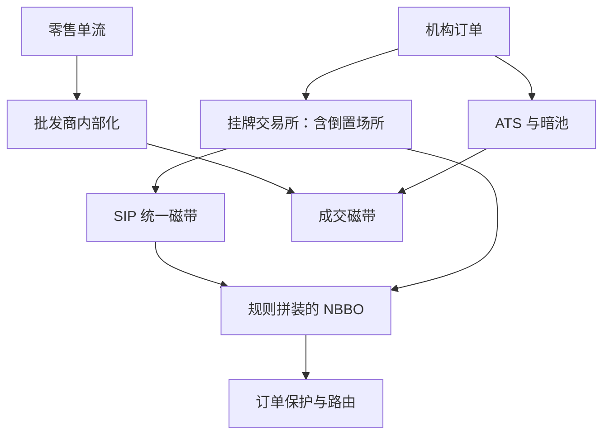
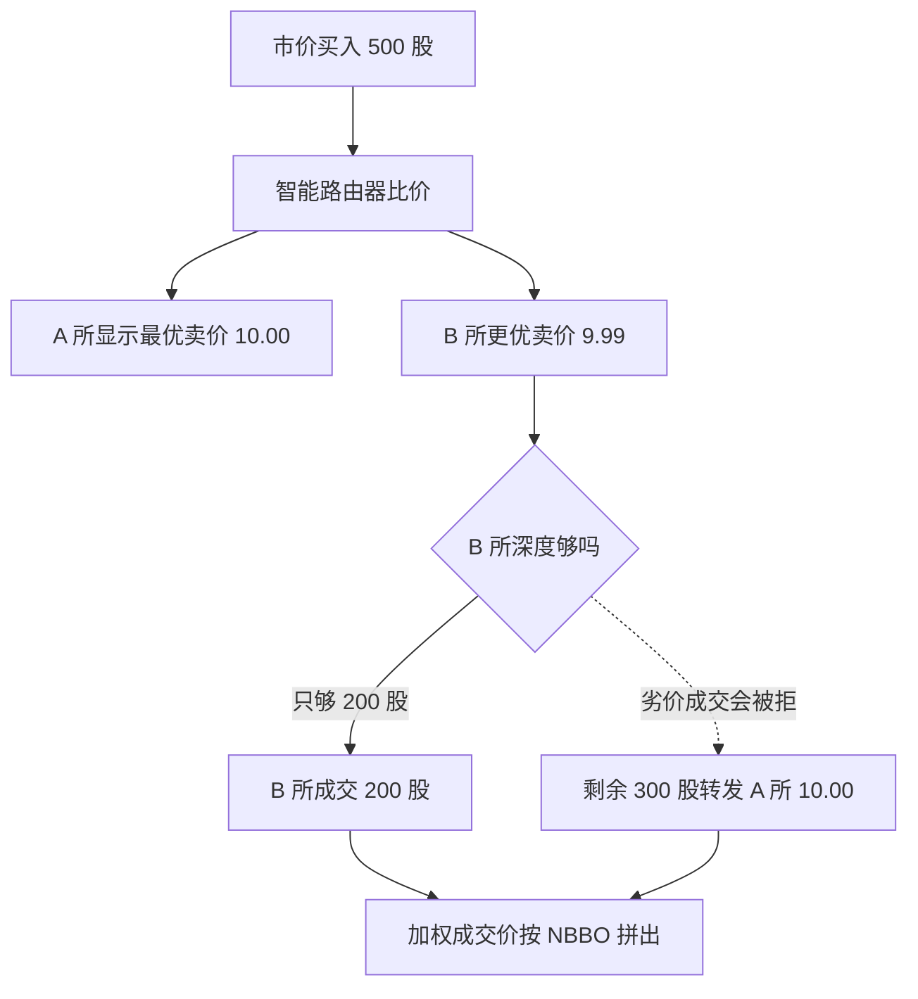

# 美国市场结构

美国股票市场的碎片化不是失灵而是设计：十几张簿在价格上竞争、在深度上拆分，再由一条规则把保护报价拼成一个全国最优——理解市场先理解这条规则。

<footer>—— 据 Reg NMS 公开规则；Angel, Harris and Spatt, Equity Trading in the 21st Century, 2010/2015 整理</footer>

[上一课](/quant/alt-case-map)把另类数据工程的案例与失败收进一张复盘单：判据先行、放弃归档，学费才有分母。数据工程收住之后，「全球市场制度对照」换一个对象：不问信号在哪，问交易发生在什么规则之下。本课程默认你已读过[市场分割与 NBBO](/quant/market-fragmentation) 的拼装逻辑与 [maker-taker 费用](/quant/maker-taker)的经济账；本课把美国收成第一个完整制度样本，后五课各接一个市场，最后四课抽机制。

## 问题

策略落地第一个问题不是信号而是簿：你下单的那张簿受哪套规则保护。美国把这个问题推到极致——同一家公司的股票同时在多家注册交易所、若干 ATS（暗池）与批发商的内部化账本里交易。Reg NMS 的订单保护规定：以劣于保护报价的价格成交会被拒绝或转发，分散的报价因此被拼成 NBBO 这个「规则的输出」。缺口不在拼装（前课已写），而在分层：挂牌所之间的倒置与费率分层、展示簿与暗池的份额分配、零售单流经内部化不进公开簿。把「美国」当一张簿来迁移策略，误差几乎全部来自把分层当成了同质。

「内部化」翻译成白话：批发商（通常是大型做市商）向券商买下零售订单流，在自己账本里当你的对手，不送去交易所公开撮合。券商拿的是订单流付款（PFOF）或「零佣金」的卖点，批发商赌的是零售单信息含量低、比在公开簿接单更赚——这桩生意的成本，最终摊在公开簿里剩下的机构订单头上。

分层把收益与代价绑在一起：价格竞争压窄保护价差，深度却被拆进多条队列，时间优先只在单个场所内成立；订单流成分因内部化而改变，展示簿上的逆向选择随之重排。只看 NBBO 宽度，读不出这套系统的真实成本。

「NBBO 内成交」不等于按全国最优成交：零股、中点协议与暗池内部成交都在保护报价之外——把所有簿内成交当规则违反，或反过来把保护当成必然最优，两种读法都错。

## 方法

部署前列一张结构清单，逐项与规则文本对齐。其一，场所与费用：把每个场所的费率表归档，倒置场所把回扣付给 taker，最窄的展示价未必是最便宜的场所，比较要加回费用再排（[maker-taker](/quant/maker-taker) 的经济价差口径）。其二，订单保护边界：保护只覆盖可见的保护报价，路由仿真要为转发延迟付费，否则实施缺口被低估。其三，数据层：SIP 是监管参照、直连是交易参照，两套「最优」在延迟差里短暂分叉，研究必须声明用哪一套。其四，熔断与做空：个股波动熔断与市场级分档熔断构成状态机，做空有借券与价格规则约束——它们改变可成交集，不是装饰。

数字实例：SIP 的合并报价通常比交易所直连馈送慢几毫秒量级。对毫秒级策略，这几毫秒里可能已经发生了成交与撤单——你从 SIP 看到「9.99 有卖单」，到了直连的现实中那个价位早被吃掉。这就是「SIP 是参照、直连是交易」的算术含义：两个口径的最优价在延迟窗里并不相等。

## 机制

订单保护的机制效果是「价格上统一、深度上分治」。竞争把各场所的保护报价压到彼此相等，于是场所间剩下可竞争的维度只有回扣、队列位置与撮合概率；做市资本从价差转向费用与排队，队列位置因此成为做市收益的一阶项。内部化的机制效果是订单流分层：零售流可预测性低、逆向选择轻，批发商愿意为它付钱，展示簿剩下的流更毒——同样宽的价差，含义完全不同。熔断的机制效果是把极端波动从连续撮合切进暂停与重开：重开质量取决于暂停期信息在别处（衍生品市场）积累多少，这与本课程后面竞价各课共享同一套逻辑。

一张限价单在保护规则下如何被「拒绝—转发」、最终按 NBBO 成交，这条路由链回答的是「全国最优价为什么是拼出来的」：

直觉类比：订单保护像商场的「全网最低价匹配」承诺——你走进任何一家分店，店员都不能按高于别家的标价卖给你，必须把订单「转发」到标价最低的那家。但它只匹配「标价」（保护报价），不保证那家店有货（深度），所以大单仍可能拆成几段、在不同店按不同队列等。

不这么做会错在哪：回测若用展示价差估成本，会同时漏掉回扣、taker 费与转发延迟三笔账；风控若把各场所深度加总当深度，会忽略时间优先只在场所内成立的排队现实。

## 边界

本课不写执行算法与 TCA 细节（执行课程已写），不重推 NBBO 拼装的技术口径（附录对象）。欧洲不是这套制度的近亲：没有订单保护、没有单一磁带，用的是最佳执行义务与透明度豁免，下一课单独写。也不要把美股的碎片化统计搬到 A 股——A 股连续时段基本是单一撮合，制度对象不同，[市场分割与 NBBO](/quant/market-fragmentation) 已把这条边界写明。

## 小结

- 美国市场结构的对象是分层：交易所、ATS、内部化三层，NBBO 只是规则拼装的参照。
- 订单保护统一了价格、没有统一深度；时间优先、排队与回扣是场所间剩下的竞争维度。
- 数据必须分声明参照：SIP 是监管口径，直连是交易口径，两者在延迟差里分叉。
- 熔断与做空规则改变可成交集，回测要按状态机处理，不是事后过滤。
- 出处：Reg NMS 公开规则；Angel, Harris and Spatt, *Equity Trading in the 21st Century*, 2010/2015；O'Hara and Ye, *Journal of Financial Economics*, 2011。
