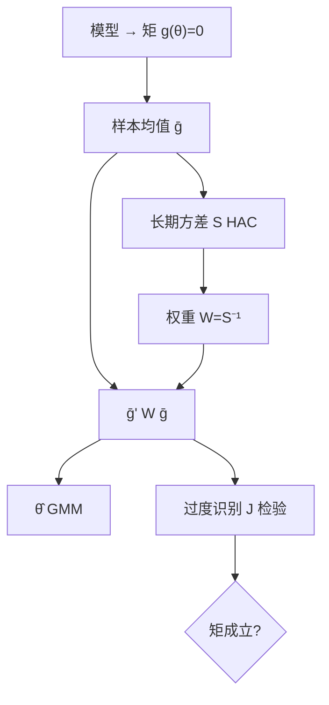

# GMM 与资产定价检验

把模型写成一束正交条件，用这些条件的样本均值去匹配零，再按条件的长期协方差加权；过度识别的距离本身就是检验。

<footer>—— Hansen, Large Sample Properties of Generalized Method of Moments Estimators, Econometrica, 1982</footer>

[上一课](/quant/long-horizon-overlap)指出 $h$ 期重叠收益让独立信息大约降到 $T/h$，必须用 Hansen–Hodrick 或 Newey–West。重叠回归已经是一个矩 $E[u_{t,h}x_t]=0$。资产定价把矩写成随机折现因子 $E[m_{t+1}R_{t+1}^e]=0$，或线性因子的 $E[R^e]=\beta\lambda$。Hansen 的 GMM 一次给出参数、HAC 式权重、以及过度识别的 $J$ 检验。本课缺口：在 [Fama–MacBeth](/quant/fama-macbeth) 与 [GRS](/quant/grs-test) 之后，用同一套正交条件做估计与检验。不重推重叠窗口的 HAC 滞后。下一课 HJ 距离是这套矩的定价误差范数。

## 问题

参数 $\theta$（因子溢价、SDF 系数、效用参数）满足 $E[g(w_t,\theta)]=0$。样本均值 $\bar g(\theta)$，GMM 最小化 $\bar g^\top W\bar g$。最优 $W=S^{-1}$，$S$ 是 $g_t$ 的长期方差——正是 Newey–West 要估的对象。过度识别时，$\min J$ 渐近 $\chi^2$，检验模型是否被矩拒绝。

问题是：资产多、矩多时 $S$ 估不稳，最优 GMM 有限样本差；一阶段 $W=I$ 稳但无效。资产定价常用两阶段或连续更新（CUE）。对象是**矩是否成立**，不是截面 $R^2$。

### 与 FM、GRS 的翻译

线性因子、可交易因子：时间序列 $E[\varepsilon_{it}]=0$、$E[\varepsilon_{it}f_t]=0$ 加上定价 $E[R_i]=\beta_i^\top\lambda$。GMM 把 FM 两步收成一块，并自动加 Shanken 一类生成回归量修正（若把 $\beta$ 也当参数）。因子是超额收益时，$\lambda=E[f]$ 是约束，GRS 是正态有限样本版本，GMM $J$ 是渐近版本。两者应同向；只报好看的那一个是选择报告。

Hansen 的 $J$ 拒绝，说的是矩不成立，不是「哪个因子坏」。过度识别把所有资产的定价误差捆在一起。要看谁坏，应看定价误差向量或其 HJ 距离分解。

## 方法

**估计。** 选 $g$：欧拉 $m(\theta)R^e$、或 beta 表示的误差。$S$ 用 Newey–West，带宽与收益重叠一致。连续更新让 $W$ 依赖 $\theta$，小样本有时更好，数值更脆。资产 $N$ 相对 $T$ 大时，应减资产（组合）或用因子模型压缩，否则 $S$ 不可逆。

**标准误。** 三明治形式，已经含 HAC。聚类：若用个股面板矩，按时间聚类对应同期相关，与 FM 同一逻辑。不要对 GMM 再「只开 White」。

**弱识别。** 因子若几乎不驱动检验资产，定价矩对 $\lambda$ 平坦，GMM 像弱工具。应看第一阶段式的因子波动与 $\beta$ 的联合，而不是只看 $J$ 没拒绝（弱时 $J$ 也没功效）。

### 消费欧拉与因子 SDF

Hansen–Singleton 的幂效用消费欧拉，矩弱、资产少时已经难估；加股票、债券后常被 $J$ 拒绝。这是模型失败，不是 GMM 失败。线性 SDF $m=1-b^\top f$ 把同一装置用在可观测因子上，与 [CAPM](/quant/capm) 的 beta 表示对偶。报告 $b$ 与 $\lambda$ 的换算，避免两套系数各说各话。

## 机制

GMM 是 M 估计：解 $\partial\bar g^\top W\bar g/\partial\theta=0$。最优 $W$ 把信息多的矩（噪声小的正交条件）加权更大。$J$ 是加权定价误差的范数：模型真则 $\sqrt{T}\bar g$ 的二次型 $\to\chi^2$；模型假则 $J$ 随 $T$ 涨。机制上，**检验与估计共用同一 $S$**，所以 $S$ 估错会同时弄坏点和检验——小样本里这是 GMM 的主风险。

与 OLS+HAC：恰好识别、线性、矩就是 $x u$ 时，GMM 退回 OLS，方差退回 Newey–West。资产定价的价值在过度识别：额外资产是额外矩，用来检验而不是只用来估。

权重矩阵 $W$ 改变的是有效性与 $J$ 的度量，不改变恰好识别时的点。过度识别时，不同 $W$ 给出不同 $\hat\theta$——你在用哪组资产的误差去定义「最小」。须声明 $W$。

### 有限样本纪律

$N=25$ 组合、$T=600$ 月、滞后 12 的 $S$ 很大。仿真（用因子模型抽收益再估）应作为 $J$ 的校正，尤其因子数 $K$ 增加时。Lewellen–Nagel–Shanken 批评：用因子自己排序的组合做矩，GMM 会「通过」。检验资产须含模型外组合。

## 边界与工程取舍

非线性 SDF、习惯、递归偏好，GMM 对初值敏感，应多起点。矩条件用水平还是用工具（滞后消费、滞后收益）会改变识别，弱工具问题从 IV 课原样进来。高频矩（已实现量）的 $S$ 有微观结构，不要把日频 HAC 套在 tick 矩上。

工程：先 FM/GRS 看经济幅度，再 GMM 报联合 $J$ 与稳健 $\lambda$；检验资产预登记。不要用 $N\gt T$ 的个股矩做最优 GMM。不要把 $J$ 的 p=0.06 写成模型成立。下一课把定价误差用 Hansen–Jagannathan 的范数再量一次。

## 小结

- Hansen GMM 用正交条件同时做估计与过度识别检验；最优权重是得分的长期方差之逆。
- 线性因子下它统一 FM 与定价误差，GRS 是可交易因子、正态残差时的有限样本亲戚。
- $S$ 不稳、弱识别、用自家排序组合当矩，都会让 $J$ 失去意义。
- 恰好识别时 GMM 退回 OLS+HAC；价值在额外资产提供的检验。
- 出处：Hansen, *Econometrica*, 1982；欧拉应用见 Hansen and Singleton, *Econometrica*, 1982；资产定价教科书表述见 Cochrane。
