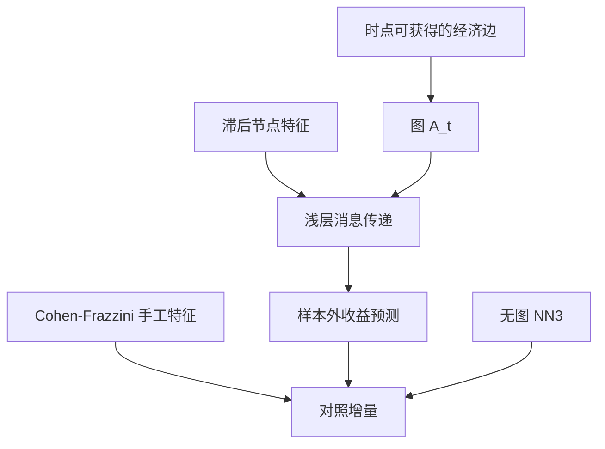

# GNN 资产定价

客户与供应商的真实经济联系，使一家公司的股票收益可以预测其贸易伙伴随后的收益；图神经网络把「沿边传递」写成可学习的消息，但不能替代边必须在信号日可获得这一条。

<footer>—— 经济联系见 Cohen and Frazzini, Journal of Finance, 2008；消息传递的网络原语见 Kipf and Welling, ICLR 2017</footer>

截面模型通常把股票当成条件独立的样本，最多用行业哑变量吸收共动。生产网络文献表明，冲击沿客户–供应商边传播：Cohen 与 Frazzini（2008）发现客户收益预测供应商随后收益；Menzly 与 Ozbas（2010）用投入产出表得到更宽的跨行业可预测性；Herskovic（2018）把网络集中度写成风险因子。图神经网络（GNN）用邻居聚合把同一张图送进可训练的层，Kipf 与 Welling 的图卷积、Veličković 等人的图注意力是常用内核。资产定价要问的不是能否在会议上把预测误差再压一点，而是：**消息传递是否只使用时点图与滞后特征，以及传递的是风险、有限注意，还是泄漏。** 边的经济学见[供应链与货运](/quant/supply-chain-alt)与[供应链网络因子](/quant/supply-chain-graph-factor)；预测协议见 [GKX](/quant/gkx-nn3)。

## 问题

表格模型的设计矩阵是 $N\times p$，行之间独立。图模型多了一个邻接 $A_t$（或边权 $W_t$）：节点 $i$ 的表示依赖 $\{j: (j,i)\in E_t\}$ 的表示。这一依赖是经济上的优点（客户信息进入供应商），也是计量上的陷阱：若 $A_t$ 用了期末才披露的年报大客户、或用了同期收益来定义「相似公司」，GNN 的增益来自[前视](/quant/look-ahead-bias)。许多计算机会议上的股票 GNN 用未来窗口的相关或用全样本图，那不是资产定价复制。

第二句话是识别。消息传递可以逼近 Cohen–Frazzini 的滞后客户收益，也可以逼近行业动量的平滑版。若不做「去掉同行业边」「只用新披露客户」这类对照，GNN 相对 MLP 的增量 $R^2$ 无法对应到哪一种边。Herskovic 的网络因子关心系统性拓扑风险，不是单边滞后；把两种回归的左边混用，会把风险溢价写成 alpha。

### 消息传递不是无条件的信息共享

一层图卷积大致是 $\tilde x_i=\sigma\bigl(\sum_j \tilde A_{ij} W x_j\bigr)$。堆多层等于把 $k$ 步邻居的特征混进来。金融图往往稀疏且有向（客户 → 供应商），还有极高中心度的节点（大型零售或平台）。过深的层会把全市场平均灌进每一个节点，GNN 退化成带平滑的市场因子，NN3 式的表格模型已经能做。有用的深度通常很浅：一到两阶邻居，对应 Cohen–Frazzini 的直接贸易伙伴，而不是六度分隔。

用收益相关性当边，图会随估计窗口里的共同因子而变；压力期相关上升，图变密，模型在最需要稳健时最不稳。经济边（披露的客户、IO 表）慢，但可审计。相关图必须滞后到 $t-1$ 且做行业中性，否则就是在平滑同期收益。

## 方法

**图。** 在每个再平衡日 $t$，只用当时可获得的边：年报客户关系加上法定滞后期，或滞后的 IO 表。边权可用销售占比。禁止用 $t$ 期收益、用测试年才出现的供应链数据商 vintage 而不做回溯。节点特征与 GKX 表对齐：滞后、截面 rank。标签仍是未来收益，时间切分与 purge 与表格模型相同。

**模型。** 基线必须包括：无图的 [NN3 / 弹性网](/quant/gkx-nn3)、Cohen–Frazzini 式客户动量（手工图特征）、再加 GNN。GNN 赢手工特征，才说明可学习的聚合有增量；只赢无图 MLP，可能只是在重新发现客户动量。图注意力（GAT）会给邻居打分：应检查高权重边是否与销售占比一致，若总是指向最大市值节点，模型在学规模，应先做[市值中性](/quant/size-neutral)。

**评价。** 样本外 $R^2$、IC、分位组合，外加：去掉同行业边后的增量、发表后或产品化后的衰减（与[指增衰减](/quant/index-enhancement-decay)同一逻辑）、以及边稀疏年份的稳定性。Avramov–Cheng–Metzker 的可交易约束同样适用：小供应商往往正是图上信息多、流动性差的节点。

### 泄漏的三种典型写法

其一，全样本构建一张静态图，再用滚动收益训练——拓扑含未来并购与披露。其二，无向化有向贸易边，把供应商信息立刻送回客户，识别从「客户领先」变成互相平滑。其三，在图上做半监督标签传播时混入了测试节点的标签。这三种都会让 GNN 看起来碾压 GKX。修复是工程而不是新架构：图的 vintage、方向、以及节点集合必须进入信息集 $\mathcal{F}_t$。

## 机制

有限注意：分析师按行业而不是按客户名单覆盖，客户盈余传到供应商需要时间，GNN 的第一层可以学习这个滞后核。风险：中心节点的特质冲击不抵消（Acemoglu 等），消息传递把系统性网络暴露写进节点嵌入，这时嵌入应进入协方差与风险预算，而不是只进多空排序。误定价：若市场已把边写进 ETF 与风险模型，滞后缩短，GNN 的增量应下降——这是可证伪的。

与[条件自动编码器](/quant/autoencoder-factor-model)的关系：自动编码器用表格特征生成 $\beta$，GNN 用邻居特征生成 $\beta$。可以把邻居聚合当作 $\beta(z_i,\{z_j\})$ 的一部分，再抽潜因子；那是图版的条件因子模型。若只做节点级预测而不抽 $f_t$，仍停留在 GKX 的预测问题。两种目标不要混报成一个「GNN 定价」数字。

中心节点在反向传播里梯度大，模型容易变成「跟着几家核心公司走」。应报告去掉最大度节点后的样本外表现；若增益消失，学到的是系统重要性，不是沿边的可交易滞后。

### 中国披露与边的生存偏差

A 股大客户附注有截断、重组与壳，边的生存偏差大于 Compustat 客户文件。用当年年报解释当年收益是前视；用上市后才出现的完整供应链回填历史，是另一类前视。GNN 不能修复边的质量，只会放大错误边。宁可稀疏且滞后，不要密且脏。

## 边界与工程取舍

不要把会议论文的预测准确率直接写成资产定价发现。不要用日频相关图去「增强」月频 GKX 特征而不做泄漏审计。不要堆很深的 GNN。可做的是：锁 vintage、浅层、强制对照手工图因子、把中心度暴露交给风险模型。图注意力的权重应可导出、可按年稳定，否则不能进投资过程。

出处：Cohen and Frazzini, *JF*, 2008；Menzly and Ozbas, *JF*, 2010；Herskovic, *JF*, 2018；Acemoglu, Carvalho, Ozdaglar and Tahbaz-Salehi, *Econometrica*, 2012；Kipf and Welling, ICLR 2017；Veličković et al., ICLR 2018；Gu, Kelly and Xiu, *RFS*, 2020。计算机文献提供层，不提供信息集。

## 小结

- GNN 把贸易网络上的消息传递参数化；经济识别仍建立在 Cohen–Frazzini 一类时点边上。
- 必须对照无图 NN3 与手工客户动量；否则增量可能只是行业平滑或规模。
- 图的 vintage、方向与深度是泄漏与过平滑的主要来源。
- 中心度更像风险，单边滞后更像有限注意；评价要能分开。
- 出处：Cohen–Frazzini, *JF*, 2008；Herskovic, *JF*, 2018；Kipf–Welling, 2017；Gu–Kelly–Xiu, *RFS*, 2020。
