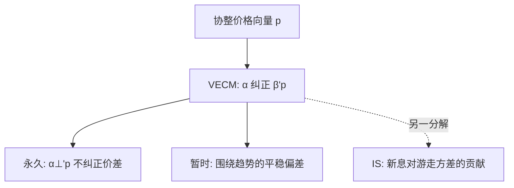

# Gonzalo–Granger 永久成分

协整系统里的价格可以拆成共同的永久趋势与各自的暂时误差。永久成分由对误差修正不反应的线性组合驱动——谁不纠正价差，谁就在定义有效价格。

<footer>—— Gonzalo and Granger, Estimation of Common Long-Memory Components in Cointegrated Systems, Journal of Business & Economic Statistics, 1995</footer>

[Hasbrouck VAR](/quant/hasbrouck-var)在单一市场上把成交新息的长期乘数叫做信息含量。缺口是：多条价格已经协整时，永久趋势本身怎么从水平变量里构造出来？Gonzalo 与 Granger（1995）给出共同长期记忆成分（PT 分解）：永久部分是对误差修正项权重为零的组合。主干[信息份额](/quant/hasbrouck-is)已经把 PT 与 IS 对照过；本课把 PT 写清，并说明它回答的是「谁跟随谁」，不是「谁贡献了随机游走方差」。

## 问题

两个市场交易同一索取权，$p_t=(p_{1t},p_{2t})'$ 协整，$\beta'p_t$ 平稳。每个价格 = 共同有效价格 + 暂时偏差。有效价格要可估计，必须指定分解。Hasbrouck 信息份额用新息对随机游走**方差**的贡献；那依赖新息相关时的变量顺序。Gonzalo–Granger 问另一句：误差修正系数向量 $\alpha$ 的正交补 $\alpha_\perp$ 所定义的组合 $\alpha_\perp' p_t$，是否就是共同趋势。这个组合对价差不反应——它走出价差，别人来纠正。

若只做 Hasbrouck 单市场 VAR，没有第二条价格，就谈不上 $\alpha_\perp$。本课默认已经有协整的价格向量：跨市场报价、现货与期货、或成交价与报价中点。

### PT 与 IS 不是 rival 的同一数字

Baillie、Booth、Tse、Zabotina 以及 Harris、McInish、Wood 的讨论表明：IS 依赖新息相关的正交化，PT 权重不依赖那一层。两者可以给出不同排序：一个市场噪声大但先动，IS 高、PT 权重低。不要把 PT 权重叫做信息份额，也不要在论文里只报一个。

Hasbrouck（1995）自己讨论了与永久–暂时分解的关系。本课补 GG 的构造，避免在信息份额课里把两套代数搅在一起。

## 方法

VECM：

$$
\Delta p_t = \alpha \beta' p_{t-1} + \sum \Gamma_i \Delta p_{t-i} + \varepsilon_t.
$$

$\alpha$ 是误差修正速度。Gonzalo–Granger 永久成分为 $f_t=\alpha_\perp' p_t$（正规化后），暂时成分为与 $\beta$ 方向相关的平稳部分。$\alpha_\perp$ 的经济含义：对价差调整最不敏感的市场，在永久成分里权重大——它「不跟随」，别人跟随它。

估计：Johansen 得到 $(\hat\alpha,\hat\beta)$，再算 $\hat\alpha_\perp$。推断要考虑协整秩与滞后。两个市场时，PT 权重是标量对，和为正规化常数。

### 从成交-报价 VAR 到水平协整

Hasbrouck（1991）多用差分后的 $r_t$ 与 $q_t$，不估计共同趋势水平。若把中点与成交价都当 $I(1)$ 水平放入 VECM，PT 可以问：成交价是否比报价更「永久」。这与单市场信息含量互补：一个看交易新息的长期乘数，一个看哪条价格序列在定义趋势。

## 机制

误差修正是「谁去消除套利」。若市场 1 的报价几乎不因价差而改，市场 2 频繁把价差拉回去，则市场 1 定义趋势。这在经济上像价格发现的领导权，但领导权是对**水平调整**而言，不是对方差贡献而言。噪声很大的领导市场仍可能在 IS 上被稀释，因为随机游走新息的方差分解把相关噪声算进去。

与 Grossman–Miller 对照：暂时成分可以是库存压力；PT 把它从共同趋势里拿掉，但不命名。与 Kyle 对照：共同趋势才是被写入的 $V$ 的代理，暂时成分不是知情交易的目标。

## 边界

协整秩、线性、常 $\alpha$，在结构断裂（切换主导市场、涨跌停）时失效。高频噪声使水平变量的单位根检验脆弱，许多应用改在一秒或更粗采样上做。PT 权重不是交易策略信号：跟随「永久成分」仍可能付价差与滑点。三个以上市场时 $\alpha_\perp$ 的基底不唯一，正规化必须事先说清。

不要用 PT 权重去给交易所排名做广告。样本时段、是否用中点还是成交、是否含零股，都会改 $\alpha$。

## 小结

- Gonzalo–Granger 用 $\alpha_\perp'p$ 构造协整系统的共同永久成分：不纠正价差的组合定义趋势。
- 信息份额分解的是随机游走新息方差；PT 分解的是水平调整的领导权。两者可排序不同。
- 单市场成交–报价 VAR 的永久乘数与跨市场 PT 是不同问题。
- 出处：Gonzalo and Granger, *Journal of Business & Economic Statistics*, 1995；对照 Hasbrouck, *Journal of Finance*, 1995。
