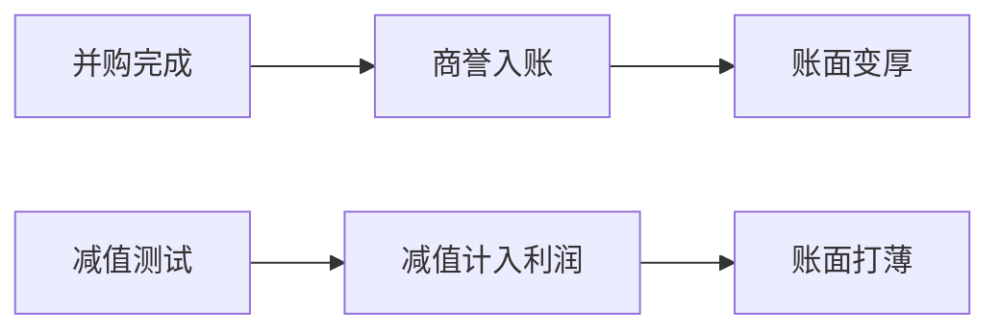

# 商誉与减值

外购商誉先把并购溢价记成资产；减值再一次性打回利润。价值与质量因子会在并购年变「厚」、在减值年变「差」。

<footer>—— 据 SFAS 142 / IAS 36 的减值逻辑；Penman 对收购会计与商誉的讨论整理</footer>

上一课[回购与分红](/quant/buyback-dividend)处理的是内部资本退出。并购是相反方向：现金或股份出去，账上出现商誉。上一课[账面价值与无形资产](/quant/book-intangibles)已指出外购商誉进账面、自制品牌不进。本课补商誉的后续计量：不摊销而减值时，利润与账面如何一起跳，以及回测如何避免用后来的减值去改写并购当年的质量。

## 问题

并购完成日，购买价超过可辨认净资产公允价值的部分记入商誉，账面立刻变厚，应计与资产增速一起变大。之后若测试认为可回收金额低于账面，减值计入当期利润，质量与盈利因子在减值年变差。若用 restated 表把减值追溯调到并购年，等于用后来才承认的失败去重写当时可交易的厚账面。缺口是把商誉当成**带事件日期的估计资产**，而不是永恒的经济品牌。

### 减值不是经营亏损的平滑版

经营亏损逐期发生；减值是估计的一次性向下修正，常滞后于经济恶化。把减值加回利润「看经常性盈利」有时合理，但若同时保留减值前的厚账面去做价值，就会一边当利润是暂时的、一边当资产是永久的。加回必须在利润与账面两侧同时声明，不能只美化盈利因子。

SFAS 142 之后美国商誉不再定期摊销，改为至少年度减值测试。摊销时代与减值时代的时间序列不可直接拼接成同一个质量因子。

## 方法

PIT 规则：并购完成且报表披露后，商誉进入账面；减值只在公告减值的那个期间进入利润与资产，不回写以前期间。因子若使用「减值前利润」，要同步提供「减值前账面」或把商誉从账面剔除，否则分子分母不配对。当时宇宙仍含后来因并购失败而退市的公司。

识别上，现金流量表与附注的减值行比利润表「特别项目」更稳。可用日期用减值公告或季报公告，不是审计报告日后的 vendor 修订日。

减值测试滞后于价格：市场往往先把收购方打下去，会计随后确认。回测若在减值公告前就用后来的减值金额调薄账面，价值因子会在下跌已经发生后才显得「更便宜是假的」——这是用未来会计解释过去价格。正确顺序是：当时厚账面参与当时排序，减值只进入公告期的利润与资产，两边都走可用日期。

## 机制

商誉让价值因子在收购方一侧机械变「便宜」（账面升、若市场尚未完全消化则账面市值升），让投资/资产增长因子变「高投资」。减值年则制造巨大的负盈利与负应计。市场往往在减值公告前已下跌，于是质量空头会看起来能预测减值——其中一块其实是价格已经反映的滞后会计确认。事件课会把业绩公告当窗口；减值公告是同类事件，只是科目更极端。

用后来的减值回填并购年账面，是典型的 restated 前视：当时交易者拿到的是厚账面，不是已经被打薄的终局账面。

并购完成日之后，商誉按当时报表进入账面与资产增长；减值只在减值公告所属期进入利润。复制投资因子时，把「含商誉资产增长」与「剔商誉资产增长」并排，避免把收购会计当成 capex。若策略加回减值「看经常性利润」，必须在同一张卡上声明账面是否仍含商誉，否则盈利被美化、价值被加厚，两边讨好。

## 边界

不讲购买法与权益结合法的历史全文，不估并购协同。少数股东与合并范围交给[合并与少数股东](/quant/nci-consolidation)。后课税率会再碰到减值的税盾。后课默认：商誉按披露时点进出账面；减值不追溯改写因子历史。

后课税率会碰到减值的税盾，分析师惊喜会碰到「是否加回减值」的口径战。本课要求：减值按公告期进入，不追溯；加回必须利润与账面成对声明。收购会计把投资、价值、质量绑在一起的那一年，来源卡上的并购标记就是为了让你看见共线，而不是再开一个「并购因子」。

后课默认商誉按披露时点进出账面，减值不追溯改写并购年的价值与投资因子。

收购完成到首次把商誉写进可用来源卡的报表之间，仍有可用日期滞后：不得在成交公告日就把尚未入表的商誉加进账面去做当周 HML。减值反向同样：只有公告期的利润与资产被改写。

摊销制与减值制的样本不要拼成同一质量时间序列；准则切换年单独标记，与租赁入表是同一类会计跳变。

## 小结

- 外购商誉使账面与资产增长在并购年跳升。
- 减值把估计失败一次性打进利润，质量因子会跳。
- 加回减值利润时，账面侧也要声明是否剔除商誉。
- 用终局减值重写并购年是 PIT 违规。
- 摊销制与减值制不可混成同一时间序列。
- 出处：SFAS 142 / IAS 36；Penman 收购会计讨论。
