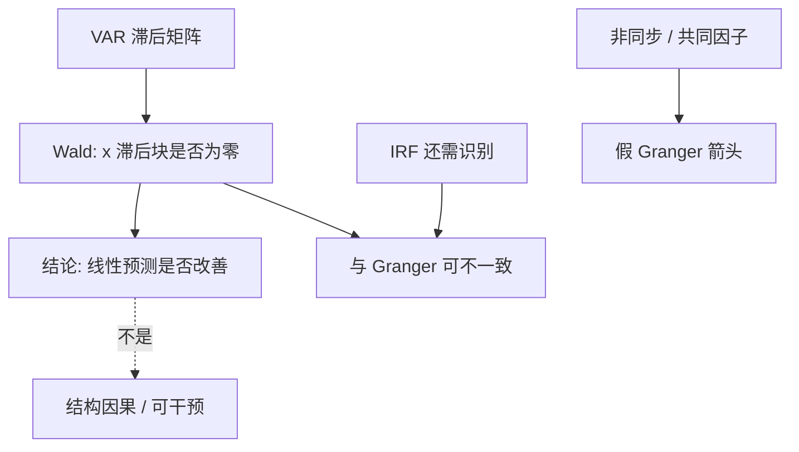

# Granger 因果

若 $x$ 的过去在 $y$ 自己的过去之外还能改善 $y$ 的预测，就说 $x$ Granger 引起 $y$；这是均方预测的可检验陈述，不是结构方程里的箭头。

<footer>—— Granger, Investigating Causal Relations by Econometric Models and Cross-spectral Methods, Econometrica, 1969</footer>

[VAR 与脉冲响应](/quant/var-irf) 已经把系统写好。IRF 还差一个识别假设才能谈「冲击」。Granger 在同一套滞后上问更窄的问题：块外生——$\Phi$ 的某些块是否为零。本课缺口：把「预测帮助」从结构因果、从同期相关、从非同步交易里拆出来。下一课状态空间处理的是潜变量与测量，不是把 Granger 箭头升级成结构。

## 问题

二元时，在 $y_t$ 对 $y_{t-1},\ldots,y_{t-p}$ 的回归里加入 $x$ 的滞后，联合显著性就是 Granger 检验（Wald）。多元则是 VAR 里 $x$ 块对 $y$ 方程的零约束。原假设：$x$ 的过去不改善 $y$ 的线性预测。问题是水平扭曲——单位根、滞后选错、异方差——以及**解释过度**：显著并不等于 $x$ 是 $y$ 的原因，更不等于可干预。

Sims 指出：Granger 与「严格外生」相关但不等价；存在期望的反馈可以让真实结构因果在 Granger 意义上双向。金融里还有第三种假箭头：A 股对美股「Granger 引起」只因开盘时差，信息已在隔夜期货里。

### 检验技术

水平近单位根时，普通 Wald 非标准，Toda–Yamamoto 用 $p+d_{\max}$ 滞后再检验前 $p$ 个，水平可以标准。异方差用稳健 Wald；GARCH 残差用自助。滞后 $p$ 用信息准则，但检验对 $p$ 敏感：太短漏动态，太长功效低。应报告 $p$ 的范围。

同期 Granger（瞬时因果）看 $\Sigma_\varepsilon$ 的非对角，那是相关不是预测。把它写成「瞬时因果」容易与结构冲击混淆。应单独报残差相关，不要塞进 Granger 一词。

## 方法

**线性。** VAR-Wald 或单方程 HAC Wald。出报告：F/Wald、稳健版本、$p$ 的选择。滚动窗口看稳定性——全样本显著常由一段危机贡献，接后课 Chow。

**非线性、分位。** 均值 Granger 为零，尾部仍可有（Hong 等）。上一课的分位工具可以做分位 Granger，多重 $\tau$ 须控制。本课默认线性均值，声明若做尾部。

**高频。** 用成交时钟或领先滞后回归，而不是日历分钟的 Granger。日历网格的 previous-tick 会制造假领先，见 [不等间隔采样](/quant/irregular-sampling)。Hasbrouck 信息份额是微观结构里更对口的「谁先动」，对象是随机游走分解，不是 VAR-Wald。

### 与 IRF、GMM 的关系

Granger 零约束成立时，正交化 IRF 里 $x$ 冲击对 $y$ 的路径仍可非零（经同期相关与其他变量）。反之，IRF 看起来为零，滞后块仍可显著（符号在地平线上抵消）。两套输出都要。GMM 的矩外生是另一层：$E[u_t z_{t-1}]=0$ 可以是有效工具，不必是 Granger 因果的叙述。

## 机制

预测改善来自 $x$ 含有关于 $y$ 未来的信息，在线性张成里尚未被 $y$ 自己的滞后张出。共同因子 $f_t$ 驱动两者、且 $x$ 对 $f$ 反应更快，会出现 $x\to y$ 的 Granger，而结构是 $f$ 引起两者。机制是**信息时点**，不是干预。这就是为什么宏观里要用外生工具或符号约束去做 IRF，而不是停在 Granger。

非同步：收盘价对不上同一瞬间的信息集，$x$ 的「过去」可能已含 $y$ 的未来。修正是对齐时钟或用重叠调整，不是加大 $p$。

样本外 Granger：样本内显著、样本外均方无改善，则更像过拟合。应把检验放到滚动预测，与后课 QLIKE 的样本外精神一致。

### 政策语言

「订单流 Granger 引起收益」在微观结构里往往是定义的一部分（价格对交易的冲击）。把它写成因果政策（限制交易会降低波动）需要结构模型（Kyle、Hasbrouck VAR 的识别）。本课停在检验的合法对象：预测。

## 边界与工程取舍

$k$ 大时两两 Granger 是多重检验。长记忆下显著性会虚高。缺失、隔夜、午休要把样本切段，跨段 Granger 无意义。

工程：报告稳健 Wald、$p$ 敏感性、滚动；高频改信息份额或 HY 滞后。不要用 Granger 替代 [IV](/quant/iv-finance) 的排除。不要在新闻标题里把 Granger 写成「导致」。下一课把不可观测状态写进滤波，预测将变成状态的条件均值。

## 小结

- Granger 因果是「滞后是否改善均方预测」的 Wald 检验，依附 VAR 的块外生。
- 单位根用 Toda–Yamamoto；异方差用稳健或自助；滞后阶要报告敏感性。
- 共同因子与非同步会制造假箭头；高频应改时钟与信息份额。
- 与 IRF 分工：一个不需正交化、一个需要；两者都不能单独承担结构政策。
- 出处：Granger, *Econometrica*, 1969；Toda and Yamamoto, *Journal of Econometrics*, 1995；宏观讨论见 Sims。
