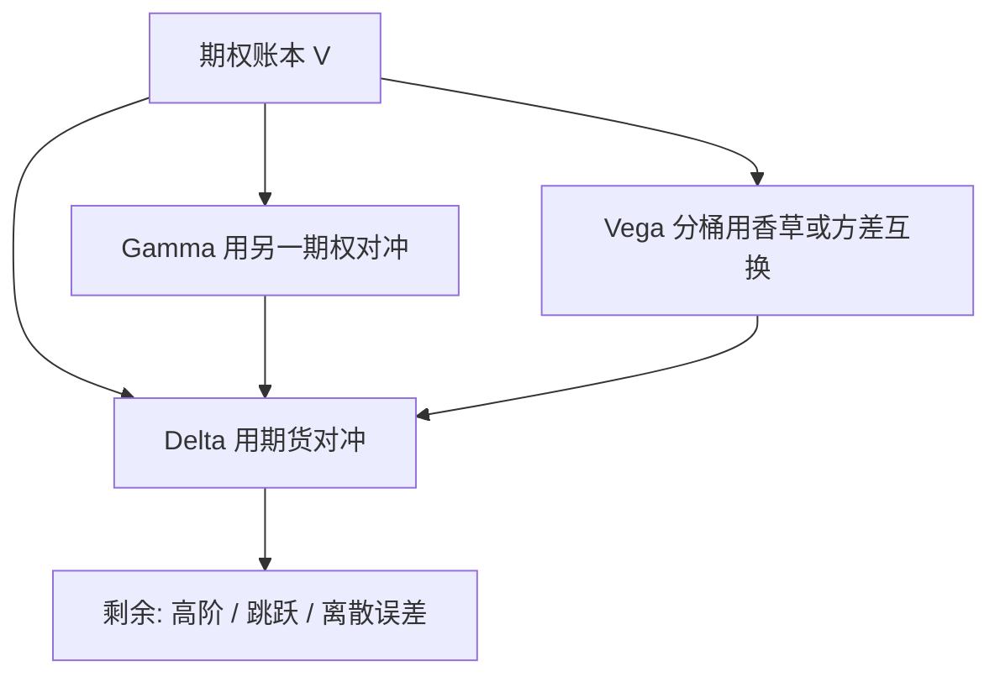

# Delta / Gamma / Vega 对冲

    
期权价值对标的、对标的的二阶、对波动率的一阶，构成日常风险账；对冲是用可交易工具把这几项暴露压到限额以内，而不是消灭全部 P&amp;L。

    <footer>—— Hull, Options, Futures, and Other Derivatives</footer>

Black–Scholes–Merton 的复制论证在连续交易、常数波动、无跳跃时，用标的（或期货）动态对冲即可复制欧式期权。交易台并不活在定理里：仓位是一篮子香草与奇异，波动率在动，再平衡是离散的。John Hull 的教科书把希腊字母组织成可运算的风险：Delta 是对现货（或远期）的一阶，Gamma 是 Delta 对现货的导数，Vega 是对隐含波动率的一阶，再加上 Theta、Rho。对冲的意思是：选期货、掉期或别的期权，使组合的 $\Delta,\Gamma,\nu$ 落在限额内，并承认未对冲的高阶与交叉项会变成 P&L。它与 [离散对冲误差](/quant/discrete-hedge-error) 衔接：即使 Delta 在每次再平衡时都归零，Gamma 仍在两次平衡之间工作。

## 问题

非线性衍生产品的价值 $V(S,\sigma,t)$ 在市场因子变动时不是直线。一阶 Taylor 用 Delta 与 Vega 解释小移动；现货大动时 Gamma 与 Volga、Vanna 变成主导。若只对冲 Delta，等价于局部线性化，暴跌或暴涨时复制失败，而这正是卖出期权的风险。若要对冲 Gamma，必须引入另一个非线性工具——通常是别的期权——因为期货的 Gamma 为零。若要对冲 Vega，同样需要期权或方差互换一类对波动率敏感的工具。问题是在流动性、买卖价差与模型定义下，选哪几个工具、在哪一个微笑动态下算这些导数。

希腊字母依赖模型与报价惯例。Black 的 $\Delta$ 与「微笑 sticky strike」下的 $\Delta$ 不同；Heston 的 Vega 是对 $v_0$ 或对某一参数，与对 Black 隐含波动的 Vega 要换算。Hull 的教学默认 Black–Scholes 公式的解析希腊字母，作为共同语言；生产上必须声明：对冲用的是哪一个曲面、哪一种 sticky 假设。

### 三个一阶对象不是三种独立货币

Delta 改变时，若现货同时动、波动率也动，P&L 不能拆成三个独立账户后简单相加——还有 $S$ 与 $\sigma$ 的交叉 Vanna。把账分成 Delta 账、Gamma 账、Vega 账是管理近似：限额按线性风险加一点凸性缓冲。真正的复制误差见离散对冲与跳跃。方差互换对 Vega 几乎线性、对现货 Delta 在复制后较小，常被用来卸指数 Vega；单名则往往仍用香草。

市场说的 Vega 常是「隐含波动率变动一个百分点」的价值，不是对 Heston $\sigma$ 或 SABR $\nu$ 的偏导。报告希腊字母必须带单位：每 1% vol、每 1 个现货点、还是每 1 个远期基点。

## 方法

Black–Scholes 下欧式看涨

$$
\Delta = \mathrm{e}^{-qT}N(d_1),\qquad \Gamma=\frac{\mathrm{e}^{-qT}n(d_1)}{S\sigma\sqrt{T}},\qquad \nu=S\mathrm{e}^{-qT}n(d_1)\sqrt{T},
$$

Vega 这里用 $\nu$ 以免与方差混淆。Delta 对冲：用 $-\Delta$ 单位标的（或等价期货）使组合 $\Delta_{\mathrm{port}}=0$。现货变动 $\mathrm{d}S$ 后，未再平衡前组合 P&L 约 $\frac12\Gamma(\mathrm{d}S)^2+\Theta\mathrm{d}t+\nu\mathrm{d}\sigma+\cdots$。卖出期权则 $\Gamma\lt 0$，需要在大动时亏损，用 Theta 收取时间价值作为补偿——这是 Hull 反复强调的 Gamma–Theta 权衡。

Gamma 对冲：加入数量 $\lambda$ 的对冲期权，使 $\Gamma+\lambda\Gamma_h=0$，再回头调整标的使 Delta 仍为零。对冲期权会带来自己的 Vega 与期限结构，通常无法同时把 $\Gamma$ 与 $\nu$ 都精确打到零，除非工具足够多。实务是解一个小的加权最小二乘：对关键执行价、关键到期的桶做 Vega 与 Gamma 分桶，而不是对整个曲面的单一 Vega 标量。

### Vega 分桶与微笑对冲

单一 Vega 把所有执行价的隐含波动当成平行移动。真实移动是倾斜与弯曲，对应 [SABR](/quant/sabr) 的 $\rho,\nu$ 或主元。分桶 Vega：按到期（有时再按 Delta）分组，用该桶里的香草去对冲该桶暴露。方差互换或 VIX 期货接近对 $1/K^2$ 加权的方差敏感，和 ATM Vega 不同，见 [方差互换与 VIX](/quant/variance-swap-vix)。外汇的 RR 与 BF 报价直接对应偏斜与弯曲的对冲工具，比单一 Vega 更接近市场坐标。

## 机制

Delta 对冲把一阶现货风险转给期货市场，留下凸性。若隐含波动不变且再平衡连续，Gamma 与 Theta 在 Black–Scholes 方程里对消，复制误差趋于零。波动率一变，Vega 项出现，必须用别的期权再对冲；对冲期权的 Delta 又破坏原来的 Delta 中性，需要一轮迭代。这是交易日盘中的标准循环，不是模型缺陷。

对冲比率对微笑动态敏感。Sticky strike：执行价固定的隐含波动不随现货动，Delta 接近 Black Delta。Sticky delta：固定 Delta 的点跟着现货走。SABR 或局部波动率给出第三种。同一香草，三种 Delta 可以差几个百分点，对大名义这就是真实金钱。Hagan 等人写 SABR 的动机之一，正是让 Delta 与微笑移动一致，见 [SABR](/quant/sabr)。Heston 下应对状态变量 $v$ 做 Vega，再映射到市场报价的桶。

### Gamma 的符号与尾部

做空香草：负 Gamma，现货静止时赚 Theta，大动时亏。做多香草相反。对冲 Gamma 并不是道德上「更中性」，只是把尾部卖给另一张期权的卖方。若对冲工具流动性差，名义 Gamma 对冲会在压力期转不动，账面中性瞬间变成裸露。限额因此同时约束 Gamma 与再对冲所需的流动性，而不是只约束瞬时 $\Gamma$ 数字。

Rho 与股息风险在长期限股权与可转债上可以大过日内 Delta。Hull 把 Rho 列为标准希腊字母，短到期外汇里它常被折进远期点，不单独对冲。

## 边界

解析希腊字母假设模型正确、参数瞬时不变。跳风险不能用 Delta–Gamma 局部展开抓住；离散对冲留下与 $\Gamma$ 成正比的误差。多曲线下利率产品的「Delta」可能是对折现曲线、对投影曲线、对关键期限的不同桶，见 [关键利率久期](/quant/key-rate-duration) 与 [OIS 与多曲线](/quant/multi-curve-ois)。信用与借券不在 Black–Scholes 希腊字母里。

Hull 提供的是共同记号与对冲直觉，不是某家银行的限额政策。生产系统要把模型 Vega 转成市场桶，把期货 Delta 转成交易合约规格，并记录微笑动态假设。没有这些，希腊字母只是 PDE 的偏导数，不能当对冲指令。

把组合「Delta 中性、Gamma 中性、Vega 中性」写成已无风险，忽略了交叉项、期限错配与对手方。中性是限额语言，不是套利定理。

## 小结

- Delta、Gamma、Vega 是价值对现货一阶、二阶与对隐含波动一阶；Hull 用它们组织期权风险账。
- Delta 对冲用标的或期货；Gamma 与 Vega 必须用非线性工具，且通常不能同时用单一工具清零。
- Gamma–Theta 在 Black–Scholes 里对消；波动率移动打破对消，需要 Vega 对冲。
- 对冲比依赖微笑动态（sticky strike / delta / 模型）；SABR 与局部波动率给出不同 Delta。
- 分桶 Vega 比单一标量 Vega 更接近交易坐标；方差互换权重不同于 ATM Vega。
- 出处：Hull, *Options, Futures, and Other Derivatives*；微笑对冲见 Hagan et al., 2002；方差条带见 Carr and Madan, 1998。
