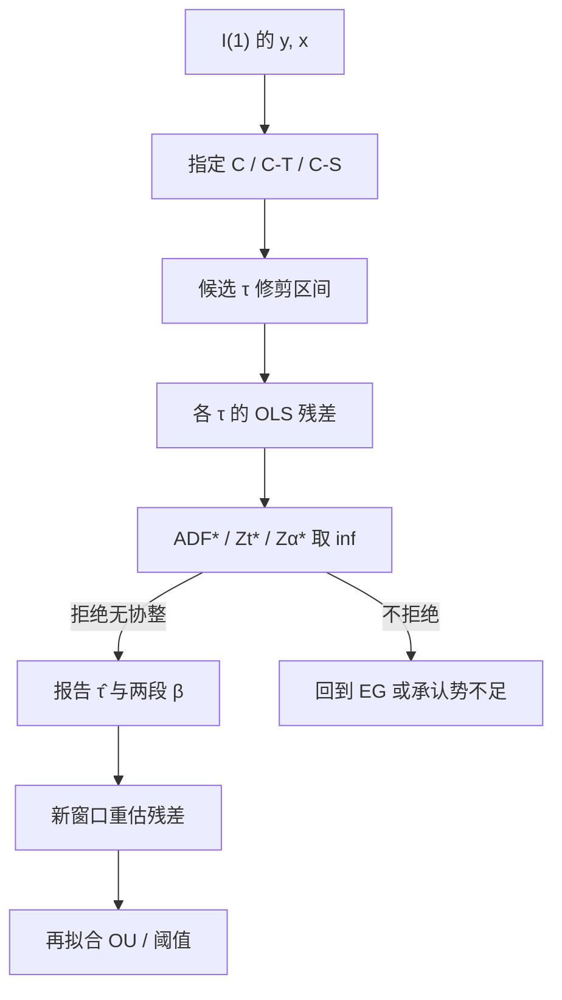

# Gregory–Hansen 协整破

在未知时点允许截距或斜率发生一次转换之后，再用残差单位根统计量在所有候选断裂日上取下确界，才能把「带机制转换的协整」从「根本没有协整」里分开。

<footer>—— Gregory and Hansen, Residual-based Tests for Cointegration in Models with Regime Shifts, Journal of Econometrics, 1996</footer>

[协整破裂](/quant/cointegration-break) 写的是交易后果：旧 $\beta$ 在机制转换后继续当均衡，残差单边走扩。[Engle–Granger](/quant/engle-granger) 与 [Johansen](/quant/johansen) 的标准检验则假定协整向量在全样本不变。Gregory 与 Hansen（1996）补的是检验本身：零假设仍是无协整，备择是存在协整、但水平或斜率在未知 $\tau$ 处跳一次。本篇写三类设定、三种 inf 型残差统计量、修剪与临界值，以及它和 [Bai–Perron](/quant/bai-perron) 不是同一个问题。能检出「带断裂的协整」，并不自动给出可交易的新对冲比。

## 问题

设 $y_t$、$x_t$ 为 $I(1)$。Engle–Granger 在

$$
y_t=\mu+\beta x_t+e_t
$$

上取残差做 ADF 或 Phillips 的 $Z_t$、$Z_\alpha$。若真实过程在 $t=\tau$ 从 $(\mu_1,\beta_1)$ 换到 $(\mu_2,\beta_2)$，全样本一条直线把两段均衡揉在一起，残差像随机游走，标准检验的势塌掉：你既可能宣布「无协整」（错过仍存在的两段关系），也可能在形成期前半段「有协整」后把仓位留进后半段错误原点。问题不是再跑一次全样本 ADF，而是把未知断裂写进备择，并为此付出更宽的临界值。

Gregory–Hansen 的搜索是单次断裂。多段制度、反复来回的牛熊，分别更接近 Bai–Perron 与 [HMM 体制](/quant/hmm-regime)。把一次监管改革拟合成高转移概率的隐状态，会错误地给「回到旧 $\beta$」的正概率；把季节性波动标成协整破裂，又会把仍可交易的价差停掉。选哪一套装置，是对数据生成过程的判断，不能只看哪个 p 值更小。

### 三类备择：水平、趋势、机制

论文给出三种回归。水平漂移（C）：截距在 $\tau$ 处加一项 $\mu_2\varphi_{t\tau}$，$\beta$ 不变，像除权未复权或基准台阶。水平加趋势（C/T）：再加确定性趋势。机制转换（C/S）：截距与斜率都变，

$$
y_t=\mu_1+\mu_2\varphi_{t\tau}+\beta_1 x_t+\beta_2 x_t\varphi_{t\tau}+e_t,
$$

$\varphi_{t\tau}=1_{\{t\gt \tau\}}$。配对里最伤的是 C/S：对冲比本身换了。C 只移动价差原点，旧仓的期望亏损是一笔水平跳；C/S 让残差带上错误的随机趋势，期望回归时间不再是 [OU](/quant/ou-spread) 的半衰期。检验必须预先声明用哪一类，不能三类都跑再挑最显著的那个 $\tau$。

$\varphi_{t\tau}$ 是虚拟变量，不是平滑转移。Gregory–Hansen 的备择是一次性台阶，不是 Tong 的门限或 Hamilton 的来回跳。价差在某个带宽内不调整，应去看[门限协整](/quant/threshold-cointegration)，而不是把「中间一段像单位根」写成机制转换。

## 方法

对每个候选 $\tau$，按选定模型 OLS，得残差 $\hat e_{t\tau}$，再算残差 ADF（记为 $\mathrm{ADF}(\tau)$）或 Phillips 的 $Z_t(\tau)$、$Z_\alpha(\tau)$。统计量是下确界

$$
\mathrm{ADF}^\ast=\inf_{\tau\in\mathcal{T}}\mathrm{ADF}(\tau),
$$

$Z_t^\ast$、$Z_\alpha^\ast$ 同样取 inf。$\mathcal{T}$ 通常是样本的 $15\%\sim 85\%$（修剪），避免把端点的一两个异常值当成断裂。临界值由 Gregory–Hansen 用响应面给出，显著宽于 Engle–Granger：你在许多 $\tau$ 上挑最像平稳的残差，必须惩罚这种搜索。

估计的 $\hat\tau$ 是使残差统计量取到 inf 的那个日期。它是诊断时点，不是事件日历。$\hat\tau$ 的不确定性在小样本里可以有数周；置信陈述不能从标准 ADF 的 $t$ 分布读。实务上应同时报告：无断裂 EG、GH 三类中预先指定的一类、以及 $\hat\tau$ 附近窗口内滚动 $\beta$ 是否覆盖旧点。Johansen 系统带确定性断裂时，要用 Hansen 或 Johansen–Mosconi–Nielsen 一类设定，不能把 GH 的残差 inf 直接翻译成迹检验的秩。

### 修剪、滞后与检验的势

修剪越宽，端点附近的真断裂越检不出；越窄，尺寸越容易被杠杆点撑破。15% 是论文默认，不是最优带宽。残差 ADF 的滞后阶仍按信息准则或序列相关诊断来，但每个 $\tau$ 上独立选滞后会再消耗自由度，应预先固定规则。势在这些情形里低：断裂靠近修剪边界、两段 $\beta$ 差距小、残差近单位根但 $\kappa$ 很小、或 $x$ 本身波动在断裂后改变。日频一年约 250 点的配对，GH 经常「什么都检不出」，策略却已经在错误 $\beta$ 上亏钱——这是检验与交易规则必须分开的原因。

辅助证据用滚动 EG、残差 [CUSUM](/quant/cusum-mosum)、以及形成期与交易期切开的半衰期。GH 显著且 $\hat\tau$ 落在形成期内，应视为形成期已被两段制度污染，历史标准差不可当开仓阈值。GH 不显著不能当「协整稳定」的证明：势低时，操作规则仍应监听滚动 $\beta$ 与残差单边走扩。

## 机制

inf 型统计量的机制是：若存在某段制度使残差平稳，则在 $\tau$ 接近真断裂时，$\mathrm{ADF}(\tau)$ 会变负；在错误的 $\tau$ 上残差仍像 $I(1)$。取 inf 是在未知 $\tau$ 下对「最好的那次切分」做检验。零假设无协整时，即使乱切，残差也不会系统地变成 $I(0)$，因而需要专门模拟的临界值。备择为真时，估计 $\hat\tau$ 一致性依赖于两段参数差距与样本在断裂两侧都足够长。

对交易的翻译是非对称的。拒绝无协整（GH 显著）只说明「存在某种带一次转换的长期关系」，不说明当前制度的 $\beta$ 是哪一段、更不说明半衰期覆盖成本。不拒绝则更弱：可能无协整，可能有协整但无断裂，可能有断裂但势不够。策略文档若把「GH 不显著」写成开仓许可，是把低势检验当成了滤波器。

临界值表按自变量个数与模型 C/C/T/C/S 分列。多条腿时 GH 的残差检验仍是单方程：先指定左边，再搜 $\tau$。篮子应回到系统方法，或先降到一对可交易的组合，而不是对每个左边各跑一遍再挑最小的 $\mathrm{ADF}^\ast$。

### 与误差修正、OU 的接口

断裂后误差修正项 $\lambda(y_{t-1}-\alpha-\beta x_{t-1})$ 的 $(\alpha,\beta)$ 必须换成新段。用旧均衡去算 $z_t$ 再套 OU，得到的 $\hat\kappa$ 往往接近 0 或符号错乱，半衰期失去含义。正确顺序是：GH 或滚动诊断触发之后，在 $\hat\tau$ 之后的窗口重估协整，再对**新残差**估 OU。$\hat\tau$ 之后样本太短时，不应立刻报一个新半衰期并开仓；应降低杠杆，直到新段有足够观测。最优进出见 [OU 最优停时](/quant/ou-optimal-stopping)，那是给定稳定 OU 之后的控制问题；GH 处理的是「OU 的原点还在不在」这一前提。

## 边界与工程取舍

单次断裂是强假设。2010 年代之后的股票对可能经历指数调入、做空规则、行业分类重画多次。多次搜索抬高临界值，小样本会全面失势。A 股停牌与涨跌停会造成伪断裂：价格冻结再跳开，某个 $\tau$ 上残差「突然平稳」或「突然单位根」，应先做公司行为与停牌处理，再跑 GH。

不要把 $\hat\tau$ 当天当成 alpha 事件去交易残差跳跃。不要在三类模型、两种统计量、若干修剪比例上做网格，再报告最显著的那一个——搜索空间已经进了配置。不要用 tick 数据直接套渐近临界值：[微观结构噪声](/quant/microstructure-noise) 下单位根与协整的渐近对象都变了。日频、周频上 GH 是形成期诊断；盘中触发器应是预先写好的滚动 $\beta$ 失稳与残差走扩规则，见协整破裂一文。

Gregory–Hansen 与「结构突变协整」文献（Hansen 1992 的 I(1) 参数稳定性、Keijzer 等后续）共享未知时点，但零假设不同：前者是无协整，后者常是「有协整且参数稳定」。拒绝稳定性不等于存在可交易的新协整；两套检验要一起读，不能互相替代。

## 小结

- Gregory–Hansen（1996）在未知单次断裂下做残差协整检验：零假设无协整，备择为水平漂移、趋势转换或机制转换。
- 统计量是候选 $\tau$ 上 ADF、$Z_t$、$Z_\alpha$ 的下确界；临界值宽于 Engle–Granger，修剪默认约 15%。
- 配对最相关的是斜率也变的 C/S；检出断裂后必须重估 $(\alpha,\beta)$，不能把旧残差继续当 OU。
- 低势意味着不显著不是开仓许可；盘中规则用滚动 $\beta$ 与残差走扩，GH 做形成期与事后诊断。
- 单次台阶、多断裂与马尔可夫来回是不同装置，应与 Bai–Perron、HMM、门限协整分工，而不是比 p 值。
- 出处：Gregory and Hansen, *Journal of Econometrics*, 1996；同作者 *Oxford Bulletin of Economics and Statistics*, 1996；Engle and Granger, *Econometrica*, 1987。
