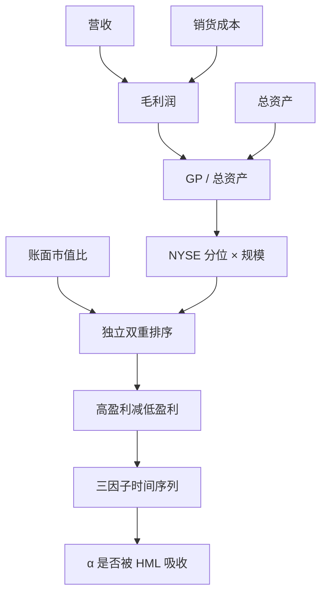

# 毛利率：Novy-Marx

    
毛利率高的公司随后平均收益更高；控制账面市值比之后这一溢价更强，价值溢价在控制毛利率之后同样更强——便宜与赚钱是定价的两面，不是互相替代的同一个特征。

    <footer>—— Novy-Marx, The Other Side of Value: The Gross Profitability Premium, Journal of Financial Economics, 2013</footer>

价值问价格相对账面是否低；毛利率问同样一单位资产能产出多少经济利润。Robert Novy-Marx 2013 年把毛利润（营收减销售成本）除以总资产，写成一条能预测截面收益的特征。它不是净利润率，也不是后来 [Fama–French 五因子](/quant/ff5) 里的营业利润率：分母是资产而不是账面股权，分子停在毛利、不扣销售管理费用与利息。更宽的[质量与盈利](/quant/quality-profitability)还把安全、分红捆进来；本篇只写这条单变量定理：定义、双重排序、以及它为什么不能被 HML 吸收。

## 问题

若市场只补偿不可分散风险，高盈利公司更安全，预期收益应更低。截面符号相反：高毛利率组合事后收益更高。这同时顶撞两条流行叙事。一是 CAPM 式的「安全则低收益」；二是粗俗价值叙事「成长股贵所以收益低」——高毛利率公司估值往往不低，HML 的 β 常常为负，更像成长。三因子用账面市值比解释不了它：控制 HML 之后 α 更大，而不是消失。

会计上还要回答：哪一层利润更接近可被定价的「经济利润」。净利润扣过利息、税、特别项，截面排序会被资本结构与一次性项目主导；营业利润再扣 SG&A，把费用政策混进来。Novy-Marx 的主张是：毛利更靠近生产函数的单位利润，总资产作分母是为了不让杠杆把亏损公司的 ROE 打成极端值。问题不是再发明一个能分开组的比率，而是证明这条比率携带独立于价格（B/M）的预期收益信息。

### 毛利率为什么停在营收减销货成本

毛利润 $\mathrm{GP}=\mathrm{Revenue}-\mathrm{COGS}$ 不扣研发、销售管理、折旧与利息。费用化的研发会压低营业利润，却往往是对未来现金流的投资；把 SG&A 扣掉，等于把「费用政策」和「单位经济利润」捆在同一排序里。除以总资产而不是销售收入，是为了比较资本生产率而不是销售加成：两家毛利率（占营收）相同、资产周转差一倍的公司，对股东占用的资本完全不同。

$$
\mathrm{GP/A}=\frac{\mathrm{Revenue}-\mathrm{COGS}}{\mathrm{Assets}}.
$$

经验上，这一口径在当时美股样本里预测力强于净利润率与资产收益率，也能在控制 B/M 后保持。它仍会被存货会计、收入确认与垂直一体化程度影响——制造业与零售的 COGS 含量不同——但比底部净利润稳，也比用净资产作分母少受负账面污染。

不要把 GP/A 与 RMW 画等号。RMW 的分子是营业利润（扣 SG&A 与利息），分母是账面股权。高杠杆、高费用或高利息的公司在两种定义下的分位可以差出一整段。复制 French 数据库必须用营业利润/账面；复制 2013 年论文必须用毛利/总资产。

## 方法

每年 6 月用已滞后的年报计算 GP/A，断点用 NYSE 的 30% 与 70% 分位（或十分位），与规模做 2×3 或独立十分位，价值加权多空即毛利率腿。金融公司的「销货成本」难定义，通常剔除。负资产或近零资产要清洗，否则分母把排序变成噪声。

关键设计是与账面市值比的**独立双重排序**，而不是先做 HML 再在残差上排毛利率。后者把相关结构藏进正交化顺序：先去掉价格信息，再看利润，会低估「贵而赚钱 / 便宜而不赚钱」交叉格子的经济含义。Novy-Marx 的表说的是：在给定 B/M 的格子里，高 GP/A 仍然赚得多；在给定 GP/A 的格子里，高 B/M 仍然赚得多。两条腿是互补，不是谁吸收谁。

$$
R_{it}-R_{ft}=\alpha_i+\beta_{iM}\mathrm{MKT}_t+\beta_{iS}\mathrm{SMB}_t+\beta_{iH}\mathrm{HML}_t+\varepsilon_{it}.
$$

按 GP/A 排序的组合在三因子上留下显著 α；把毛利率多空加到右侧之后，这些 α 被吸收。这只说明它是一条可写成因子的共同收益，还不等于它已进入随机贴现因子的公理推导。

### 与价值一起用，而不是互相替代

股利贴现的比较静态是：给定当前价格，更高的预期盈利对应更高的内部收益率；给定盈利，更低的价格同样对应更高的内部收益率。于是「便宜」和「赚钱」应当同时进入预期收益。实务上做多高 GP/A 且高 B/M、做空低 GP/A 且低 B/M，比单做价值或单做盈利更强，换手仍接近年度财务重构。不要先在全截面上做价值中性、再抱怨盈利因子变弱——中性顺序本身就是一种模型。

## 机制

风险解释不整齐。高毛利率更像低经营杠杆、低困境概率，按消费 CAPM 应要求更低收益，符号对不上。一种修补是：高盈利公司对资本品与需求冲击更敏感，坏状态下的边际利润下降得更狠，系统风险其实更高——条件 β 的证据并不稳定，Lewellen–Nagel 式的短窗口检验也很难撑起所需的 β 波动。行为解释更直接：投资者对「无聊的高利润率公司」反应不足，对故事型亏损成长过度支付；毛利率溢价是价值溢价的镜像，一边是价格，一边是基本面。

会计解释与应计相邻。毛利仍是应计制：存货与收入确认可以把利润提前。Ball、Gerakos、Linnainmaa、Nikolaev 主张用现金营业利润替代，部分样本里预测力更强，换手与对盈余公告的暴露也变。若现金口径把溢价吃掉，机制就更接近应计异常而不是「生产函数被定价」。三条机制对交易的含义不同：行为通道怕拥挤与叙事反转，会计通道怕准则变更，风险通道怕宏观状态切换。

### 费用、研发与行业结构

停在 COGS 的代价是行业不可比。零售的 COGS 占比高、软件的 COGS 占比低，GP/A 的截面会被行业结构拉开。行业中性之后溢价通常仍在，但幅度下降；若不中性，多头会系统性偏科技与品牌消费，空头偏零售与大宗。研发费用化使部分高投入公司的营业利润看起来很弱，但毛利不受影响——这正是 Novy-Marx 想保留的信息，也是 RMW 与 GP/A 分道的原因之一。不要在同一回归里同时塞进高度相关的毛利率腿与 RMW 还报告两个 α。

高毛利率不是高毛利增长。水平高但正在恶化的公司，和水平低但正在改善的公司，对动量与盈余漂移的暴露相反。2013 年论文排的是水平，不是变化。把 PEAD 或盈利动量写进毛利率因子，是另一条策略。

## 边界与工程取舍

财务数据至少滞后六个月，6 月重构是为了避免前视。用未发布年报的毛利会把盈余公告后的漂移算进「可交易溢价」。季度更新能加快信号，季节性与噪声上升。跨国复制要统一 COGS 口径与研发会计；IFRS 与 US GAAP 对某些行业的成本分类不同。A 股壳资源、ST 与借壳会让空头腿出现总资产跳跃，必须缩尾或单独分组。

容量上，价值加权、年度重构的毛利率腿可交易；等权小盘低盈利空头含大量不可借券名字，账面夏普会虚高。不要把 QMJ 的「质量」标签贴回 2013 年：Asness–Frazzini–Pedersen 把安全与分红捆进来之后，与 [BAB](/quant/low-vol-bab) 的相关会上升。也不要把本篇与[投资因子](/quant/cma-investment)混写——高盈利公司有时多投资、有时把现金吐出，GP/A 与 CMA 必须分开检验。

真实出处：Novy-Marx, *The Other Side of Value: The Gross Profitability Premium*, Journal of Financial Economics, 2013。RMW 见 Fama & French, 2015；现金营业利润见 Ball 等。禁止把 QMJ 或五因子盈利定义标成 2013 年论文的构造。

## 小结

- 毛利率用（营收−销货成本）/总资产预测截面收益，符号与「安全则低收益」相反。
- 与账面市值比是互补的两面：双重排序后两边都更强，而不是谁替代谁。
- 口径不是 RMW，也不是净利润率或 ROE；复制时分母、分子都要对齐。
- 机制可以是错误定价、应计或尚未被条件 β 说清的风险，对冲工具不同。
- 出处：Novy-Marx, Journal of Financial Economics, 2013。
