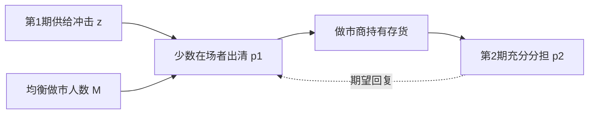

# Grossman–Miller 流动性提供

流动性不是做市商的人格美德，而是有人愿意在冲击到达的那一期吸收存货、等到下一期再把风险交给更多人分担。提供流动性就是跨期的风险转移。

<footer>—— Grossman and Miller, Liquidity and Market Structure, Journal of Finance, 1988</footer>

[Ho–Stoll](/quant/ho-stoll-inventory)写出单个经销商如何给自己的库存定价。缺口是市场结构：为什么需要一群常设的流动性提供者，而不是让所有投资者等下一期再见面？Grossman 与 Miller（1988）把流动性定义成**即时性的供给**：外生需求冲击来的那一期，有人先接走存货；到了更多交易者到场的下一期，风险被重新分担，价格部分回复。本课不重做最优买卖价差的一阶条件。

## 问题

若所有人只能在同一期交易，需求冲击会立刻反映在价格里，没有「暂时」与「永久」之分。现实里交易者不同时在场：有人必须现在卖，有人要等新闻、等资金、等下一次拍卖。市场结构决定有多少风险承担者现在在场。人数少时，接住冲击的人要求很大的价格折让；下一期人到齐，折让消失，价格回复。问题是：均衡里有多少人选择成为常设的流动性提供者（持有做市能力、等待冲击），以及即时价格相对充分分担价格的偏离有多大。

这把「价差」从经销商的报价宽度，改写成**两期价格路径**上的暂时成分。它与信息范式正交：即使没有知情交易，只要人不同时在场，就会有冲击与回复。

### 做市商人数是均衡对象

成为流动性提供者有成本（资本、注意力、库存风险）。人数 $M$ 增加，每一期冲击被更多人分担，即时折让变小，做市利润下降，直到与进入成本抵平。$M$ 太少则折让巨大、做市租高，会吸引进入。市场「有多流动」因此是内生的，不是外生的 $\sigma_u$。

Kyle 的噪声交易者提供掩护但不优化；Grossman–Miller 的流动性需求者有外生时机，流动性供给者优化是否在场。噪声规模在这里部分内生化。

## 方法

两期（或有限多期）均值–方差交易者。第 1 期一小群人在场，出现外生供给冲击 $z$；第 2 期全体到场，价值公开或风险被充分分担。第 1 期出清价 $p_1$ 相对第 2 期期望价格的折让，补偿在场者暂时持有 $z$。折让与 $z$、风险厌恶、在场人数成比例——形式上像一个库存压力价格，但压力来自**谁在场**，不是某一个专家的 $I$。

进入均衡：$M$ 个做市商预先支付成本，换取第 1 期在场的权利。期望做市利润随 $M$ 下降。比较静态：冲击更频繁或更大、资产波动更高，均衡 $M$ 增加，但即时折让不必单调——进入与风险对冲。

### 暂时价格与可预测回复

第 1 期被压低（抬高）的价格，在第 2 期期望回复。收益因此出现负的序列相关，来源是存货的跨期分担，不是 Roll 的买卖弹跳，也不是反应不足。经验上要把「暂时成分」从信息引起的永久成分里分开，需要后文 Hasbrouck 的结构；本课只给出一种纯粹的暂时成分机制。

## 机制

即时性是一种商品。需求方为了现在成交，接受不利价格；供给方用资本换取这笔风险溢价。市场设计改变的是第 1 期有多少人在场：连续交易、指定做市商、强制做市义务，都是在改变 $M$ 与在场约束。电子限价簿把「在场」改成挂单——你不必是注册经销商，但你的限价单同样是在某一瞬间提供即时性。

危机里 $M$ 有效下降（资本约束、撤退），同样大小的 $z$ 造成更大折让，看起来像流动性蒸发。Brunnermeier–Pedersen 的融资流动性会把这条线接到资金约束；本课的机制已经足够：在场风险分担能力收缩，暂时折让放大。

## 边界

两期、对称信息、外生冲击，不解释逆向选择导致的永久性价格移动。真实冲击里夹着知情交易，$p_1$ 的折让部分永不回复。Grossman–Miller 也不能单独给出买卖价差的买卖两侧：它给出的是交易价格相对充分信息价格的压力。要把压力写成 bid/ask，需回到 Ho–Stoll 或限价簿模型。

不要把「价格回复」自动当成 Grossman–Miller 成功。过度反应、集合竞价收盘、指数再平衡都可以制造回复。识别需要看到存货或做市商资本，而不只是自相关符号。

## 小结

- Grossman–Miller（1988）把流动性定义为跨期风险分担：少数人先接冲击，全体到场后价格回复。
- 做市商人数是均衡对象，由做市利润与进入成本决定。
- 暂时折让可以完全来自不同时在场，不必有知情者。
- 与 Ho–Stoll 的个体库存优化互补：一个问谁在场，一个问在场者如何报价。
- 出处：Grossman and Miller, *Journal of Finance*, 1988；库存报价见 Ho and Stoll, 1981。
