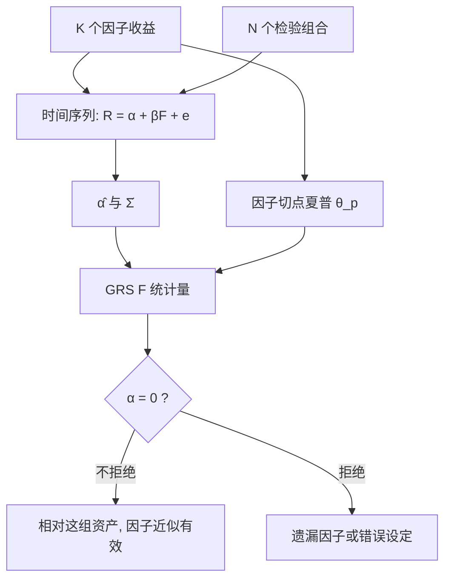

# GRS 检验

一组资产的定价误差是否联合为零，等价于问：在因子之外再纳入这些资产，切点组合的夏普能不能显著提高。

<footer>—— Gibbons, Ross and Shanken, A Test of the Efficiency of a Given Portfolio, Econometrica, 1989</footer>

时间序列里每只检验资产都有一个 $\alpha_i$。逐个看 t 值会漏掉它们的相关：十个中等 α 若残差高度相关，联合证据弱；若残差几乎正交，联合证据强。[CAPM](/quant/capm) 与[三因子](/quant/ff3)要回答的是「这组 α **一起**是否为零」，不是「里面有没有某只碰巧显著」。Gibbons、Ross 与 Shanken 给出在残差联合正态下的精确有限样本 $F$ 检验，并把统计量写成夏普改进。它是因子模型最常用的联合检验，也是检验资产选得太多时最先失效的那一个。

## 问题

对 $N$ 个检验资产、$K$ 个因子，$T$ 期超额收益

$$
R_t=\alpha+\beta F_t+e_t,\qquad e_t\sim \mathrm{i.i.d.}\ \mathcal{N}(0,\Sigma).
$$

原假设 $H_0:\alpha=0$（$N\times 1$）。若逐个检验，多重比较会膨胀一类错误；若只报告平均 $|\alpha|$，又丢掉协方差。需要一个把 $\hat\alpha$ 与 $\hat\Sigma$ 收成标量、并在正态假设下有已知空分布的统计量。

几何上，因子的切点组合有夏普 $\theta_p$；把检验资产加进去后切点夏普为 $\theta_*$。$H_0$ 成立则因子已经张成均值方差前沿上相关的那一段，$\theta_*=\theta_p$。GRS 检验的就是 $\theta_*$ 对 $\theta_p$ 的改进是否只是抽样噪声。Roll 的批评仍然在：你检验的是**手里这组因子**对**手里这组资产**是否均值方差有效，不是不可观测的真市场。

### 联合为零，不是平均为零

平均 α 接近零、但一半大正一半大负，GRS 仍可拒绝：模型系统性地误定价两端。反过来，所有 α 同号但残差几乎共线（它们其实是同一个被遗漏因子的复制），GRS 可能不如看起来那么显著——$\Sigma^{-1}$ 会把重复的方向降权。这正是联合检验相对「数一数有几个 t>2」的优点。

GRS 假定残差 IID 正态。日频金融残差有波动聚集与肥尾，有限样本 $F$ 的尺寸会歪。月频、检验组合而非个股，是文献默认；用日频个股做 GRS 再声称「模型被摧毁」，往往是分布假设被摧毁。

## 方法

令 $\hat\alpha$ 为 $N\times 1$ 的 OLS 截距，$\hat\Sigma$ 为残差协方差（通常用无偏形式），$\bar f$ 为因子样本均值，$\hat\Omega$ 为因子样本协方差。GRS 统计量

$$
\mathrm{GRS}=\frac{T-N-K}{N}\cdot\frac{\hat\alpha^\top\hat\Sigma^{-1}\hat\alpha}{1+\bar f^\top\hat\Omega^{-1}\bar f}
$$

在 $H_0$ 与正态 IID 下服从 $F_{N,\,T-N-K}$。分母里的 $1+\bar f^\top\hat\Omega^{-1}\bar f=1+\hat\theta_p^2$，把因子自身的夏普平方拿掉：α 的「大」要相对于因子已经解释掉的均值。分子是 Mahalanobis 意义下 α 的总长度。

实施要点：检验资产必须比因子多出真正的新方向，但 $N$ 又不能靠近 $T-K$。$T-N-K$ 一窄，$F$ 的分母自由度不够，$\hat\Sigma$ 接近奇异，统计量爆炸。文献用 25 个规模–价值组合、或 5×5 再加动量组，月频几十年，就是为了让 $N\ll T$。A 股样本短、行业与政策分段多，更应控制 $N$：用 5×5 或 2×3 组合，而不是两百只个股。

### 与 Fama–MacBeth、Wald 的关系

[Fama–MacBeth](/quant/fama-macbeth) 估的是风险价格 $\lambda$ 的时间序列；GRS 估的是时间序列 α 的联合。可交易因子下，α 与 $\lambda$ 的偏离是同一套定价误差的两种写法，应选一个主检验，不要两张表都当独立发现。大样本 Wald $T\hat\alpha^\top\hat\Sigma^{-1}\hat\alpha$ 忽略因子均值的不确定性，也没有 GRS 那种精确 $F$；Shanken 修正与 GMM 处理生成回归量，对象偏向截面 $\lambda$。工程顺序：先 GRS 看这组因子对这组组合够不够；再 FM 报告经济幅度。

因子模型比较时，嵌套模型可以用 GRS：三因子相对市场、五因子相对三因子，看 α 是否被新因子吃掉。非嵌套则 GRS 不能直接当「谁更好」——拒绝 CAPM 与拒绝三因子可以同时发生。应报告每个模型自己的 GRS、平均 $|\alpha|$、以及 $R^2$，而不是只给最小的那个 p 值。

## 机制

在联合正态下，均值方差有效性有精确的小样本检验，这是 GRS 相对渐近 χ² 的理由。统计量把 α 放到残差度量里：被共同残差驱动的 α 不算「很多独立证据」。分母标准化因子已有的夏普，避免「因子很弱、α 看起来很大」或「因子已经很强、一点点 α 仍显著」两种误读不对齐——后者仍可能拒绝，但经济上改进的夏普可能很小。因此除了 p 值，应报告 $\hat\theta_*-\hat\theta_p$ 或 $\hat\alpha^\top\hat\Sigma^{-1}\hat\alpha$ 的经济尺度。

拒绝的含义是模型对**这组左边**失败，不是对所有资产失败。按 β 排序的组合专门打 CAPM；按规模–价值排序专门打市场模型；按动量排序专门打三因子。检验资产的选择就是备择假设。把「对 25 个规模–价值组合 GRS 不拒绝」写成「模型成立」，漏掉了动量、盈利、换手等你没放进左边的方向。

### A 股左边怎么选

A 股若把含壳的小盘放进 5×5，GRS 很容易拒绝任何从美股搬来的三因子，拒绝的是壳与投机，不一定是「市场 β 无效」，见[壳溢价](/quant/cn-shell-premium)。Liu–Stambaugh–Yuan 的做法是先剔除最小 30%，再用剩余股票构造检验组合与中国因子。复制 GRS 必须声明宇宙。涨跌停与停牌使月度组合收益仍含不可成交区间，α 里有执行缺口；这不会让软件报错，但会让「定价误差」含微观结构。

$N\gt T$ 时 $\Sigma$ 不可逆，GRS 未定义。先降维（组合、主成分）或给 $\Sigma$ 加收缩，后者已经不是 1989 年的精确 $F$。不要对个股截面硬做 GRS。

## 边界与工程取舍

正态 IID 不成立时，可用 GMM Wald、bootstrap 或对残差做 Newey–West 再报渐近检验，但不要再引用 $F$ 临界值。结构断裂（2015、2020、注册制扩容）使全样本 GRS 难解释：应分段，或承认检验的是「平均意义下的线性因子模型」。

不要用同一批数据先搜因子再做 GRS 还把 p 值当名义水平——搜过的因子已经用了 α 的信息，见[Harvey–Liu–Zhu](/quant/harvey-liu-zhu)。不要只剔除使 GRS 变差的组合。不要把「加入某因子后 GRS 的 p 从 0.01 变成 0.06」当成该因子被定价，幅度可能仍大。

出处：Gibbons, Ross and Shanken, *Econometrica*, 1989。几何解释即切点夏普比较。时间序列 α 的经济报告习惯见 Fama & French 1993、2015。A 股检验组合的宇宙见 Liu, Stambaugh and Yuan, *JFE*, 2019。

## 小结

- GRS 对一组时间序列 α 做联合 $F$ 检验，原假设是因子对检验资产均值方差有效。
- 统计量是 α 的马氏长度相对因子夏普的标准化；空分布在残差 IID 正态下精确。
- $N$ 须远小于 $T$；检验资产的选择就是备择，未放入左边的异常不算被通过。
- 日频、个股、肥尾下不要用名义 $F$；A 股须先规定是否含壳与最小市值。
- 与 FM 截面 λ 是同一套误差的两种语言，应指定主检验。
- 出处：Gibbons, Ross and Shanken, *A Test of the Efficiency of a Given Portfolio*, Econometrica, 1989。
