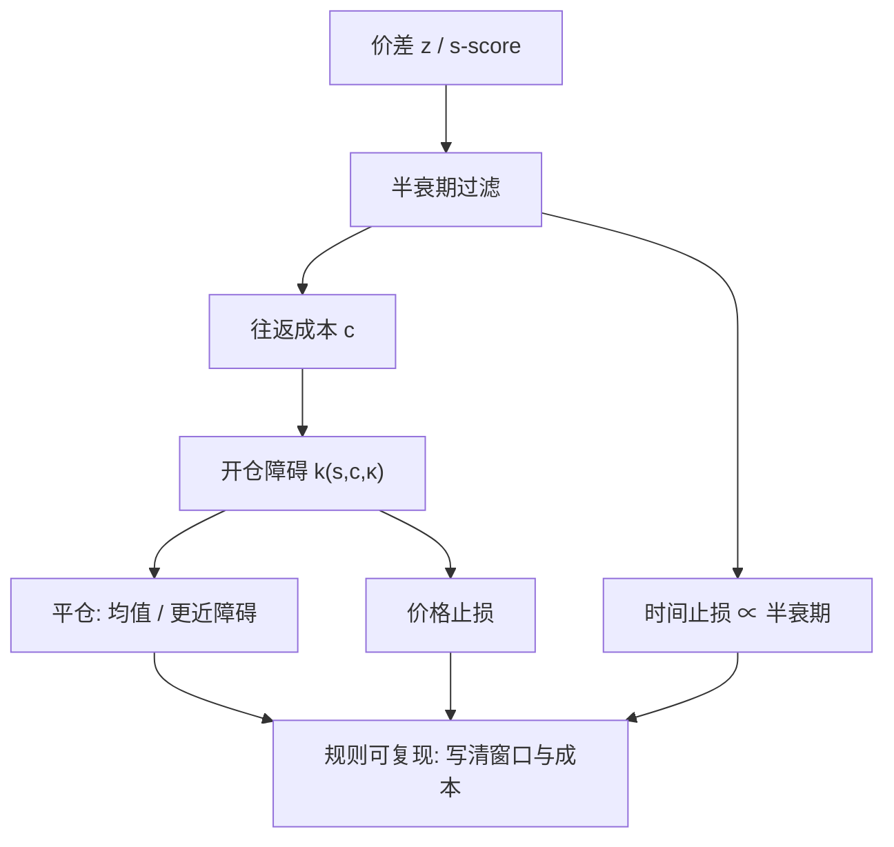

# 半衰期与开平阈值

距离法配对用历史标准差的两倍做开仓、回到均值做平仓；这是一条可复现的规则，不是从价差动力学推出来的最优障碍，半衰期与往返成本会改同一条规则该不该做。

<footer>—— Gatev, Goetzmann and Rouwenhorst, Pairs Trading: Performance of a Relative-Value Arbitrage Rule, Review of Financial Studies 2006</footer>

[OU 残差](/quant/ou-spread) 给出两个尺度：回复有多快（半衰期），偏离有多大（平稳标准差）。把它们变成订单，还缺开仓、平仓、止损与「抱太久就走」。Gatev、Goetzmann 与 Rouwenhorst 用形成期距离最小的配对，交易期在价差偏离历史两倍标准差时开仓、交叉时平仓，为相对价值提供了可对照的基准。Avellaneda–Lee 用 $s$-score 的 $\pm 1.25$ 一类阈值。最优障碍文献（如 Leung–Li）在 OU 加成本下解进出障碍，说明「两倍标准差」只是启发式。本篇写半衰期如何过滤配对、阈值如何被成本推动，以及样本内最优障碍为何在样本外失效。

## 问题

设价差 $z_t$ 已标准化或已拟合 OU。规则要决定：在哪些 $z$ 上开反向仓，在哪些 $z$ 上平，是否用止损，是否用时间止损。没有成本时，OU 的最优策略倾向于「立刻上最大仓、在均值平」，因为期望拉力在偏离处最大。有买卖价差与冲击时，必须等偏离大到覆盖往返成本加风险补偿，否则 Sharpe 在摩擦后变负。

半衰期过滤是另一层：$\kappa$ 太小，资本占用长，结构断裂来得比回复早；$\kappa$ 太大，交易像噪声交易，成本占比高。Gatev 等人的距离配对没有显式 $\kappa$，但形成期窗口与持有到交叉，隐含了「不要抱无限久」。问题是把这组启发式写成与 OU 参数、成本参数一致的约束，而不是再调一组魔术数字。

### 两倍标准差从哪里来

Gatev–Goetzmann–Rouwenhorst 的 2σ 是形成期价差的样本标准差，不是 OU 平稳分布的 $\sigma/\sqrt{2\kappa}$。形成期若含趋势，σ 被抬高，开仓变少；若过短，σ 被低估，开仓过密。2 没有最优性证明，好处是简单、可复现、少一个样本内优化维度。把 2 换成网格搜索的 1.5 或 2.5，必须把搜索本身纳入多重检验，否则夏普是过拟合。

「回到均值平仓」在无成本时合理，在有成本时往往不是最优：最优平仓障碍通常在均值的另一侧之前就该走，或甚至在均值同一侧的某个更近水平——因为再等交叉要付时间风险。启发式平仓在 0，是为了规则干净，不是因为 OU 的首达时间在 0 处最优。

## 方法

**半衰期过滤。** 由 AR(1) 的 $\phi$ 得 $t_{1/2}=\ln 2/(-\ln\phi)$（时间单位与 $\Delta$ 一致）。设定上限：例如半衰期超过形成期的三分之一，则不做——还没回来，$\beta$ 或均值可能已经变了。设定下限：半衰期短于若干个交易间隔，且往返成本占平稳 $\sigma$ 的比例过高，则不做。过滤在形成期末做一次，避免用交易期信息选参数。

**固定倍数阈值。** 开仓 $|z-\mu|>k s$，平仓 $|z-\mu|<k_{\mathrm{exit}} s$，止损 $|z-\mu|>k_{\mathrm{stop}} s$。$s$ 用形成期或滚动窗口。时间止损：持有超过 $c\cdot t_{1/2}$ 仍未平则平，承认 OU 的首达时间有长尾。Gatev 规则近似 $k=2,\ k_{\mathrm{exit}}=0$，无显式止损。

**成本调整。** 往返成本 $c$（价差单位）至少要求 $k s$ 显著大于 $c$，否则开仓的期望收敛不够付摩擦。更细的做法是把 OU 的期望收益 $\mathbb{E}[\int \kappa(\mu-z)dt]$ 在障碍间积分，减 $c$，再除以占用波动。Leung 与 Li 一类最优双障碍把这个问题写成控制，解出 $k$ 随 $c,\kappa,\sigma$ 变：成本升则 $|k|$ 升。

### 标准化：σ 还是分位数

用标准差做 $k$ 假定对称与近似高斯。残差若厚尾，2σ 开仓太频，应用经验分位数或 [EVT](/quant/evt) 的超出阈值。$s$-score 用滚动均值与滚动波动，能适应异方差，但滚动窗口又是带宽：太短则阈值乱跳、假信号；太长则像全样本 OU。报告阈值时必须写 $s$ 的定义窗口，否则规则不可复现。

Avellaneda–Lee 在因子残差上交易，阈值针对残差的 $s$-score，不是原始价格比。把他们的 1.25 套到 Engle–Granger 价差上，量纲已经不是同一套标准化。

## 机制

OU 下，从障碍 $a$ 出发到 $b$ 的期望时间有闭式，期望折现收益在无成本时对「更极端的 $a$」更大，但更极端意味着更少的交易次数。成本是每次进出的固定（或与波动成比例的）扣减，于是最优 $a$ 是次数与每次期望利润的折中。半衰期进入折现：$\kappa$ 小，同样的障碍，期望等待长，折现后利润下降，障碍应更远或干脆不做。

时间止损的机制是截断首达时间的长尾，并在协整破裂时止损：若 $\beta$ 已经坏了，$z$ 不会按 OU 回来，时间止损把「无限等待」关掉。它与价格止损不同：价格止损认 OU 仍成立但碰到更大的扩散实现；时间止损认模型可能已经错了。

形成期/交易期分离是 Gatev 等人控制前视的关键：配对与 σ 只用形成期。若每天重估 $k$ 与名单却用含当天的滚动 σ，阈值会在大偏离当天被抬高，开仓被推迟，这是一种隐性的前视或至少是同步偏差，回测会好看。

### 多重配对与拥挤

许多对同时用 2σ，信号在市场压力下相关：残差一起裂开，一起触发。组合层的开仓次数与杠杆不受单对规则约束。半衰期短的对往往是同一行业微观结构噪声，看起来夏普高，容量小。阈值应随参与率和冲击上调，否则单对回测的 $k=2$ 在组合上变成不可执行的 $k$。

## 边界与工程取舍

最优障碍对 $\kappa,\sigma,c$ 敏感，样本内校准的 $k$ 在样本外 $\kappa$ 一变就错。更稳健的是粗网格加成本压力，而不是精细到 1.83σ。涨跌停、停牌让「交叉平仓」无法执行，规则必须定义替代平仓。分红与拆股会制造假突破，阈值应在复权序列上算，执行在实际可成交价上算。

不要用交易期最小化回撤去选 $k$。不要把止损设在刚好比回测里最大不利偏移远一点的地方。不要对半衰期三天的噪声对和半衰期三个月的协整对用同一 $k$——成本占比完全不同。

与 [Kalman 对冲](/quant/kalman-hedge) 叠用时，$z$ 每天被重定义，$\sigma$ 必须来自滤波创新而不是来自过时残差；否则阈值跟踪的是已经不交易的那条价差。Gatev 的距离法不估计 $\beta$ 的动态，阈值语义更简单，但对对冲比误设更敏感。

RFS 2006 的贡献是相对价值规则的可复现绩效与风险特征（包括回撤集中在某些时期），不是证明 2σ 最优。后续论文改阈值、改协整、改 Kalman，比较时应先对齐形成期长度与成本假设，再谈超额。

## 小结

- 半衰期过滤掉「回不来」与「回得太快以至于只剩成本」的配对；它是形成期约束，不是交易期调参。
- 2σ 开仓、回均值平仓是 Gatev 等人的可复现启发式；有成本时最优平仓一般不是均值交叉。
- 阈值的 $s$ 必须定义窗口与是否滚动；厚尾时用分位数，异方差时用 $s$-score 一类局部尺度。
- 时间止损截断首达长尾并限制协整破裂后的无限等待。
- 样本内最优 $k$ 极易过拟合；成本、冲击与拥挤会把单对阈值推远。
- 出处：Gatev, Goetzmann, Rouwenhorst, *Review of Financial Studies*, 2006；$s$-score 见 Avellaneda and Lee, *Quantitative Finance*, 2010；OU 加成本的最优障碍见 Leung and Li 等均值回复交易文献。
