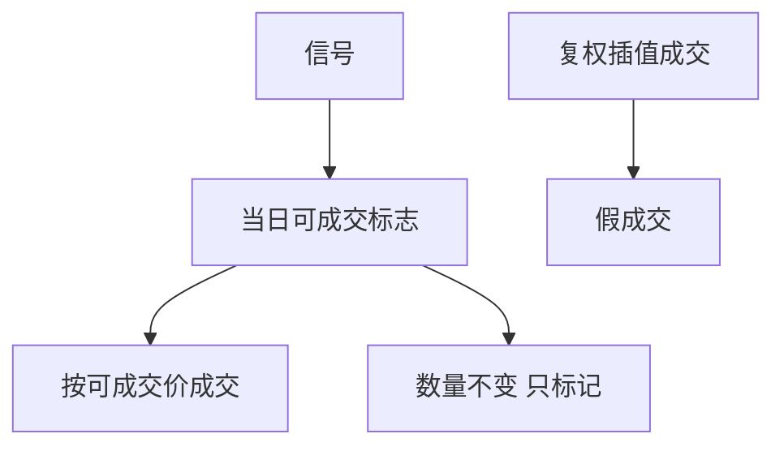

# 停牌与涨跌停对回测

连续复权价会在停牌日插值、在涨跌停日画出一个可成交的收盘价；当时你可能一股也买不到。可成交集合是制度状态，不是数据缺失。

<footer>—— 据 Harris, Trading and Exchanges；交易所涨跌幅与停牌规则整理</footer>

上一课[指数调入调出](/quant/index-rebalance)已经碰到生效日买不到的问题。本课把**可成交性**写成回测的硬状态：停牌、涨跌停、临时停牌。财务课的退市是离开列表；本课证券仍在列表上，但当日没有合法成交价。不重写退市回报，不进入 LOB 排队。

## 问题

vendor 的日线常给停牌日一个价格（昨收或标记价），涨跌停日给一个等于限价的收盘。回测若按收盘价成交，会在涨停板「买到」、在跌停板「卖出」，方向往往正好是动量与事件策略最想做的一侧。缺口是给每个证券每个交易日一个可成交标志与可成交价格集合：停牌则不能成交；涨停时只能卖不能买（或只能平仓，视规则）；跌停相反。信号仍可更新，仓位不能假装更新。

中国 A 股、部分新兴市场对这条最硬；美股的 limit up/down 与 trading halt 是同类约束，不可因为样本是美股就跳过。

### 停牌不是缺失再前向填充

前向填充把最后价一直写到复牌，持有期回报为零，好像波动消失。真实路径是复牌第一笔可能跳空，保证金按经纪商规则在停牌期间仍可能占用，复牌走缺口课。填充零回报会低估事件风险、高估夏普。

一字涨停连板时，日线收盘全是可画的点。策略若每天按收盘加仓，会在板上堆积一个从未成交的库存。

## 方法

日终状态机：若停牌，禁止开平仓，持仓数量不变，市值按规则标记（昨收或交易所标记价）只用于保证金，不用于「成交」。若触及涨跌停且无打开，开仓方向受限。回测成交价必须来自当时可成交的拍卖或连续竞价，而不是复权后的合成价。事件策略的「第一可成交价」在停牌后等于复牌第一笔，不是事件日那根被填出来的 K 线。

样本不得因为「停牌日没有成交量」就删掉该公司——那会在事件研究里丢掉最极端的公告。

一字板期间日线收盘等于限价，看起来天天可成交。状态机必须用成交量或涨跌停标志：量为零或标志为板，则对应方向开仓失败。停牌日的标记价只进保证金，不进成交。复牌集合竞价的第一笔才是事件策略的「第一可成交价」。把停牌区间从样本里 dropna，等于在最需要制度约束的日子关掉约束。

## 机制

涨跌停把缺口课的「下一可成交价」变成可能数日之后。PEAD、并购、指数在板上的纸面 CAR 大量来自不可成交的限价。资金占用在停牌期间不释放，借券可能被召回却无法回补，直到复牌——召回加停牌是空头的最差组合。回测偏差方向：动量与事件的多头在涨停侧被高估，空头在跌停侧被高估。

下一课做空规则限制的是空头如何挂单；本课限制的是任何方向在限价上能否成交。先有可成交集合，再谈报升。

收盘拍卖里「看起来有量」也不等于你的市价单能进。涨停板的成交往往是早排进的限价，后来的买盘只是排队。日频回测看不见队列，因此触及限价且未打开时，对应方向的开仓应记失败，而不是按收盘量分配一笔成交。复牌日的缺口计入强平与事件，不计入「正常换手」。

## 边界

不汇编各交易所涨跌幅百分比，不模拟集合竞价的全部规则。LOB 的队列位置、部分成交，交给[Limit order book 结构](/quant/lob-structure)。后课做空规则是空头委托的额外门；本课先钉任何方向的可成交集合是否为空。复权连续价不得当成交证据；停牌区间不得前向填充成零回报。事件样本保留停牌观测。可买可卖标志是日频状态，不是数据缺失。

美股的 limit up/down 与短暂停牌，和 A 股涨跌停不是同一套百分比，但回测接口相同：当日是否允许该方向成交。不要因为样本是美股就跳过这张标志表。开盘集合竞价被取消或延迟时，事件策略的「第一可成交价」继续后移，直到真正出现可成交记录；用计划开盘时间的参考价成交，仍是假成交。停牌期间借券召回不能按标记价回补，必须等到复牌第一笔，这与缺口课是同一成交定义在可成交集合为空时的推论。临时停牌若只停个股、指数期货仍在交易，对冲腿会短暂变成单边；回测要允许这笔基差，不能用指数价格去填个股停牌日。标志表按交易所日历对齐，时区与夏令时写死。

## 小结

- 停牌与涨跌停定义可成交集合，不是缺失值。
- 复权连续价上的收盘成交会在板上假成交。
- 停牌期间占用不释放，复牌按缺口价。
- 删掉停牌日样本会丢掉极端事件。
- 事件与动量的纸面收益对这条最敏感。
- 出处：Harris, *Trading and Exchanges*；交易所停牌与涨跌幅规则。
