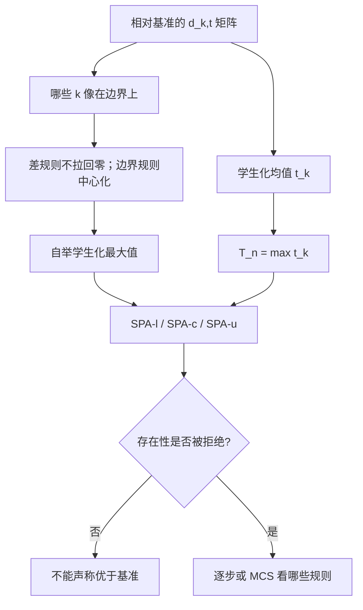

# Hansen SPA 检验

    
检验的是是否存在优于基准的预测或规则；学生化与对差模型的再中心化，避免让一堆明显很差的替代把功效吃掉。

    <footer>—— Hansen, A Test for Superior Predictive Ability, Journal of Business &amp; Economic Statistics, 2005</footer>

White 的 Reality Check 问「最好的规则是否优于基准」，但把许多期望为负、噪声很大的差规则留在集合里时，最大值的自举分布被这些差规则撑宽，检验变得过于保守——有技能也拒绝不了。Hansen（2005）的 Superior Predictive Ability（SPA）检验针对同一原假设

$$
H_0:\ \mu_k\le 0\quad\text{对所有 }k,
$$

即没有一条规则的期望相对绩效为正，但在统计量与零分布上做了两处关键修正：对学生化绩效取最大，以及在自举里把明显差的模型再中心化到零附近、而不是让它们以负均值去制造虚假的极端最大值。本篇写 SPA 相对 Reality Check 改了什么、三种 p 值（下界、一致、上界）怎么读，以及它与 Romano–Wolf 逐步法、[PBO](/quant/pbo) 的分工。对象仍是预测或交易规则的相对绩效，不是截面因子动物园的 FDR。

## 问题

记 $d_{k,t}$ 为规则 $k$ 相对基准在 $t$ 的损失差或收益差，$\mu_k=\mathbb{E}[d_{k,t}]$。$H_0$ 是所有 $\mu_k\le 0$。样本均值 $\bar d_k$ 的方差 $\omega_k^2$ 可以差几个数量级：高换手规则噪声大，低换手规则噪声小。未学生化的 $\max_k\bar d_k$ 容易被高方差规则的幸运实现主导。学生化统计量

$$
T_n=\max_k\frac{\sqrt{n}\,\bar d_k}{\hat\omega_k}
$$

把比较放到 $t$ 的尺度上，使「稳稳高出一点」可以和「偶然高出很多」分开。这还不够：自举若对所有 $k$ 都减 $\bar d_k$（完全中心化），差规则的 $\bar d_k$ 为负，减去之后等于把它们抬到零附近再允许正噪声，零分布过宽；若完全不中心化，原假设边界上的近似又坏掉。Hansen 的做法是只对「看起来可能在边界上」的规则中心化，对明显差的规则保持其负均值，从而收紧零分布、恢复功效。

### 学生化不是装饰

$\hat\omega_k$ 须与 $d_{k,t}$ 的依赖结构一致，通常用 HAC 或与平稳自举兼容的方差估计。学生化之后，规则集合里加进一条方差极大、期望为负的「噪声策略」，不应再显著改变检验结论——这是相对 Reality Check 的可观测改进。若加入噪声策略后 p 值大幅上升，说明实现仍接近未学生化的 Reality Check，应检查方差估计或自举设计。

SPA 的「预测能力」在 Hansen 原文里用损失差（如平方预测误差）表述，交易规则用效用差或超额收益即可，数学相同。不要因为标题含 predictive 就把检验限制在回归预报；技术规则与执行算法的相对绩效同样适用。

## 方法

**一致 SPA。** 对每个 $k$ 构造中心化后的自举均值：当 $\bar d_k$ 低于某个随 $n$ 趋于零的负阈值（Hansen 用 $-\hat\omega_k\sqrt{2\log\log n}$ 一类），视为明显差，自举时不把它拉回零；否则按边界情形中心化。每次自举计算学生化最大值，与样本 $T_n$ 比较得到 p 值。该 p 值在 $H_0$ 下渐近有效，且在存在差模型时比 Reality Check 更有功效。

**SPA-l、SPA-c、SPA-u。** Hansen 建议同时报告三个 p：下界（最乐观、把尽可能多的模型当边界）、一致估计、上界（最保守、接近把所有模型当边界，精神上靠近 Reality Check）。三者一起读：若连下界都不能拒绝，证据弱；若只有下界拒绝、上界不拒绝，结论依赖对差模型的处理，应在报告里写明。不要只摘最小的那个 p。

**逐步与多重优于。** SPA 是「是否存在至少一个优于基准」。若还想知道**哪些**规则优于，需要逐步法：Romano–Wolf 在 Reality Check 族上做逐步 FWER 控制；Hansen 也可对个体假设做学生化逐步。先 SPA 再逐步，避免在未拒绝「存在性」时讨论冠军名单。

### 实施清单

输入是 $n\times M$ 的相对绩效矩阵，已扣费、已按同一基准对齐。自举用平稳或块自举，块长度与 Reality Check 同样需要敏感性。规则若来自网格，全部格子进矩阵。嵌套选择产生的「每期一个冠军」应先展开为候选矩阵，而不是把路径拼接曲线当成 $M=1$。样本切分若用于选择，见 [嵌套交叉验证](/quant/nested-cv)，SPA 不能事后修补泄漏。

对高度相关的规则簇，学生化最大值仍然有效，但逐步名单会整簇一起显著或一起不显著。报告应聚类，避免把十个近亲当成十个独立发现——与 [MDA](/quant/mda-importance) 的簇置换同一精神。

## 机制

功效改进来自零分布的几何。Reality Check 的自举最大值要覆盖「最差那些规则碰巧冲到最前」的事件；差规则越多、方差越大，覆盖区间越宽。SPA 把这些规则从边界上拿开：它们的期望被允许保持为负，于是自举最大值主要由真正靠近零的竞争者决定。学生化则压缩高方差幸运儿的坐标。两者一起，使检验的尺度与「有没有一个合理稳定的优势」对齐，而不是与「有没有一个吵闹的幸运者」对齐。

原假设是复合的（所有 $\mu_k\le 0$）。最难拒绝的是边界：若干 $\mu_k=0$，其余 $\lt 0$。一致 SPA 针对这条边界构造。若真实世界是全部 $\mu_k$ 远小于零，p 值应大；若有一个 $\mu$ 明显为正，p 值应小。有限样本里阈值的选择会影响谁被当成「明显差」，所以要报三个 p，而不是假装存在唯一正确的中心化。

### 与 PBO、DSR、HLZ 如何一起用

SPA / Reality Check：相对明确基准的存在性检验。PBO：搜索冠军的相对中位可迁移性。DSR：对已选夏普的解析放气。Harvey–Liu–Zhu：因子发现的多重 $t$。一个策略研究室的协议可以是：候选矩阵先扣费，再 SPA 相对买入持有或相对已部署基准；对通过存在性的搜索，报 PBO 与 DSR；因子论文另走 HLZ / FDR。用 SPA 替代 PBO 会漏掉「全体都赢基准但选择无相对价值」；用 PBO 替代 SPA 会漏掉「相对中位还行但全体没有经济边缘」。

## 边界与工程取舍

SPA 仍是对历史期望 $\mu_k$ 的检验，非平稳时 $\mu$ 不是未来边缘。块自举假设弱依赖而非突变；体制切换应分段报告，而不是把两段过程混成一个更「有功效」的长样本。学生化方差在很短样本上本身很吵，极端肥尾下正态极值近似差，可辅以子抽样。

不要为了拒绝而删掉差规则：那会改变原假设的对象，并把选择规则集合变成又一次窥探。正确做法是预注册集合，让 SPA 自己对差规则降权。也不要把连续调参轨迹压缩成一条规则再做 SPA 却声称 $M=1$。计算上与 Reality Check 相同，瓶颈在 $M\times$ 自举次数的矩阵运算，应对时间下标重抽样。

Hansen 后来还有 model confidence set 等后续，用来给出「不能被证明更差」的模型集合。SPA 拒绝之后，MCS 比「只宣布冠军」更诚实：往往留下一整簇不可区分的规则，而不是一个点。

## 小结

- Hansen SPA 与 Reality Check 共享「有无优于基准的规则」这一原假设，但用学生化与对差模型的再中心化恢复功效。
- 应同时报告 SPA 的下界、一致与上界 p 值，不要只摘最小者。
- 存在性拒绝之后再用逐步法或模型置信集谈名单；相关簇按族解读。
- 规则矩阵必须扣费、预注册；SPA 不修复泄漏与非平稳。
- 与 PBO、DSR 分工：SPA 管相对基准的存在性，PBO 管选择的可迁移排名，DSR 管被选夏普的放气。
- 出处：Hansen, *Journal of Business & Economic Statistics*, 2005；White, *Econometrica*, 2000；Romano and Wolf, *Econometrica*, 2005；Hansen, Lunde and Nason, *Econometrica*, 2011（model confidence set）。
