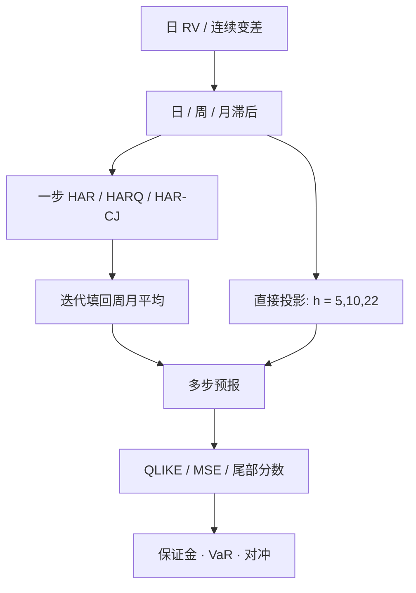

# HAR-RV 多尺度预测

一日、一周、一月三个滞后已经把长记忆近似写进线性式；真正决定风控与交易价值的，是同一组成分如何对多步地平线做直接投影，以及用哪一种损失去比较预报。

<footer>—— Corsi, A Simple Approximate Long-Memory Model of Realized Volatility, Journal of Financial Econometrics, 2009</footer>

[HAR 已实现波动](/quant/har-rv) 一文写 Corsi（2009）的对象：用日、周、月 RV 的线性组合逼近长记忆，避免估计分整阶数。本篇假定那条回归已经成立，把问题换成**预报协议**：一步还是多步、迭代还是直接、水平还是对数、MSE 还是 QLIKE、要不要把跳与测量误差拆开。风控要的一周或十日期方差，不是把一日 $R^2$ 乘上地平线。Patton 表明 QLIKE 对波动预测是一致排序的损失；Bollerslev、Patton 与 Quaedvlieg 的 HARQ 把已实现四分位变差放进回归，修正 RV 作为积分波动代理时的异方差测量误差。Andersen、Bollerslev 与 Diebold 把连续变差与跳分开进 HAR-CJ。这些扩展改的是预报，不是再发明一种长记忆。

## 问题

设已有日频 $RV_t$。一步 HAR 预报 $RV_{t+1}$。保证金、VaR、期权对冲却常要 $h\in\{5,10,22\}$ 日的积分方差 $\sum_{i=1}^h RV_{t+i}$ 或期末 $RV_{t+h}$。两条路。迭代：用一步模型把 $\widehat{RV}_{t+1}$ 填回周、月平均，再推 $t+2$，直至 $h$。直接：用同一组滞后对 $RV_{t+h}$ 或对未来 $h$ 日平均再回归一次，系数随 $h$ 变。问题是哪一条在样本外更稳，以及如何声明损失，使「HAR 赢了 GARCH」这句话可复现。

RV 不是积分波动 $IV_t$，而是带测量误差的代理。误差在平静日相对更大，OLS 把高噪声观测与低噪声观测同等对待，系数被拉向噪声。多步预测把误差累加进周、月平均，月成分尤其脏。不处理测量误差，多尺度只是把脏数据做了三次平均。

### 地平线一变，日成分就不应再占主导

一步预报里 $\beta_d$ 通常最大：明天最像昨天。十日前，慢成分占优，直接 HAR 的 $\beta_m$ 上升、$\beta_d$ 下降，这是投影公式的结果，不是参数漂移。若只用迭代一步模型去报十日期，等于假设日成分的动力学在多步里仍然正确；若日成分其实含大量测量噪声，迭代会把噪声当作可持续的高波动。直接投影把这个问题交给数据：长地平线上自动减权日滞后。

把一日 HAR 的 $R^2$ 写成「模型很好」，再在周 VaR 里用 $\sqrt{5}$ 放大，是把条件异方差当成独立同分布。HAR 的价值正在于条件均值随尺度变；丢掉尺度，只剩一个带三个系数的 AR。

## 方法

**损失。** 水平 MSE 对高峰过度敏感，模型靠压低极值讨好平方损失。Patton 的 QLIKE（或等价的高斯准似然）在以 $IV$ 为对象时对代理噪声稳健排序。实务应同时报 QLIKE、MSE，以及一种尾部分数（例如超阈值的频率校准）。对数 HAR 在 $\log RV$ 上拟合再指数化，须做 Jensen 调整或直接在水平损失上评估，不能用对数域 $R^2$ 与水平域 $R^2$ 混排。

**HAR-CJ 与杠杆。** 用双幂次或跳稳健变差把 $RV$ 拆成连续 $C$ 与跳 $J$，各自做日/周/月，预报次日 $RV$ 或次日 $C$。跳的可预测性通常弱于连续部分；把 $J$ 放进回归，往往只改善有跳日之后的短期，对多步帮助有限。杠杆项（昨日负收益）吸收非对称，应以外层样本 QLIKE 决定去留，见[嵌套交叉验证](/quant/nested-cv)，不要在全样本 $t$ 显著就留下。

**HARQ。** Bollerslev–Patton–Quaedvlieg 令系数随已实现四分位变差缩放：测量误差大的日子，该日 RV 对次日的权重下降。这是对「RV 是带噪 $IV$」的一阶修正，不是新的异质期限。多步 HARQ 把同一思想做到直接投影。上游 RV 若已经过核或预平均，测量误差变小，HARQ 的增益会收缩——应先固定 [RV 构造](/quant/rv-noise)，再比较 HAR 与 HARQ。

### 迭代、直接与混合

迭代实现简单，与条件均值模型一致，便于做情景路径。偏差来自：非线性变换（对数）、周月平均里的生成回归量误差、以及跳的稀疏性无法由线性迭代传播。直接投影每一种 $h$ 一套系数，多步通常更准，但系数之间不保证与一步模型相容，长地平线样本有效变少。混合做法是：一日用 HAR/HARQ，多日用直接 HAR 对未来平均 RV，并在报告里把 $h=1,5,10,22$ 分成四张表，而不是只贴 $h=1$。

与 GARCH、已实现 GARCH 比较时，信息集必须对齐：HAR 用到 $t$ 日终了的日内信息；日频 GARCH 只用到 $t$ 日收益。把收盘后才能得到的 RV 拿去和「只用日收益」的模型比同一时点的预报，HAR 占便宜。公平比较是：都在 $t$ 日收盘后预报 $t+1$，或都在开盘前只用到 $t-1$。隔夜方差是否进入左边，见[日历与隔夜](/quant/calendar-overnight)。

## 机制

异质市场给出为什么三个滞后够用：不同期限交易者把冲击存进不同长度的波动成分。预报机制是这些成分的衰减速度不同。短冲击在几天内消失，周、月成分像状态变量。多步直接投影等于按地平线重估三层的相对权重。这解释了「HAR 的长记忆只在日到月之间像」：超过月，月平均本身开始均值回复，年度地平线应换宏观状态或期权期限结构，而不是把 $RV_{t-252:t}$ 再塞进回归叫 HAR-年。

测量误差机制：$\mathrm{RV}_t=IV_t+e_t$，$e_t$ 的方差与 $IV_t$ 和网格有关。OLS 的衰减偏误让 $\beta_d$ 偏小。HARQ 用 quarticity 当 $e_t$ 方差的代理，做广义最小二乘式的加权。跳的机制不同：跳抬高 RV 但不一定抬高次日连续波动；HAR-CJ 避免把跳日当成「高波动体制的开始」。若预报对象是总二次变差（方差互换浮动腿），跳应留在左边；若对象是连续对冲误差，应预报 $C$。

QLIKE 对低估波动惩罚更重，与保证金、VaR 的不对称一致。只在 MSE 上宣称 HAR 与 HARQ 无差异，往往会在压力日暴露：测量误差加权的模型更不愿把噪声高峰当成可持续。

### 从点预报到风险输入

HAR 输出条件均值。VaR 还要残差分布：大 RV 之后预报误差也大，残差有波动的波动。把 $\sqrt{\widehat{RV}_{t+1}}$ 直接当正态标准差，忽略 HAR 残差的条件异方差与跳。工程上可在 HAR 残差上再套一层简单 GARCH 或经验分位，或用分位回归直接预报 RV 的分位。组合层面，个股 HAR 加总不等于组合 RV，缺相关；应对因子组合或指数直接估 HAR，再把个股预报留给特异风险。

## 边界与工程取舍

结构突变会让全样本系数被危机年主导。滚动 HAR 适合实盘，但窗口短于两年时月成分估不稳。不要在未清洗的成交价 RV 上比较多步 $R^2$：微观噪声的短记忆会伪装成巨大的 $\beta_d$，一步看起来极准，多步迅速崩溃。也不要把 HAR 预报当成方差风险溢价交易信号：左边是已实现测度，不含风险中性补偿。

计算极轻，真正成本在上游网格与下游损失协议。模型比较必须冻结：RV 定义、变换、地平线、损失、样本切分。用全样本挑「HAR-CJ 还是 HARQ」再报告同一段样本外，回到非嵌套。多品种扫描时，系数异常（负的月成分、和大于 1）应触发数据诊断，而不是直接进风控。

Corsi 原文的贡献是近似长记忆的简约均值方程。多尺度预报的贡献是把地平线、损失与测量误差写成实验设计。把所有扩展塞进一个「终极 HAR」再在全样本上调，会把简约模型重新做成脆弱的高阶 AR。

## 小结

- HAR 的多尺度价值在直接或迭代的多步预报，不在一日 $R^2$；地平线变长时月成分应升权。
- 比较须固定 QLIKE（及 MSE），对数变换要在水平损失上评估。
- HAR-CJ 避免把跳当成持续波动；HARQ 修正 RV 的测量误差加权。
- 点预报不是 VaR：残差仍有波动的波动，组合还缺相关。
- 出处：Corsi, *Journal of Financial Econometrics*, 2009；Patton, 波动预测损失；Andersen, Bollerslev and Diebold, HAR-CJ；Bollerslev, Patton and Quaedvlieg, HARQ, *Journal of Econometrics*。
