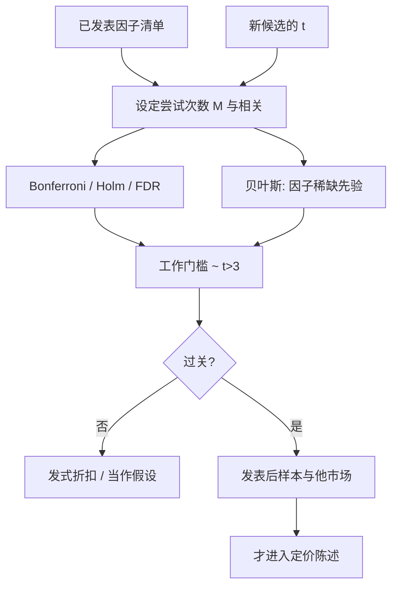

# Harvey-Liu-Zhu 多重检验

试图解释截面期望收益的因子已经太多。新因子的 t 统计量门槛不应再是 2.0；在他们收集的文献与合理的尝试次数下，大约 3.0 才对应 5% 的显著性。

<footer>—— Harvey, Liu and Zhu, … and the Cross-Section of Expected Returns, Review of Financial Studies, 2016</footer>

单次检验里 $|t|>1.96$ 大约是 5%。资产定价的「发现」却从来不是单次：同一 CRSP 截面上换特征、换加权、换样本起止、换正交顺序，再发表那个最好的 t。Harvey、Liu 与 Zhu 把截至当时的因子动物园点了名——三百多个声称解释截面的因子——并问：在这种搜索强度下，还把 2.0 当发现，一类错误有多高。他们的回答是把多重检验写进门槛，而不是写进脚注。本篇写 2016 年这篇 RFS 的定标逻辑、t≈3 从哪来、以及它和[更宽的 p-hacking 讨论](/quant/multiple-testing-factors)、[紧缩夏普](/quant/deflated-sharpe)如何分工；不把 3.0 当成永远不变的魔法数。

## 问题

设真实存在的可定价因子很少，研究人员却报告了数百个「显著」α。两种解释：市场真有这么多独立风险；或者大部分是多重尝试下的幸运。McLean 与 Pontiff（2016）看到许多异常在发表后衰减，第二种至少占一块。Harvey–Liu–Zhu 的问题更具体：若把已发表因子当成一次多重检验的结果，新提交的第 $k$ 个因子，其 t 要多大才配得上「不是又一次幸运」。

尝试次数 $M$ 不可全观测。已发表的是上偏样本；实验室里失败的变换、未投稿的 t=1.8，构成暗数。任何门槛都依赖对 $M$ 与因子相关结构的假设。HLZ 的贡献不是给出唯一正确的 $M$，而是表明：在他们收集的因子数量与几种常见的多重检验调整下，继续用 2.0 在定量上站不住。

### 已发表的 t 是截断样本

期刊偏好显著结果，报告的 t 分布在 2 附近堆一截，这是选择而不是自然定律。用这些 t 去估「因子的真实强度分布」会偏高。HLZ 用多重检验框架给已发表 t 做发式折扣（haircut）：同样的点估计，扣掉因搜索而产生的乐观。折扣后许多曾经「显著」的因子落到临界以下。这与 Hou、Xue、Zhang 用更严复制手续看到的衰减是同一方向的证据，手续不同。

暗数比已发表清单更要命。你在 A 股上试了换手、振幅、北向、龙虎榜、五十个技术指标，只投稿两个 t>3 的，HLZ 的 $M$ 应按五十计，不能按两篇论文计。Git 日志是比参考文献列表更诚实的 $M$。

## 方法

**频繁主义门槛。** Bonferroni 把单次水平 $\alpha$ 换成 $\alpha/M$，t 门槛大约从 2 升到 $\Phi^{-1}(1-\alpha/(2M))$。$M=300$、双侧 5% 时，门槛已经在 3.4 附近。Holm 逐步稍松。因子之间正相关时，有效尝试次数小于 $M$，Bonferroni 偏保守；HLZ 讨论了相关下的调整，并给出与当时动物园规模匹配的建议值：**新因子 $|t|>3.0$** 作为经验工作门槛。这不是推导出的自然常数，是对「数百次尝试、中等相关」的校准。

**贝叶斯多重检验。** 先验认为大部分候选因子的真 α 为零（或很小）。观测到 t=2 时，似然不足以把后验推到「应该进入教科书」。HLZ 用这种先验给发现概率定标，得到与频繁主义门槛同量级的结论：要让后验发现概率可接受，需要更高的 t。先验越悲观（因子越稀），门槛越高。

**发式折扣。** 对已报告的 t，按多重检验与选择偏差向下调整，再问调整后是否仍过关。适合读旧文献：不是把 1990 年代 t=2.2 的因子直接删掉，而是标明「按今日搜索强度，证据不足」。新研究不应依赖折扣后的旧 t 去加杠杆，而应重做样本外与他市场。

### 与策略搜索、CPCV 的接口

HLZ 的对象是**因子发现**（截面定价、学术 t）。策略配置的网格、特征变换、执行参数是另一场多重检验，往往 $M$ 更大，见[过拟合作为风险](/quant/overfit-as-risk)与 [CPCV](/quant/cpcv)。把因子论文的 3.0 直接当交易策略准入，可能仍然太松。反过来，风险模型要的是协方差解释力，t 小的风格仍可留在风险里，不必满足「alpha 发现」门槛。HLZ 约束的是「我发现了新的期望收益来源」这句话。

## 机制

多重检验不改变单次回归的点估计，改变的是「该估计能对抗偶然性」的陈述。样本内 α 可以很大、夏普可以好看，若它们是 $M$ 次搜索的最大值，期望样本外为噪声。这与[拥挤](/quant/factor-crowding)不同：拥挤是真信号被资金做薄；HLZ 是信号在统计上从未建立。实盘都表现为衰减，处方相反——前者管容量，后者停用。

发表偏差让文献的 t 分布不像零假设下的折叠正态，而像在 2 处截断后再平移。读者若把文献当独立重复实验，会严重高估可复制性。HLZ 把截断写进推断，等于提醒：你读到的已经是被选过的。

### A 股动物园需要更高还是更低的门槛

A 股样本短、制度常改、零售交易强，可挖掘的「特色因子」名单更长：换手、涨跌停距离、北向、龙虎榜、壳、ST……候选空间大于美股经典会计异常。若 $M$ 更大，门槛应**高于** 3，而不是因为「新兴市场无效所以 2 就够」。另一方面，若某个因子有预先声明的制度机制（例如[T+1](/quant/cn-tplus1) 强制隔夜、[融券约束](/quant/cn-short-constraint) 截断空头），可以在预注册的前提下给稍松的多重检验权重——必须先写机制再看 t，不能先显著再补制度故事。

t=3 对应的月频样本大约要二十年以上才有功效用来检出中等 α。A 股有效制度样本更短，真因子也可能检不出。这是功效问题，解决办法是降低杠杆与等待，不是把门槛降回 2 去「发现」。

## 边界与工程取舍

不要把 3.0 印成永久合规线：因子继续增殖、机器学习特征把 $M$ 推到几千时，门槛还要升。不要用换起始年让 t 刚过 3 再停。不要把风险模型里的风格因子与 alpha 发现用同一句话宣布「通过 HLZ」。不要引用 HLZ 却同时报告二十个相关变体里最大的那个 t。

与[紧缩夏普](/quant/deflated-sharpe)的分工：DSR 处理策略夏普的选择与非正态；HLZ 处理因子 t 的多重检验。两者都要你提交尝试次数。不报 $M$ 的「我们用了 HLZ 门槛」是空话。

出处：Harvey, Liu and Zhu, *Review of Financial Studies*, 2016。后续 Harvey and Liu, *Lucky Factors*。发表后衰减见 McLean & Pontiff, *JF*, 2016。复制衰减见 Hou, Xue and Zhang, *RFS*, 2020。

## 小结

- Harvey–Liu–Zhu（2016）把因子发现写成多重检验：在数百个已发表因子与暗数尝试下，t=2 不够。
- 他们校准的工作门槛约为 $|t|>3.0$；这是对当时 $M$ 的定标，不是物理常数。
- 已发表 t 应做发式折扣；新因子还要通过发表后样本与他市场，而不是只过名义门槛。
- A 股特色因子搜索空间更大，门槛应更高；有预声明制度机制的除外，但不能事后编故事。
- 风险解释与 alpha 声称可以分门槛；策略网格的 $M$ 往往要求比 3.0 更严。
- 出处：Harvey, Liu and Zhu, *… and the Cross-Section of Expected Returns*, RFS, 2016。
