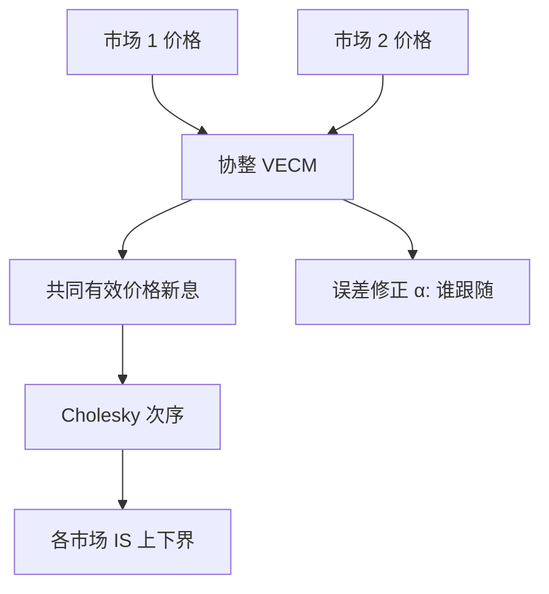

# Hasbrouck 信息份额

同一证券在多个市场上留下的报价，共享一个随机游走的有效价格；把这个游走的新息方差分解到各市场的扰动上，得到的就是各市场对价格发现的贡献。

<footer>—— Hasbrouck, One Security, Many Markets: Determining the Contributions to Price Discovery, Journal of Finance, 1995</footer>

[上一课](/quant/depth-mid)把多档可见量收成 $P(Q)$，最优档微价格是 $K=1$ 的极限；小单看微价格，大单看沿簿均价。缺口从一张簿的读数转到多市场：同一索取权在若干交易所或现货/期货同时交易时，新信息先写进哪一个价格——这不是「谁更流动」或「价差更窄」。本课钉 Hasbrouck（1995）信息份额：协整系统里有效价格新息方差的分解。不重讲目标量 $Q$。对照 [微观结构噪声](/quant/microstructure-noise) 的定价误差方差；后课流动性因子默认 IS 不是 PIN，也不是 Kyle $\lambda$。

## 问题

深度加权给出一张簿上的 $P(Q)$，回答不了新信息先写进哪一个市场。若两个市场交易本质上同一索取权，长期看价格不能分道扬镳，否则存在套利。短期看，谁先动、谁跟随，噪声谁更大，可以完全不同。中间价、成交价都含微观结构噪声，简单比较「谁先跳一个 tick」会被弹跳欺骗。需要一个模型：每个市场的价格 = 共同有效价格 + 自身平稳误差，然后问：有效价格的新息，有多少方差来自市场 $i$ 的扰动。

这个问题与「哪边成交量更大」不同。一个市场可以很活跃却主要在弹跳（份额低），另一个可以稀疏却常常先把有效价格挪走（份额高）。也与毒性不同：毒性问流动性提供者是否在亏，信息份额问发现发生在哪。把 IS 高的市场当成「更毒」没有理论依据。

### 共同随机趋势与 VECM

记 $p_t$ 为 $n$ 个市场的价格向量。协整假定 $\beta'p_t$ 平稳（通常取价差为平稳），而 $p_t$ 本身 $I(1)$。向量误差修正模型为

$$
\Delta p_t=\alpha\beta'p_{t-1}+\sum_{j=1}^{k}\Gamma_j\Delta p_{t-j}+\varepsilon_t,\qquad \mathrm{Var}(\varepsilon_t)=\Omega.
$$

$\alpha$ 是误差修正速度：谁在价差出现后负责拉回去，谁就更像跟随者。Hasbrouck 把有效价格的新息写成 $\varepsilon$ 的线性组合，其方差为 $c\Omega c'$ 一类二次型（$c$ 来自共同趋势的载荷）。市场 $i$ 的信息份额是：在 $\Omega$ 的某一种因子分解下，第 $i$ 个正交新息对该方差的贡献占比。所有市场的 IS 之和为 1。

协整向量通常取 $(1,-1)$ 或对 ETF/期货做合约乘数调整。若两个价格根本不为同一索取权（不同到期、不同币种未对冲），强行估 IS 只是把不平稳的价差塞进误差修正，份额没有经济含义。

## 方法

采样时钟必须统一：Hasbrouck 原文用规则的短间隔（如一秒）取最后报价。更细的事件时间可以对齐到每一次任一市场的报价更新，未更新的市场沿用上一次——这会把慢市场写成一串零收益，份额自动偏向活跃市场，需要交代。滞后阶数用信息准则，但应稳定到份额对 $k$ 不敏感。估计在每个交易日或滚动窗内做，避免隔夜跳空破坏协整。

$\Omega$ 不是对角的：市场新息瞬时相关，因为同一毫秒的信息或共同延迟。Cholesky 分解依赖变量次序：先放的市场会吃掉共有的瞬时方差，IS 被抬高。Hasbrouck 的做法是报告所有次序下的最小与最大 IS，把区间而不是一个点当成结果。市场很多时次序爆炸，可报上下界的均值，或改用后来的修正（如最大似然下的唯一分解），但原文的识别限度应写进表注。

### Cholesky 次序与上下界

若 $\Omega$ 近乎对角，上下界收窄，份额稳健。若瞬时相关很高——两个做市商看同一公共信息、或数据时间戳精度不够——上下界会拉开到几乎 $[0,1]$，这时 IS 不可用，应先改善时钟、或承认「发现发生在这一毫秒的公共信息里」，而不是硬拆给某一交易所。把某个市场永远放在 Cholesky 第一位再只报一个数字，是常见的美化。

Gonzalo–Granger 永久—暂时分解给出的是共同趋势的权重（谁的价格进入有效价格的水平），不依赖 $\Omega$ 的因子分解，因而没有次序问题；它回答的是「有效价格是各市场价格的哪种线性组合」，不是「新息方差从哪来」。两个指标可以分歧：一个市场噪声大但新息重要（IS 高、GG 权重低）。应同时报告，不要只选好看的那个。

## 机制

机制是套利与学习。有效价值变动时，更快处理信息或更靠近知情流的市场先改报价；其他市场的做市商看到价差，用误差修正把报价拉回去。$\alpha$ 大的市场是跟随者；IS 高的市场是新息的主要来源。流动性好可以降低定价误差（1993 年的质量），但不自动提高 IS：它可以只是把别人已经发现的价格印得更勤。

与 Kyle、PIN 的接口：知情交易可以集中在某一市场，于是该市场 IS 高、同时 [PIN](/quant/pin) 或毒性也可能高——这是可能的共现，不是定义。Kyle 的 $\lambda$ 描述该市场内部订单流如何冲击价格；IS 描述市场之间谁贡献有效价格方差。一个市场可以 $\lambda$ 很大（浅）但 IS 很高（信息先到这里），也可以相反。把 IS 当成流动性排序会把发现与深度混在一张表里。

### 与 Gonzalo–Granger、PIN 的差别

PIN 用单一市场的买卖计数估信息事件概率，没有「多市场贡献」。VPIN 是成交量时钟上的毒性代理。IS 不用方向计数，只用价格向量的协整。现货与期货之间估 IS，是价格发现文献的经典应用：到期临近、基差平稳时识别较好；远月合约与近月不是同一索取权，应先转换或只取近月。ETF 与篮子：篮子有构造延迟，IS 常偏向期货或活跃 ETF，但不意味着成分股「没有信息」，只意味着新息先出现在衍生品印记上。

时间戳精度是一等识别条件。把两个市场的时钟对不齐，领先滞后会被管道延迟写成「发现」。应使用交易所时间并处理夏令时、午休断开，而不是用本地接收时间。

## 边界

两个价格必须协整。结构断裂——一只腿停牌、最小报价单位调整、交易时段不一致——会让全日 VECM 无意义。多于两个市场时，IS 上下界变宽。把微价格、深度加权中间价与中点当成「三个市场」去估 IS，是把同一张簿的三种读数当成独立观测，共同噪声使分解无效。

高频下微观结构噪声占满 $\Delta p$，协整关系被弹跳淹没，IS 会乱。Hasbrouck 自己使用的采样相对当时的数据已经是在噪声与信息之间折中；今天若用微秒，应先考虑是否应对价格做轻度平滑或改用中点。不要用 IS 去指导「把订单送到份额最高的市场」而不谈费用、延迟与可成交深度——发现贡献不是执行算法的充分统计。

信息份额不是市场份额，也不是成交量份额。报告时应并列成交量、价差与 IS 上下界，避免读者把「贡献了 70% 的发现」读成「70% 的量应该去那里」。

## 小结

- Hasbrouck（1995）在多市场价格的协整系统里，把有效价格新息方差分给各市场，得到信息份额。
- 瞬时相关使 IS 依赖 Cholesky 次序，应报告上下界；时钟对齐是识别条件。
- Gonzalo–Granger 给共同趋势权重，与 IS 互补，二者不必一致。
- IS 不是流动性、不是 PIN、不是 Kyle $\lambda$，也不应用同一张簿的多种读数去冒充多市场。
- 停牌、合约乘数、时段与噪声采样限制分解的可用性。
- 出处：Hasbrouck, *Journal of Finance*, 1995；定价误差与市场质量见 Hasbrouck, *Review of Financial Studies*, 1993。
