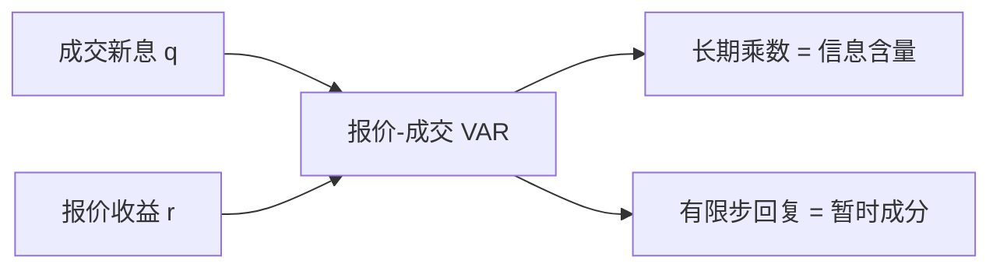

# Hasbrouck 报价-成交 VAR

把成交与报价放进一个向量自回归：成交对后续报价的永久影响，度量这笔交易的信息含量；随后回复的部分，才是弹跳、库存与噪声。

<footer>—— Hasbrouck, Measuring the Information Content of Stock Trades, Journal of Finance, 1991</footer>

[Stoll 三成分](/quant/stoll-three-components)用成交指示回归给价差做会计。缺口是更一般的动态：报价与成交互相预测，冲击有脉冲响应，不必事先把移动贴成三个常数比例。Hasbrouck（1991）估计成交–报价的 VAR（及同年 RFS 的信息含量摘要），把一笔带符号成交的**永久价格影响**定义为信息含量。本课不是 [1995 年多市场信息份额](/quant/hasbrouck-is)。

## 问题

Stoll 型回归把 $\Delta m_t$ 写成 $Q_{t-1}$ 的同期函数，滞后结构很短。真实过程里，大单被拆开、报价在成交前已动、成交后还有多步修订。需要一个对 $\{q_t,r_t\}$（带符号成交与报价或中点收益）的线性动态，问：对 $q$ 的一个新息，当 $h\to\infty$ 时 $r$ 的累积响应是多少。这个极限响应是交易的信息含量；有限 $h$ 上多出来又缩回去的，是暂时成分。

问题还包括识别新息：当期成交与当期报价修订往往同时发生。Hasbrouck 用结构假设（例如成交可以立刻进报价，报价新息不立刻进成交，或反过来做稳健）来排因果顺序。顺序一错，永久影响会把弹跳算进去。

### 与信息份额课的分工

[信息份额](/quant/hasbrouck-is)问多个市场谁对共同随机游走贡献方差。本课问**同一市场**里，交易相对于报价修订贡献了多少随机游走。一个是跨市场分解，一个是交易对报价的脉冲。Gonzalo–Granger 的永久成分是下一课的对象。

经验 Kyle $\lambda$ 常是 $\Delta p$ 对 $q$ 的同期回归，相当于 VAR 脉冲的第 0 步。Hasbrouck 要的是脉冲的终点，不是第 0 步。

## 方法

令 $x_t=(r_t,q_t)'$，

$$
x_t = A_1 x_{t-1}+\cdots+A_p x_{t-p}+\varepsilon_t.
$$

$r_t$ 多用中点对数变化，$q_t$ 用带符号量或方向。成交新息的长期乘数

$$
\alpha_q = \lim_{h\to\infty} \frac{\partial}{\partial \varepsilon^q} \sum_{k=0}^{h} r_{t+k}
$$

是信息含量。可对大单、小单、不同时段分别估。Hasbrouck（1991, RFS）还把信息含量收成 $R^2$ 型摘要：随机游走新息方差里有多少能被交易解释。

### 暂时成分是残差，不是「库存的名字」

VAR 不先验标签库存或处理。凡是不进入随机游走的线性组合，都叫暂时。要说它是库存，需要额外把做市商头寸放进系统。本课的机制贡献是**分离永久与暂时**，而不是完成 Stoll 的三项命名。

## 机制

公共信息可以先改报价、再诱发成交，也可以先成交、再改报价。VAR 允许两条通道。若市场有效且无微观结构摩擦，成交新息对价格的永久影响应等于其信息，暂时影响为零。摩擦把暂时影响做大：弹跳、库存、过时报价。信息含量随公司规模、价差、时段变化，给出「哪些交易在发现价格」的描述，而不需要 PIN 的体制结构。

与连续 Kyle 对照：那里全部价格移动都是对累计流的滤波，没有单独的报价过程。Hasbrouck 的数据是电子盘的报价与成交两条时间序列，更靠近[限价簿](/quant/lob-structure)的可观测量。$\alpha_q$ 可以看成时变、状态依赖的经验 $\lambda$，但不是均衡里的常数。

## 边界

线性、平稳、新息顺序，三条都脆。跳变、隔夜、集合竞价要切开样本。多市场时本地 $q$ 不是全部流，永久影响会被低估或错配，那是信息份额的问题。隐藏流动性让 $q$ 测量不全。高频下微观结构噪声使 $r_t$ 以负自相关为主，滞后阶数不足会把暂时当永久。

把 $\alpha_q$ 在截面上对预期收益回归，并不自动等于 Amihud–Mendelson。信息含量高可能意味着逆向选择溢价，也可能意味着更有效的发现、风险更低。符号不是理论定理。

## 小结

- Hasbrouck（1991）用报价–成交 VAR 把一笔交易的永久价格影响定义为信息含量。
- 同期回归斜率只是脉冲的第 0 步；终点乘数才对应随机游走。
- 暂时成分是不进入随机游走的部分，默认不贴库存标签。
- 1995 年信息份额是多市场问题，不在本课。
- 出处：Hasbrouck, *Journal of Finance*, 1991；摘要度量见 Hasbrouck, *Review of Financial Studies*, 1991。
