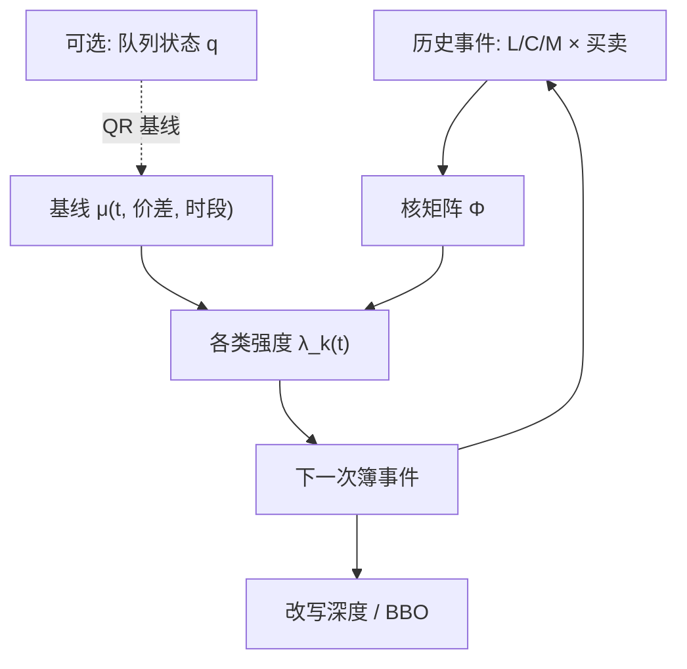

# Hawkes 订单簿强度

限价簿上的增、撤、成不是各自独立的泊松流：一笔事件会在随后的毫秒到秒里抬高若干类事件的强度，簿的路径因此是相互激励的点过程，而不只是队列长度上的马尔可夫跳。

<footer>—— 据 Hawkes 的线性自激过程；限价簿上的应用见 Bacry, Mastromatteo and Muzy 的综述，以及 Large 等对簿恢复力的点过程估计</footer>

[成交到达强度](/quant/hawkes-trades) 把 Hawkes 用在成交这一个标记上，解释为什么成交成串。订单簿上还有限价到达与撤销，而且分买卖两侧，事件类型一下子变成六类甚至更多（再按是否改 BBO 切分）。Hawkes 订单簿强度关心的是：**哪一类事件抬高哪一类后续强度**，以及这种抬高如何与深度、价差一起塑造短时波动。它与 [Queue-reactive](/quant/queue-reactive) 互补：QR 让强度看当前 $q$，Hawkes 让强度看过去事件的时间核。本篇写事件标记、核的时间尺度和诊断，不重复成交篇里已经展开的一维分支比课。自激是统计依赖，不是一份把撤单堆成串以误导他人的操作手册。

## 问题

只对成交拟合 Hawkes，会把「成交之后的撤单潮」和「成交之后的补限价」都推进残差，或者错误地算进成交自激。簿的恢复力（resilience）恰恰表现为：主动买打薄卖档之后，限价卖在短时间内涌回。Large 用点过程刻画这种恢复；Bacry 等人把多元 Hawkes 当成高频价格与订单流的标准语言。问题是事件字典：至少需要买限价、卖限价、买撤、卖撤、主动买、主动卖。再细可以加「改善报价的限价」与「队尾限价」，因为二者对 BBO 的含义不同。

日历基线仍然存在：开盘强度高。若把开盘的外生脉冲全部交给核，分支比会被抬向临界。簿模型必须同时有 $\mu(t)$ 与 $\phi$，而且最好让 $\mu$ 依赖价差或是否处于开盘区间。

### 事件标记比核形状先决定识别

指数核 $\phi(u)=\alpha e^{-\beta u}$ 在六维里已经有 $36$ 个 $\alpha$ 与若干共享或分开的 $\beta$。没有清晰的事件定义，这些参数没有名字。建议的最小字典：

- $L^b,L^a$：不能立刻成交的限价增加；
- $C^b,C^a$：撤销（含改价造成的撤旧）；
- $M^b,M^a$：主动成交（市价或可立即成交的限价）。

每条消息只进一类。改单拆成撤加增，与交易所会计一致。心跳、状态校验必须丢掉，否则强度被技术消息污染，见 [L2 / L3](/quant/l2-l3-data) 与 [LOBSTER / ITCH](/quant/lobster-itch-feed)。

成交篇里的分支比 $n=\int\phi$ 在这里变成矩阵 $N=\int\Phi(u)\,\mathrm{d}u$。稳定性看谱半径 $\rho(N)\lt 1$。单看成交子块的 $n_{MM}$ 会低估系统内生性：撤单与限价的回路可能才是主导。

## 方法

似然仍是 $\sum\log\lambda_k(t_i)-\int\sum\lambda_k$，指数核用 Ogata 递归。六维全核难以在单日稳定估计，实务约束是：只保留经济上可命名的边，其余 $\alpha_{ij}=0$。常见的稀疏图：成交自激与互激（切片、回弹）；成交抬高对手方限价（补货）与同侧撤销（逃价）；限价到达抬高同侧撤销（闪价、探询）。先估计这个稀疏模型，再看残差互相关决定要不要加边。

诊断：补偿后的残差应对每一类接近单位泊松，类与类之间残差互相关应接近零。若残差仍在 $q$ 很小时成串，说明缺了状态依赖，应把 QR 的 $\lambda(q)$ 当作基线，Hawkes 只解释减去状态之后的余震。A 股午休断开积分。集合竞价不要套连续强度。

### 恢复力：打穿之后谁回来

主动买 $M^b$ 之后，卖侧深度如何恢复，是执行与做市共同关心的对象。Hawkes 用 $\phi_{L^a\leftarrow M^b}$ 描述限价卖被主动买激励的核：峰值、半衰期、积分（平均补回多少次事件，不是多少股）。要谈股数，需要标记点过程，给事件带上量。只数事件会把许多一股的补量当成强恢复。量的核更难估，但更接近 [瞬时与永久冲击](/quant/temp-perm-impact) 里簿的 replenishment。

与 OFI 的接口：Hawkes 给出事件何时来，OFI 给出事件如何改中点。可以在高强度区间单独估 $\Delta m\sim\beta\,\mathrm{OFI}$，看冲击斜率是否随活跃度变陡。不要把 $\lambda$ 本身叫做冲击。

## 机制

内生回路的例子：主动买消耗卖一 → 中点上移 → 原买一变成次优、部分买限价撤销或改价 → 新的卖限价在新的 BBO 排队 → 可能诱发反向主动卖。每一箭头都对应核矩阵的一个元素。QR 把其中「因为 $q$ 变了所以强度变了」的部分收进状态；Hawkes 把「因为刚刚发生了这件事，即使 $q$ 相同，短期仍更可能再来一件」的部分收进记忆。算法切片产生成交自激；做市补货产生成交对对手方限价的激励；闪价产生限价与撤销的紧密互激。

外生回路：公告进入所有 $\mu_k(t)$。若核被允许很长，外生脉冲会被误认为长记忆自激。机制识别的最低标准是把已知日历与公告放进基线，再报告 $N$ 的谱半径及其置信区间。接近 1 仍然不是交易信号，成交篇已经说过虚假临界；簿的维数更高，误设更严重。

### 价格路径不是强度的积分

Hawkes 订单簿模型输出的是事件，价格是事件改写 BBO 之后的派生。有人直接对中点变动拟合 Hawkes（上跳下跳两个过程），那是价格点过程，不是簿点过程。两者相关，但前者抹掉了深度。执行仿真需要簿：同样强度的主动买，打在厚档与薄档上的短fall 不同。把价格 Hawkes 的路径当对手方成交，会重复成交篇里警告过的错误——缺少状态依赖冲击。

标记点过程把量、是否改善报价、是否隐藏单放进核。维数立刻上升。宁可先做六类无标记，再对量做条件分布，也不要一上来估一个无法识别的大核。

## 边界

线性 Hawkes 不能表达抑制（例如刚成交后的短不应期、自成交防范）或硬性队列上限。非线性或带 QR 状态的混合模型更真实，估计也更重。事件分类错误会把整列核扭曲：把被动成交标成主动，会把补货回路估成成交自激。多场所时本地 Hawkes 看不见他处事件，谱半径被低估或把延迟当因果。

不要用日历网格上的计数去拟合点过程似然。不要把模拟 Hawkes 簿直接接到策略回测而不包含自己订单对状态的影响。长期幂律核可以把趋势写进内生性，短样本尤其危险。

Hawkes 解释到达的时间结构。谁知情、是否可交易，需要方向、实现价差与成本。强度高的开盘不是毒性警报。

## 小结

- 订单簿 Hawkes 把限价、撤销、主动成交分侧建模，内生性由核矩阵的谱半径描述。
- 事件字典先于核形状；改单应拆成撤加增；技术消息必须过滤。
- 恢复力对应成交对对手方限价的核；谈深度恢复还需要对量做标记。
- 与 QR 分工：状态看 $q$，Hawkes 看时间记忆；残差上再加核。
- 价格点过程不能替代簿点过程去做执行仿真。
- 出处：Hawkes, *Biometrika*, 1971；Bacry, Mastromatteo and Muzy 综述；Large 对限价簿恢复力的点过程工作。
