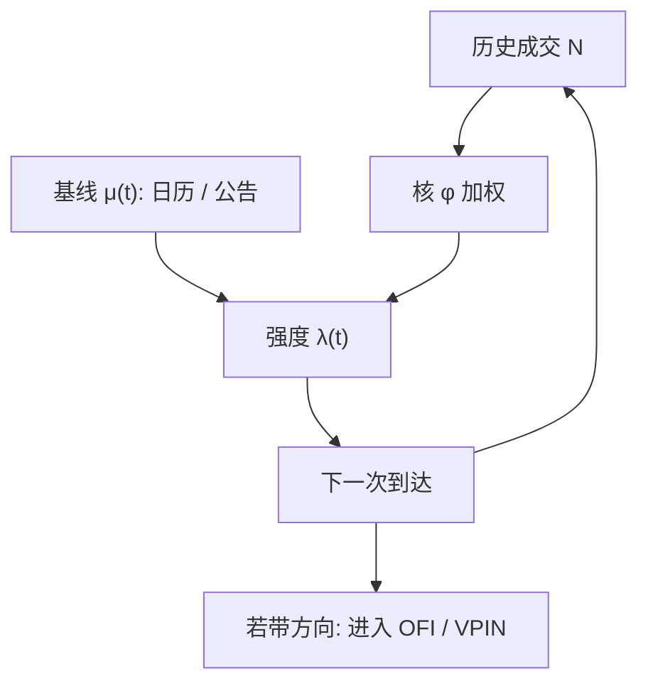

# 成交到达强度

一笔成交会抬高随后成交的瞬时强度：市场不是在日历上以常数速率抛硬币，而是在已经发生的跳动上自我激励。

<footer>—— 据 Hawkes, Spectra of some self-exciting and mutually exciting point processes, Biometrika, 1971；微观结构中的自激到达见 Bacry, Mastromatteo and Muzy 的综述</footer>

[上一课](/quant/queue-imbalance-alpha)把队列不平衡写成短窗、事件时间上的存量 $I$，预测下一跳几何；它与 OFI 共线，一个是状态、一个是流量。缺口是到达时钟：成交成串到来，常数泊松会把依赖写进「知情强度」，识别偏掉；要描述过去事件如何抬高现在的到达率，需要强度过程。本课钉 Hawkes 成交点过程：核、分支比，以及和毒性仪表的时钟关系。不重讲 $I$ 的选边用法。后课微价格默认成串是统计依赖，不是一份误导脚本。

## 问题

队列不平衡是存量状态，解释不了成交为何成串。泊松过程的强度 $\lambda$ 为常数，事件独立，等待时间是指数。真实成交不是这样：一笔大单之后往往紧跟着一串同向或反向的小单，算法切片、排队补量、以及价格移动引发的止损，都会在短时间内抬高到达率。用常数泊松去估 PIN 式的到达，等于把成串到来的依赖写进「知情强度 $\mu$」，识别会偏。问题是：能否把强度写成历史事件的显式函数，使成串成为模型的一部分，而不是残差里的谜。

双向市场还需要相互激励：主动买是否抬高随后主动卖的强度（回弹、做市补货），还是主要抬高随后主动买（动量、切片）。这是多元 Hawkes 的问题。日历效应——开盘强度高、午间低——则要求基线强度 $\mu(t)$ 随墙钟变化。点过程必须同时容纳内生反馈与外生日历。

### 自激核与分支比

一维线性 Hawkes 的强度为

$$
\lambda(t)=\mu+\int_{(-\infty,t)}\phi(t-s)\,\mathrm{d}N_s=\mu+\sum_{t_i<t}\phi(t-t_i),
$$

其中 $N$ 是计数过程，$\phi\ge 0$ 是核。指数核 $\phi(u)=\alpha e^{-\beta u}$ 最常用，强度在每笔成交后跳上 $\alpha$，再以 $\beta$ 衰减。稳定性要求分支比 $n=\int_0^\infty\phi(u)\,\mathrm{d}u<1$：$n$ 是一笔事件平均触发的「后代」事件数，$n\to 1$ 表示内生反馈接近临界，一小段外生流可以引发长串余震。Filimonov 与 Sornette 曾用接近 1 的分支比讨论市场内生性；估计对核的误设与短样本很敏感，不能把某日 $\hat n\approx 1$ 直接写成「即将崩盘」。

Hawkes 的「自激」是条件强度上升，不是价格一定沿同一方向走。同向切片与反向补货都可以抬高成交计数。要把方向放进模型，应用带标记的点过程或买卖分开的二元 Hawkes。

## 方法

数据用成交时间戳（最好是交易所匹配引擎时间），清洗错单见 [异常成交](/quant/outlier-trades)。估计可用对数似然

$$
\sum_i\log\lambda(t_i)-\int_0^T\lambda(t)\,\mathrm{d}t,
$$

指数核有递归，可避免对历史双重循环。基线 $\mu$ 可成分段常数（按开盘、上午、下午）或用样条。诊断看残差过程 $\Lambda(t)=\int_0^t\lambda$：若模型正确，$\Lambda(t_i)$ 应接近单位速率泊松。只报告样本内似然不够。

买卖分开时，核是矩阵 $\phi_{ij}$：$j$ 类事件对 $i$ 类强度的激励。对角占优表示切片与动量；反对角占优表示反向成交、做市或回跳。与 OFI 对照：Hawkes 解释**何时**发生事件，OFI 解释事件的**符号净额如何移价**。可以先用 Hawkes 滤出强度，再在高强度区间估 OFI 的 $\beta$，看冲击是否随活跃度变陡。

### 成交时钟上的强度而不是日历秒

强度 $\lambda(t)$ 的自变量仍是墙钟，因为它要谈单位时间的到达率；但「一步」的经济含义更接近事件。VPIN 用成交量切桶，Hawkes 用时间衰减核，二者都在成交加速时自动加密采样。差别是：VPIN 把方向不平衡当毒性；Hawkes 即使不分方向也能描述成串。把 Hawkes 强度当毒性会混类别：开盘的高 $\lambda$ 多半是机制，不是知情。毒性应在强度条件之上再看方向持续，或直接用 OFI、VPIN。

核的时间尺度必须匹配问题。算法切片的自激在毫秒到秒；公告后的余震在分钟；日度再入不适合用同一个 $\beta$。跨尺度叠加可用若干指数核之和，或幂律核；后者更慢、更难估，也更容易把趋势写进内生性。

## 机制

内生机制：一笔主动成交改变队列与中点，引发撤单、补单、止损与切片的下一笔，于是 $N$ 的历史进入 $\lambda$。这是限价簿状态机的统计压缩，不必指定哪一类参与者。外生机制：公告、宏观印记、指数再平衡在 $\mu(t)$ 里抬高全体到达，即使没有自激也会成串。识别二者靠核：外生脉冲之后若 $\lambda$ 很快回到基线，串来自 $\mu$；若衰减符合 $\phi$ 且分支比稳定，串来自反馈。

与信息模型的接口：Glosten–Milgrom 与 PIN 假设到达是（混合）泊松，事件独立。Hawkes 破坏独立，PIN 的日度加总或许仍可用中心极限，但把日内强度当成常数 $\varepsilon,\mu$ 会错。知情交易可以表现为某一方向的自激上升，但非知情的算法切片看起来一样。因此不能把 $\hat\alpha$ 叫做知情到达率。Kyle 的连续拍卖里噪声是布朗流，也没有自激；经验 $\lambda$ 若在高强度区间更大，说明深度随到达加速而消耗，冲击模型应条件于 $\lambda(t)$。

### 内生性、公告与虚假临界

分支比接近 1 的估计，对删失（开盘前没有足够历史）、对把公告放进自激核、对采样空洞都敏感。把周末当成高强度衰减的一部分，会扭曲 $\beta$。稳健做法是：交易时段内估计、公告窗单独放进 $\mu(t)$、报告 $n$ 的置信区间而不是点值叙事。市场「临界」是一个吸引人的隐喻，不是 Hawkes 似然能够单独证实的交易信号。

冰山补量会在显示块耗尽后制造规则间隔的限价到达，点过程里出现近似周期性的激励。这会让指数核误把制度性补量当成自激。研究上可用标记（是否紧挨着同价位耗尽）把这类到达从核里分出来。同样，这是设定检验，不是教人设置补量间隔以伪装成自然流。

强度模型解释到达，不解释谁知情。要谈毒性，需要方向、实现价差或 PIN/VPIN 一类不平衡对象。Hawkes 可以当时钟与条件变量，不能当信息不对称的充分统计。

## 边界

线性 Hawkes 不允许抑制（$\phi$ 为负）或硬性不应期，而真实簿在撮合间隔、自成交防范上有短不应期。非线性 Hawkes、带状态依赖的强度（依赖 $I_1$ 或价差）更贴近，更难估。多元过程维数随事件类型爆炸：成交、增、撤两侧已是六维。估计应先从买卖成交二维做起。

不要在集合竞价的离散匹配上套连续强度。不要用日历等间隔去拟合 Hawkes 再抱怨拟合差——点过程的似然建立在真实到达时刻上。A 股的午休要把过程断开，否则午间空洞被核解释成强衰减。长期记忆若存在，指数核只是短时近似。

把模拟出来的 Hawkes 路径直接当回测成交，会低估滑点的状态依赖：真实冲击还依赖当时深度与 OFI，而标准 Hawkes 不包含价格。价格标记的联合模型才谈得上执行仿真。

## 小结

- 成交到达是自激点过程：Hawkes 强度 $\lambda(t)=\mu+\int\phi\,\mathrm{d}N$，分支比 $n=\int\phi$ 度量内生反馈。
- 似然在真实时间戳上估计；残差过程应接近单位泊松；买卖应用多元核分开。
- 自激解释成串，不自动等于知情；毒性还要方向与事后价差。
- 公告应放进基线，避免把外生脉冲估成临界分支比。
- 冰山式规则补量会污染核，检测属于设定诊断。
- 出处：Hawkes, *Biometrika*, 1971；市场微观结构中的综述见 Bacry, Mastromatteo and Muzy；内生性估计见 Filimonov and Sornette 及相关讨论。
