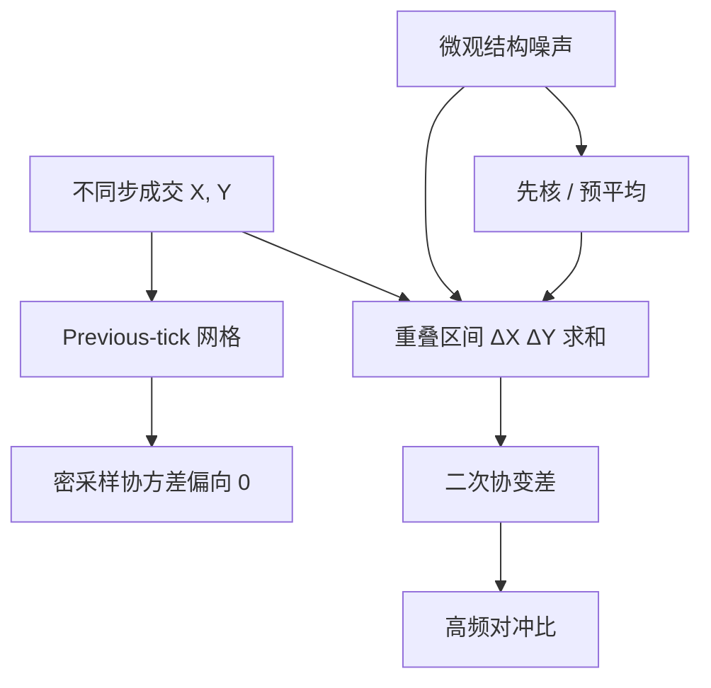

# Hayashi–Yoshida 相关

两只资产若在不同时点成交，把价格先插值到同一网格再算协方差，会把不同步变成向下的偏差；改为只对时间上相交的那两段收益做乘积求和，协方差在无噪声扩散下可以一致。

<footer>—— Hayashi and Yoshida, On Covariance Estimation of Non-Synchronously Observed Diffusion Processes, Bernoulli, 2005</footer>

配对与多腿对冲需要的是协方差，不只是各自的方差。高频里两只股票很少在同一毫秒成交：一只刚走，另一只的「最新价」可能停在几十秒前。传统做法是 previous-tick 插值到等间隔格子，再算已实现协方差。Hayashi 与 Yoshida（2005）指出，这种同步本身制造偏差；他们的估计量不对齐时钟，只把**时间区间相交**的增量相乘后求和。本篇写 HY 公式、它修正的是不同步而不是全部微观结构噪声，以及它与 [Epps 效应](/quant/epps-effect)、[已实现核](/quant/realized-kernel) 的分工。对统计套利：用错步的协方差去算对冲比，高频 $\beta$ 会系统性偏小，残差被低估的共同波动「做干净」，日频上再暴露出来。

## 问题

设对数价格 $X,Y$ 为连续半鞅，观测发生在停时 $\{\tau_i\}$、$\{\sigma_j\}$，一般 $\tau_i\neq\sigma_j$。Previous-tick：在时钟格子 $k\Delta$ 上取各自最后一笔成交价，得同步收益 $r^X_k,r^Y_k$，已实现协方差 $\sum r^X_k r^Y_k$。若一格内只有 $X$ 成交，$Y$ 用陈旧价格，该格 $r^Y_k=0$，贡献为零——共同波动被当成「没有同向移动」。采样越密，格子越容易只装下一只的事件，协方差越被压向 0。这是 Epps（1979）观测到「间隔越短相关越低」的一条主要机制，对象是**时钟对齐**，不是经济相关真的消失。

问题是在不规则、不同步的点观测上，构造二次协变差 $[X,Y]$ 的一致估计，且尽量不引入插值。HY 的对象是无噪声（或噪声相对次要）的扩散；观测若含买卖弹跳，HY 仍会把噪声交叉项加进去，需要与核、预平均或先刷新时间再估计的流程配合。

### 相交增量，而不是同一格

记 $\Delta X_i=X_{\tau_i}-X_{\tau_{i-1}}$，$\Delta Y_j=Y_{\sigma_j}-Y_{\sigma_{j-1}}$。Hayashi–Yoshida 估计量

$$
\langle X,Y\rangle_T^{\mathrm{HY}}=\sum_{i,j}\Delta X_i\Delta Y_j\,1_{\{(\tau_{i-1},\tau_i]\cap(\sigma_{j-1},\sigma_j]\neq\emptyset\}}.
$$

只要两段成交间隔在日历上重叠，就计入乘积。无需公共网格，也无需把一只的价格强行当成另一只时点上的观测。无噪声、有限跳跃活动等条件下，它向二次协变差收敛。重叠指示函数代替了插值：不同步被显式建模，而不是被 previous-tick 藏进零收益。

HY 不是「用成交时钟代替日历时钟」那么简单。两只腿的事件时标仍然各自为政；联系它们的是区间是否相交。把两只股票都重采样到同一成交事件时标，仍会留下一只的陈旧价格，偏差类型与 previous-tick 同类。

## 方法

**实现。** 对两只清洗后的成交（或中点）序列，按时间排序，用双指针扫重叠区间，复杂度与观测数近线性。应去掉明显的错单、盘前盘后若不想纳入协方差则切开。隔夜不要跨进求和：隔夜是一跳，不是高频不同步问题，应单独加一项日间协方差。

**刷新时间（refresh time）。** Barndorff-Nielsen 等人在多元已实现核里用「所有资产都至少更新一次」的时刻做同步，再在刷新网格上算核。刷新时间丢掉等待慢的那只时快的那只已经发生的成交，对流动性差异大的配对会扔掉大量 $X$ 的信息。HY 保留所有重叠，对「一只极活、一只较慢」更节省。代价是噪声处理不如核系统：HY 原论文不是为 i.i.d. 微观结构噪声设计的稳健估计量。

**与对冲比。** 高频 $\beta^{\mathrm{HY}}=\langle X,Y\rangle^{\mathrm{HY}}/\langle X\rangle$。$\langle X\rangle$ 仍可用单资产 RV 修正（两尺度、核、预平均）。分子用 HY、分母用朴素 RV，量纲不一致，噪声会进入 $\beta$ 的分母。应声明分子分母的噪声处理是否对称。日频配对若只在日收益上估 $\beta$，HY 用不上；HY 出现在：盘中对冲、ETF 篮子、期现、以及用分钟协方差做风险预算的时候。

### 噪声、跳跃与领先滞后

加性噪声使 HY 含 $E[\varepsilon^X\varepsilon^Y]$ 交叉项。若两只的微观结构独立，该项近零，方差上升；若共同做市或交叉盘口，噪声相关，HY 偏。此时应先预平均或先对各自做核，再考虑不同步——顺序是「降噪」与「对齐」不要互相覆盖。领先滞后：若 $Y$ 系统性地晚于 $X$ 几秒（指数成分股对期货），严格同期 HY 会低估短时相关，但把经济上的领先滞后算进「瞬时协方差」本身就不对。应另做指定滞后的 HY 或 Hayashi–Yoshida 的滞后版本，把领先滞后当信号或当执行延迟，而不是强行推进瞬时 $[X,Y]$。

跳跃：二次协变差含共跳。HY 会把时间上重叠的跳乘进去。若你要的是连续部分的相关（扩散相关），需跳跃稳健的多元估计；若你要的是「这一分钟是否一起跳」（并购公告、宏观点），共跳正是对象。先写对象再选估计量。

## 机制

Previous-tick 偏差的机制是零填充：未更新的腿贡献零收益，乘积为零，共同的连续波动在密格子上被稀释。HY 的机制是：只要两段路径在日历上同时「活过」一段，它们的增量就共享那一段的潜在 $d\langle X,Y\rangle$。重叠越多、越短，估计越接近积分协变差的黎曼和。流动性极不对称时，慢的腿的长间隔会与快的腿的许多短间隔重叠，于是一个 $\Delta Y_j$ 乘上许多 $\Delta X_i$，这是公式的一部分，不是 bug；但若慢的腿间隔长到跨过宏观公告，这一项会把一段异质波动揉进一个乘积，方差变大。

对 OU 配对：若用被 Epps 压低的高频相关去算 $\beta$，残差 $y-\hat\beta x$ 在高频上看起来更平稳、$\hat\kappa$ 更大，开仓更勤；到了日频，被低估的共同因子回来，残差带趋势。这是把不同步偏差写成了 alpha。形成期 $\beta$ 应用与交易频率匹配的协方差：日频交易用日收益；盘中用 HY 或刷新核，并在同一频率上估半衰期。

相关是协方差除以标准差。HY 修的是分子的不同步；分母若仍用被噪声炸开的 RV，相关会被额外压低。Epps 图上看到的下降往往是分子分母同时坏，只换 HY 不够。

### 与不规则采样、事件时间

[事件时间](/quant/event-time) 问的是单资产「一步」如何定义；HY 问的是两资产步长如何对齐。二者正交：可以在成交事件上定义增量，再用相交规则做多元。不要把所有高频相关问题都叫成 HY：同步偏差是一块，[微观结构噪声](/quant/microstructure-noise) 是一块，领先滞后是一块。HY 只把第一块从插值里拿掉。

## 边界与工程取舍

极稀疏的名字上重叠少，HY 方差大，日频协方差可能更稳。最小报价单位使增量离散，重叠乘积呈现网格噪声。A 股集合竞价与连续竞价应切开；涨跌停时一腿冻结，重叠区间的乘积不反映扩散相关，应把冻结标记为缺失而不是零收益。

不要在含错单的 tick 上直接 HY。不要用 HY 的分钟 $\beta$ 去解释日频协整向量——频率不同，对象不同。不要以为 HY 消除了 Epps：噪声与领先滞后仍在。

Hayashi–Yoshida（2005）的渐近是半鞅加不规则观测、噪声缺席或足够弱。后续有带噪声的修正与预平均版 HY。工程引用应写清用的是原始重叠和，还是降噪后的变体。

## 小结

- Hayashi–Yoshida（2005）用时间上相交的增量乘积和估计不同步扩散的协方差，避免 previous-tick 插值把未更新的腿写成零收益。
- 这是 Epps 效应里「对齐偏差」的修正，不自动修正微观结构噪声或领先滞后。
- 高频 $\beta$ 若用被压低的协方差，残差在交易频率上会假平稳；协方差估计必须与交易时钟一致。
- 刷新时间同步加核是另一条多元路径，对噪声更系统，对流动性不对称更浪费快腿信息。
- 隔夜、涨跌停与集合竞价应与连续时段分开，不要送进同一重叠和。
- 出处：Hayashi and Yoshida, *Bernoulli*, 2005；多元已实现核与刷新时间见 Barndorff-Nielsen, Hansen, Lunde, Shephard；Epps, *JASA*, 1979。
