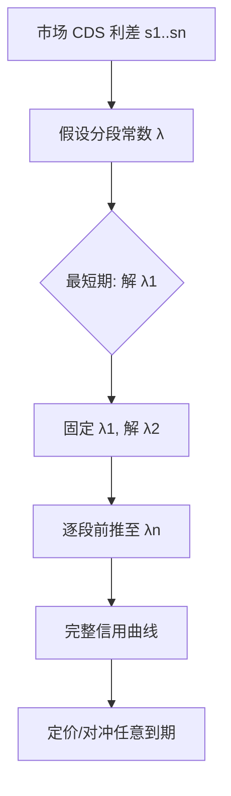
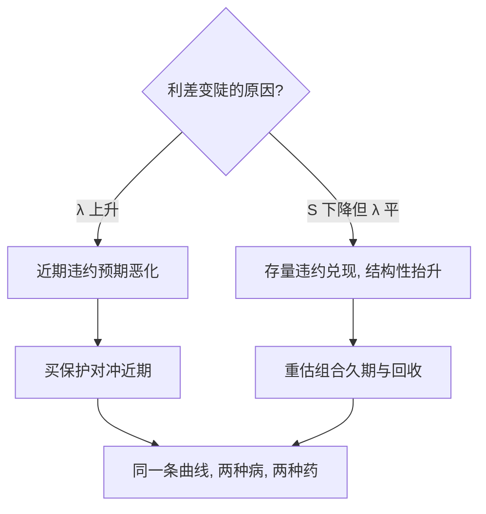

# hazard-rate-model

别问「一年后违约概率多少」，问「活过今天之后，明天瞬间违约的速率多少」——风险率把信用定价从静态变即时。

<footer>—— 据 Cox 比例风险模型 (1972)；Duffie–Singleton 信用期限结构框架</footer>

[波动率微笑插值](/quant/smile-interpolation)解决「期权价格如何跨行权价自洽」，本课转向信用侧的同一类问题：违约时点未知、只能给概率分布，如何定价与对冲。缺口是**风险率（hazard rate）**：条件瞬时违约强度 $\lambda(t)$。它和波动率一样是「从市场价格反推的隐含参数」。本课不做违约相关性（copula 那一支）。

## 问题

信用债、CDS 的定价需要「违约何时发生」的完整分布，而市场只给几个期限的 CDS 利差。把违约当作泊松到达，强度 $\lambda$ 常数化太粗——次贷前后强度差一个量级。缺口：**从离散利差报价反解分段常数的 $\lambda(t)$**，即信用曲线 bootstrap。本课不建宏观因子模型。

术语翻译：风险率（hazard rate）= 活到 $t$ 的条件下、$[t,t+dt]$ 内违约的概率密度，$\lambda(t)dt=\Pr(\tau\in dt\,|\,\tau\gt t)$；生存概率 $S(t)=\exp(-\int_0^t\lambda)$。它不是无条件概率密度——条件与无条件差一个「活到今天」。

数字实例：常数 $\lambda=2\%$（年化），1 年生存 $S(1)=e^{-0.02}\approx 98.02\%$，1 年无条件违约概率 $1-S\approx 1.98\%$。若回收率 $R=40\%$，CDS 公平利差 $\approx(1-R)\lambda\approx 120$ bp——与「利差/损失率」的拇指法则对上。

## 方法

Bootstrap 三步：取市场 CDS 利差 $s_1\lt s_2\lt s_3\cdots$ 按期限排序；假设 $\lambda$ 在相邻期限间为常数；逐段解方程「CDS 价值 = 0」。CDS 价值 = 保费腿（活着才付）与保护腿（违约时赔 $1-R$）之差，两腿都按生存概率与贴现因子加权。解出各段 $\lambda$，就得到整条信用曲线。

直觉类比：风险率像「连过几关后下一关的难度系数」。总通关率由各关难度连乘（生存函数取指数），而市场报价只告诉你「通过 1/3/5 年关卡的总概率」——bootstrap 就是逐关反推难度，前面的关先定死，后面的关才轮得到解。

## 机制

Cox 框架下 $\lambda(t)$ 可以是随机过程（双随机假设：给定强度路径，违约到达是泊松），定价取期望强度即可，这是信用曲线与利率曲线能共用 bootstrap 机器的原因。风险率与违约概率密度的关系 $p(t)=\lambda(t)S(t)$ 说明：利差陡升未必源于远期违约高，也可能是生存者变少。反解方程里保费腿按季度付、违约时点在期内均匀近似，离散化误差在高利差下显著——机构用期内积分精确处理。

常见误区：把 CDS 利差直接当违约概率——1000 bp 利差在回收率 40% 下对应 $\lambda\approx 16.7\%$ 而非 10%；又把风险率与年化违约概率混写，忽略 $1-e^{-\lambda}$ 与 $\lambda$ 在高 $\lambda$ 时的差别（$\lambda=30\%$ 时两者差 3.5 个百分点）。

## 边界

模型假设违约独立于利率与回收率——真实市场「利差扩大 + 回收下降」同发（wrong-way risk），需引入相关或跳扩散。分段常数假设在报价期限之间插入的是假设不是信息，曲线中段插值方式（平坦 λ 对平坦利差）会让远端定价差几十 bp。数据稀疏时（只有一个 5 年报价）只能先验定形状。与 [PFE 敞口曲线](/quant/pfe-ee-profile)的关系：对手方信用曲线是 PFE/CVA 机器的输入之一，风险率错一档，CVA 全线偏移。

直觉类比：利差是「体温」，风险率是「病因曲线」——体温计人人会读，bootstrap 是把体温时间序列翻译成病程；翻译错一截，后面的处方（对冲）全跟着偏。

## 小结

- 风险率 $\lambda(t)$ 是条件瞬时违约强度；生存函数 $S(t)=e^{-\int\lambda}$。
- CDS 曲线 bootstrap：分段常数 λ，逐段解「CDS 价值为零」。
- 利差 ≠ 违约概率：差一个损失率与 $1-e^{-\lambda}$ 修正。
- 出处：Cox (1972)；Duffie–Singleton「Credit Risk」(2003)；ISDA CDS 标准模型。
