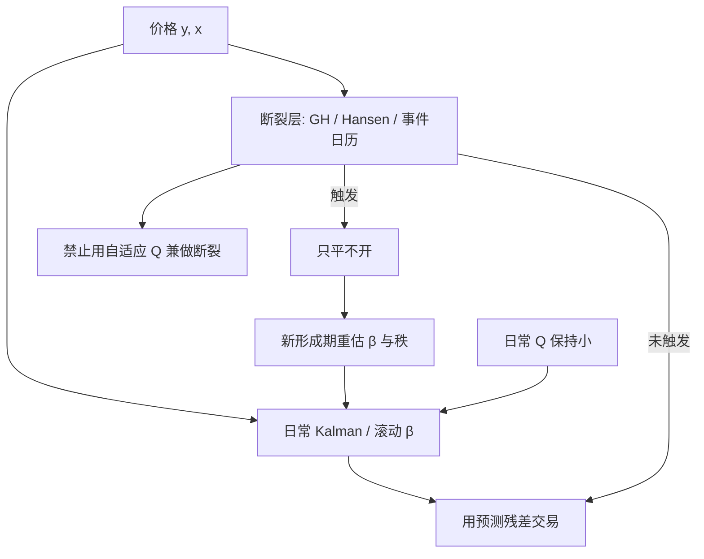

# 时变对冲比断裂

    
对冲比被允许慢变之后，真正危险的不是日常的 Kalman 更新，而是更新速度无法追上的那一次结构跳变：旧 $\beta$ 还在交易，新关系已经是另一条单位根。

<footer>—— 协整斜率转换见 Gregory & Hansen, Journal of Econometrics, 1996；I(1) 回归参数不稳见 Hansen, Journal of Econometrics, 1992；滤波超参与识别见 Harvey, 1989</footer>

[协整破裂](/quant/cointegration-break) 写的是常数 $\beta$ 在未知时点发生水平或斜率转换，全样本残差检验会失效。[Kalman 时变对冲比](/quant/kalman-hedge) 允许 $\beta_t$ 随机游走，日常的慢变被 $Q$ 吸收。本篇写两者之间的缝：当真实变化是**断裂**（并购、成分股调整、会计口径、监管、业务转型）而不是扩散，滤波会把跳变摊成许多期的「$\beta$ 在走」，价差在过渡期被当成可交易偏离，开仓方向往往对着新均衡。识别「这是该调的结构」还是「这是该做的回归」，不能靠把 $Q$ 调到样本内夏普最大。

## 问题

观测 $y_t=\alpha_t+\beta_t x_t+\varepsilon_t$。若 $\beta_t$ 真是平滑扩散，$Q$ 匹配时滤波跟踪误差小，残差像噪声。若 $\beta$ 在 $\tau$ 从 $\beta_1$ 跳到 $\beta_2$，跳变当天的新息极大。Kalman 会按增益把一部分写入 $\hat\beta$，一部分留给价差。$Q$ 小则 $\hat\beta$ 几乎不动，价差出现一个近似 $(\beta_1-\beta_2)x_t$ 的新趋势，Z-score 开仓会沿着错误原点加仓。$Q$ 大则 $\hat\beta$ 几日内跟上，过渡期短，但平时把可交易偏离也解释成 $\beta$ 变动，策略无信号。单一 $Q$ 不能同时服务「平时稳」与「断裂快」——这是线性高斯滤波的结构限制，不是实现细节。

滚动 OLS 有对称问题：窗口内断裂被平均成一条斜的 $\beta$，窗口一旦吐出断裂点，$\hat\beta$ 又跳一次，交易规则会在窗口边缘二次受伤。Gregory–Hansen 针对的是常数系数加一次断裂的检验；它不能直接给 Kalman 的 $Q$ 做假设检验，但可以在形成期问：这段里是否已经发生过一次斜率转换。若发生过，历史 $\sigma$ 被两段制度拉大，阈值对当前制度过松。

### 断裂与拥挤平仓长得像

2007 年类拥挤里，许多相对价值同时走扩，$\hat\beta$ 未必变，变的是残差相关与 $\kappa$ 的符号。若把这类事件当成对冲比断裂去「跟上」，会在最毒的方向上调腿：价差越扩越改 $\beta$，等于在亏损上加码对冲比。反过来，把真的公司事件（吸收合并、主业更换）当成拥挤等待回归，会把错误的 $\beta$ 拿到更久。区分需要工具变量式的信息：是否有针对该腿的公司行为、指数调整、停牌，而不是只看 $|\Delta\hat\beta|$ 的大小。大的 $\Delta\hat\beta$ 两种故事都会有。

$\hat\beta_{t|t}$ 在断裂日用了当期价格。用它来「已经跟上了所以开仓」含同期信息。可交易的是断裂检测之后的停手，以及新形成期的 $\hat\beta_{t|t-1}$，不是断裂当天的滤波更新。

## 方法

把监控写成与交易分离的层。

**日常层。** Kalman 或滚动 OLS 给出 $\hat\beta_{t|t-1}$ 与状态方差。状态方差大则降杠杆，不改变模型。新息标准化后超过日常阈值，只视为「这一天价差大」，按普通 [Z-score](/quant/zscore-entry) 规则处理。

**断裂层。** 候选检测包括：Gregory–Hansen 在滚动窗口上的 inf-ADF；Hansen（1992）对 I(1) 回归的 $L_C$ 一类不稳定性统计量；Bai–Perron 在允许的断裂次数上估 $\hat\tau$；以及简单的 $|\hat\beta_t-\hat\beta_{t-h}|$ 相对形成期波动的分位数。检测触发后，交易规则应切到「只平不开」：先把旧价差上的仓降到零，再进入长度为 $T_f$ 的新形成期。不要在 $\hat\tau$ 附近把新息当成更大的 alpha。

**滤波修补。** 若坚持用状态空间，断裂更接近「过程噪声在 $\tau$ 处的一次协方差脉冲」，而不是把日常 $Q$ 开大。实现上可用新息的稳健更新（$t$ 量测、Huber）减少单日跳对 $\beta$ 的污染，同时用独立的断裂检验决定是否重置状态。把 $Q$ 写成 GARCH 式随新息变，会在拥挤期自动加大 $\beta$ 跟踪，恰恰是上面说的错误叙事。

$$
\text{日常: } Q\text{ 小、交易 }x_t;\qquad
\text{断裂: 重置状态、停止交易。}
$$

两条通道，不要用一个自适应 $Q$ 兼做。

### 从检测到可执行的确认滞后

检验的 $\hat\tau$ 有估计误差，往往滞后。Kaminski–Lo 意义上的止损与时间止损在这里是保险：在断裂检验发出之前，价格止损会先切掉一部分。确认滞后意味着：你知道断裂时，价差已经走了一段，平仓冲击大。这是制度现实，不是把检测改成「更灵敏」就能免费消除——更灵敏会把日常波动当断裂，频繁重置，$\beta$ 无法积累。应预先规定最短形成期与最短交易期，与 [GGR](/quant/ggr-pairs) 的日历纪律同类。

多腿篮子的断裂可以是某一条腿的系数跳，秩也可能从 1 变成 0，见 [协整秩选择](/quant/coint-rank)。检测应在单腿系数与秩两个层面都做；只监控组合价差的 $\sigma$，会把 $\beta$ 跳和波动上升混在一起。

除息、拆股、配股必须在观测方程里显式处理。未调整的价格会制造一次假断裂，滤波会用 $\beta$ 去吸收公司行为，随后若干日的「回归」只是复权误差的回吐。

## 机制

线性滤波的增益是连续的，断裂是离散的。连续增益的最优对象是高斯随机游走系数，不是带跳的系数。跳跃发生时，最优是重置或使用检测–估计两步（先估 $\tau$，再分段滤波）。交易系统若只用连续增益，就会在跳跃后的一段里系统性地把错误价差当成均值回复：因为旧 $\beta$ 下残差一边倒，Z-score 维持开仓，OU 的 $\hat\kappa$ 甚至可能仍为正——样本前半的回归还在记忆里。这就是「时变对冲比」策略在事件日亏大钱的典型路径，看起来像止损不够紧，根因是模型还在交易一条已经不存在的价差。

Alexander 区分协整对冲与最小方差对冲：前者对齐共同趋势，后者最小化短期方差。断裂后共同趋势的权重变了，继续用旧协整向量，长期两边一起漂；若滤波把 $\beta$ 跟得过紧，行为滑向滚动最小方差，短期跟踪漂亮，趋势对不齐。断裂检测要保护的是第一种对象：承认趋势权重换了，而不是把跟踪误差再压小一点。

### 与价差滤波的界面

[Kalman 价差滤波](/quant/kalman-spread) 把 $Q$ 加在 $\mu$ 上。断裂若来自 $\beta$，加大 $Q_\mu$ 会把错误对冲吸收成新原点，残差看起来更平稳，经济上腿数已经错了。正确升级是：断裂层改 $\beta$ 或停手，而不是改价差原点。日常层两者可以并存——$\beta$ 极慢、$\mu$ 慢、$x$ 快——但断裂层只重置 $\beta$（以及随后的 $\mu$），不把跳跃写进 $x$ 当开仓理由。

## 边界与工程取舍

不要用交易期 PnL 去学「何时算断裂」。不要在 $|\Delta\beta|$ 上做无约束的网格，使断裂检测变成另一种 Z-score。不要把 Hansen 或 Gregory–Hansen 的 $p$ 值当成当天的仓位函数：检验是形成期诊断，仓位函数应是离散状态机（交易 / 只平 / 重估）。A 股停牌、涨跌停、重组停牌尤其容易制造 $\beta$ 跳；停牌期应只预测、不更新，复牌后先进入观察窗。

与协整破裂文的分工：那篇写检验与常数系数机制转换；本篇写时变规格下断裂与日常更新的冲突，以及交易状态机。两者都要求：$\hat\tau$ 附近不是 alpha。卖空约束下，断裂后要重估的不仅是 $\beta$，还有空头可行集——新关系若依赖不可融的腿，篮子直接作废。

状态方差变大不一定是断裂，也可能是 $x$ 波动上升或停牌造成的量测缺失。断裂层需要价格与事件日历，不能只看滤波的 $P_{t|t}$ 对角元。

## 小结

- 时变 $\beta$ 的日常扩散与一次性斜率断裂不是同一个 $Q$ 能服务的；断裂应重置状态并停手，而不是把过程噪声开大。
- 用旧 $\beta$ 在跳跃后继续 Z-score 开仓，等于对着新均衡加仓；$\hat\tau$ 附近不是更大的 alpha。
- 拥挤平仓与公司事件都会让 $|\Delta\beta|$ 变大，区分要靠事件日历，不能只靠系数变化幅度。
- 价差滤波的 $Q_\mu$ 不能用来吸收 $\beta$ 断裂，否则会把错误腿数洗成平稳残差。
- 出处：Gregory and Hansen, 1996；Hansen, 1992；Kalman / Harvey 的滤波框架；对照 [协整破裂](/quant/cointegration-break) 与 [Kalman 对冲比](/quant/kalman-hedge)。
