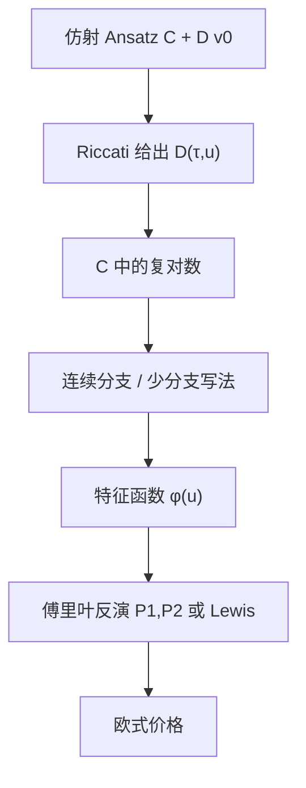

# Heston 特征函数

    
平方根方差与线性漂移构成仿射扩散，条件特征函数满足 Riccati 方程并有显式解；欧式价格因而化成特征函数的傅里叶反演，而不是二维偏微分方程。

    <footer>—— Heston, A Closed-Form Solution for Options with Stochastic Volatility, Review of Financial Studies, 1993</footer>

[上一课](/quant/sobol-qmc)把金融定价写成单位立方体上的积分节点，Koksma–Hlawka 要求有限变差；不连续支付上理论速度不成立。[Heston 模型](/quant/heston) 已经写出 CIR 方差与杠杆如何弯折微笑。缺口是那篇 1993 年论文真正交付的对象——仿射特征函数，以及沿积分路径的对数分支。本课把 $\phi(u)$ 展开到能实现，不重讲 Sobol' 方向数，也不重复 Feller 与校准哲学。没有稳定的特征函数，Heston 的「半闭式」比蒙特卡洛更危险。

## 问题

欧式看涨 $\mathbb{E}[e^{-rT}(S_T-K)^+]$ 在随机波动下没有 Black 那种误差函数。若能得到 $\phi(u)=\mathbb{E}[e^{iu\ln S_T}\mid S_0,v_0]$，Gil-Pelaez 或 Lewis 的反演把分布函数与期权价写成 $\phi$ 的积分。二维 Fokker–Planck 没有初等密度，但仿射结构把 $\phi$ 的对数对 $v_0$ 线性化，偏微分退化成对期限 $\tau=T$ 的常微分方程。问题是写出这组 ODE、解出 $C(\tau,u),D(\tau,u)$，并保证 $u$ 沿积分路径走时 $\phi(u)$ 连续——最后一步不是经济学，却决定价格会不会跳。

Heston 原文把价格仿成 Black–Scholes 的 $S_0 P_1 - Ke^{-rT}P_2$，两个概率对应两个测度（股票或然与现金或然），因而有两套 $b_j,u_j$ 参数。许多实现改为直接积修正后的 $\phi$，少一次容易弄错的测度更换，数值上应与 $P_1,P_2$ 一致。

### 仿射形式从哪里来

方差是 CIR，漂移对 $(S,v)$ 仿射，扩散矩阵的平方在状态上仿射，相关为常数。Duffie–Pan–Singleton 后来把这一族写成一般仿射跳扩散；Heston 是其中无跳、方差平方根的特例。对 $\phi$，Ansatz $\exp\bigl(C(\tau,u)+D(\tau,u)v_0+iu\ln S_0\bigr)$ 代入 Feynman–Kac，得到 $D$ 的 Riccati 与 $C$ 的积分。$D$ 的显式解含平方根 $d(u)$ 与比值 $g(u)$，再对 $C$ 出现 $\ln\bigl((1-g e^{d\tau})/(1-g)\bigr)$。对数把复平面的分支送进定价公式，这是「有闭式」之后真正的数值问题。

特征函数的闭式不等于密度的闭式。$v_t$ 的边缘是非中心卡方，但 $\ln S_T$ 要对随机积分波动再混合，密度仍是积分。实现时不要去「解析反演」$\phi$，去积已经振荡的那个实部。

## 方法

记 $\sigma$ 为方差扩散系数（vol-of-vol），$\kappa,\theta,\rho,v_0$ 如常。对数价格在风险中性测度下的特征函数取 Ansatz $\exp(C+Dv_0+iu\ln S_0)$，Riccati 的判别式为

$$
d(u)=\sqrt{(\kappa-\rho\sigma iu)^2+\sigma^2(u^2+iu)},
$$

$$
g(u)=\frac{\kappa-\rho\sigma iu+d}{\kappa-\rho\sigma iu-d},\qquad
D(\tau,u)=\frac{\kappa-\rho\sigma iu+d}{\sigma^2}\frac{1-e^{d\tau}}{1-g e^{d\tau}}.
$$

$C$ 由 $D$ 积分得到，含上述对数。这是 Heston 原文「第一套」写法。Albrecher、Mayer、Schoutens 与 Tistaert 指出，$g$ 沿实轴 $u$ 增大时会绕过 1，对数主值跳跃，被积函数不连续，价格出现伪振荡——所谓 Little Heston Trap。把 $g$ 换成 $1/g$、平方根取另一支，解析延拓沿实轴连续，公式与原文等价却可积。Lord 与 Kahl 进一步主张：不要盲目换支，而要沿路径跟踪对数的连续分支，使 $C$ 对 $u$ 连续。生产代码应在长到期、大 $\sigma$、违反 Feller 时用后者。

### 反演：Lewis、Carr–Madan 与截断

Gil-Pelaez 给出

$$
P_2=\frac12+\frac1\pi\int_0^\infty\mathrm{Re}\Bigl(\frac{e^{-iu\ln K}\phi(u)}{iu}\Bigr)du.
$$

$P_1$ 用股票测度下的特征函数。Lewis（2001）把看涨写成 $\phi$ 在 $\mathrm{Im}\,u=-1/2$ 一类水平线上的积分，阻尼自动，实现时少一次 $P_1$。Carr–Madan 对价格做对 $\ln K$ 的 FFT，一次得到许多执行价，适合校准；要选阻尼 $\alpha$ 使 $\mathbb{E}[S^{1+\alpha}]\lt \infty$，Heston 的矩有爆炸时间，过大的 $\alpha$ 或过长的 $T$ 会让 $\phi$ 在阻尼点不存在。积分截断：$\phi(u)$ 对大 $u$ 的衰减由 $D$ 的实部决定，短到期、小 $v_0$ 衰减慢，需要更长的上限或振荡积分（例如 Gauss–Laguerre 不总合适）。余弦展开（Fang–Oosterlee COS）把密度在对数价格区间上展开，Heston 的 $\phi$ 直接当系数，短到期往往比朴素截断稳。

校准循环里应对 $\phi$ 做缓存：同一参数下所有执行价共享 $\phi(u_k)$ 网格。分支跟踪必须在参数扰动下也连续，否则希腊字母的有限差分会吃进跳跃。

## 机制

Riccati 的 $D$ 是「方差对特征函数的敏感度」。$u=0$ 时 $\phi=1$，$D=0$。虚部编码偏斜：$\rho\lt 0$ 时负收益与正方差耦合，特征函数的相位产生左尾。$\sigma$ 增大让 $d(u)$ 更早进入复平面深处，$\phi$ 衰减变慢或变振荡，对应更弯的微笑。$\kappa$ 大则 $D(\tau)$ 更快忘记 $v_0$，长端由 $\theta$ 主导——这与模型篇的参数分工一致，但这里能从公式直接看见：$C$ 里出现 $\kappa\theta$ 组合，分开识别 $\kappa$ 与 $\theta$ 在特征函数层面就已经共线。

Feller 条件 $2\kappa\theta\gt \sigma^2$ 不是特征函数存在的前提，而是方差过程不碰零的前提。违反时 $\phi$ 仍常可算，但积分更抖，模拟与 PDE 还要处理边界。把「校准违反 Feller」当成公式写错，是误诊；把违反 Feller 的参数送进未跟踪分支的实现，才会真的写出错价。

### 与蒙特卡洛、PDE 的分工

特征函数加速的是欧式香草与能写成 $\ln S_T$ 函数的支付（包括某些复合、数字欧式）。障碍、亚式、美式不能从 $\phi(u)$ 直接读出，除非另做 Wiener–Hopf 或 COS 对路径的扩展，那已超出 1993 年公式。用 Heston 欧式作 [控制变量](/quant/mc-variance-reduction) 时，控制价必须来自同一套被验证过的 $\phi$，否则「闭式」偏差会灌进 MC。PDE 在二维网格上同时给障碍与美式，不依赖分支，但校准几千张香草时比积分慢。生产系统常见的是：香草与校准走特征函数，奇异走 PDE 或 MC，并用同一参数在欧式上对账。

所谓 Little Heston Trap 不是模型有两个价格，而是同一解析函数的两个代数表达式在主值对数下分道。测试应用「长到期 + 沿 $u$ 扫描 $\phi$ 的连续性」，而不是只对几个平值执行价对一下 Black。

## 边界

矩爆炸：Heston 的正阶矩在有限时间可发散，Carr–Madan 的阻尼带可能空。深虚值短到期的积分高度振荡，需要变换变量或把虚值改用看跌、由平价接回。利率与分红若随机，特征函数要升维，不再是 1993 年股票五参数公式。加入跳跃变成 [Bates](/quant/bates)，$\phi$ 乘上复合泊松因子，分支问题还在，只是多一段整函数。

数值上不要用实数平方根函数去接 $d(u)$ 的两支；应在复数里选使 $\mathrm{Re}\,d$ 符号固定的那一支（常见约定），再对对数做增量连续。论文给的是 Riccati 解与概率积分，不是某一种 FFT 网格。实现应对标：Feller 满足的长到期欧式、已知的参考参数表，以及 $\rho\to 0,\sigma\to 0$ 时退回 Black–Scholes。

风险中性特征函数里的 $\kappa$ 已含方差风险溢价。物理测度下的特征函数系数不同，不能把收益序列估出的 CIR 参数直接塞进期权 $\phi$。

## 小结

- Heston（1993）的闭合对象是仿射特征函数 $\exp(C+Dv_0+iu\ln S_0)$，$D$ 来自 Riccati，价格来自傅里叶反演。
- 原文 $g$ 的主值对数会沿实轴跳支；少分支写法或路径跟踪是工程前提，不是可选优化。
- Lewis 积分与 Carr–Madan FFT 是同一 $\phi$ 的不同求积；阻尼受矩爆炸约束。
- 香草校准走 $\phi$，路径产品仍要 PDE/MC；控制变量必须用同一实现的欧式价。
- 违反 Feller 不自动否定 $\phi$，但会放大分支与振荡问题。
- 出处：Heston, *Review of Financial Studies*, 1993；分支见 Albrecher et al.；连续对数见 Lord and Kahl；FFT 见 Carr and Madan。
