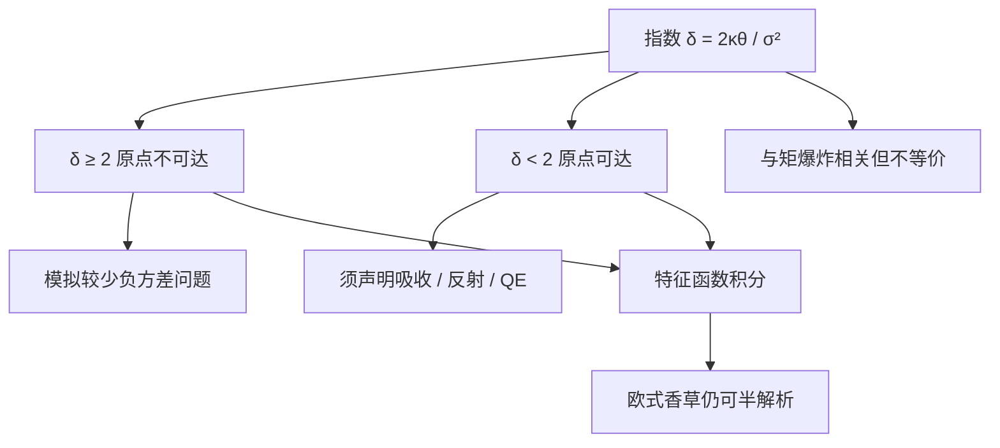

# Heston Feller 条件

    
平方根方差过程在零点的边界分类由 $2\kappa\theta$ 与 $\sigma^2$ 的相对大小决定；不等式成立时原点不可达，方差保持严格为正，否则过程可以碰到零，模拟与矩都要改口。

    <footer>—— Feller, Two Singular Diffusion Problems, Annals of Mathematics, 1951；Heston, Review of Financial Studies, 1993</footer>

[Heston](/quant/heston) 让瞬时方差走 Cox–Ingersoll–Ross 平方根扩散。该扩散在 $v=0$ 处扩散系数消失，是 Feller（1951）所研究的奇异边界。Feller 用尺度函数与速度测度给出：何时原点不可达、何时可达且反射、何时吸收。Cox、Ingersoll、Ross（1985）把同一过程用作短期利率，并把 $2\kappa\theta>\sigma^2$ 写成保证利率为正的条件。Heston（1993）把这套动力学接到股票上，欧式价格仍有 [特征函数](/quant/heston-cf)。校准却经常把参数推到不等式的另一侧：为了拟合短端弯曲，vol-of-vol $\sigma$ 很大，Feller 条件失败。本篇只写这一不等式的概率含义、对模拟与矩爆炸的后果，以及它**不是**特征函数能否计算的充要条件。模型选择与傅里叶积分仍见模型篇与特征函数篇。

## 问题

风险中性下

$$
dv_t=\kappa(\theta-v_t)\,dt+\sigma\sqrt{v_t}\,dW_t^v.
$$

$\kappa>0$ 是回复速度，$\theta>0$ 是长期均值，$\sigma>0$ 是方差的扩散系数。原点处漂移为 $\kappa\theta>0$，扩散为 $0$，直观上有一层「向上的软壁」。壁是否够硬，使 $v_0>0$ 的过程永远不碰零，要由 Feller 的边界分类回答，而不是由「平方根看起来为正」回答。定义指数

$$
\delta=\frac{2\kappa\theta}{\sigma^2}.
$$

标准结论是：$\delta\ge 2$（即 $2\kappa\theta\ge\sigma^2$）时原点不可达；$0<\delta<2$ 时原点可达，对 CIR 通常作为反射边界处理；$\delta\le 0$ 时（实务上对应无回复或非正的 $\theta$）原点可吸收。Heston 文献里常把 $2\kappa\theta>\sigma^2$ 称为 Feller 条件，强调严格正方差。问题是：市场校准为什么总想违反它，违反之后哪些对象仍然合法、哪些数值方案会静默地改模型。

### 为何校准爱走 $\delta<2$

短到期微笑要陡的弯曲，Heston 主要靠 $\sigma$ 与 $|\rho|$。$\sigma$ 一大，$\delta$ 就掉到 2 以下。这不是软件缺陷，是五个参数的几何：纯扩散、仿射、无跳的 Heston 用方差碰到零附近的高曲率去模仿跳。Albrecher、Mayer、Schoutens、Tistaert 讨论的「小 Heston 陷阱」是特征函数分支，与 Feller 不是同一件事，但常在同一组「激进参数」上共现：$\sigma$ 大、$\kappa$ 与 $\theta$ 的识别差、积分路径挑剔。工程上要分开报告：$\delta$ 是否小于 2，以及特征函数实现是否过了连续分支测试。把二者捆成「模型坏了」，会既不敢用合法的 $\delta<2$ 模拟，又放过真正积错的傅里叶。

$\delta$ 是 CIR 的自由度（非中心卡方的自由度相关量）。$\delta\ge 2$ 时密度在零处为零；$0<\delta<2$ 时密度在零附近可积地爆炸，过程可访问原点但仍有平稳分布。平稳分布是 Gamma 族，均值 $\theta$，与是否碰零无关——碰零改变的是路径性质，不是长期均值公式。

## 方法

模拟。欧拉离散会把 $v$ 打成负数，因为高斯增量没有平方根过程的反射。Lord、Koekkoek、van Dijk 比较了吸收、反射、截断、高阶等有偏格式：不同修补对应不同的边界行为，等于在 $\delta<2$ 时偷偷改了模型。Andersen 的 QE（quadratic-exponential）方案用 $v_t$ 的已知条件矩匹配对数正态或二次形式，并单独处理接近零的质量，是实务上更常见的、针对 Heston 的无偏或低偏方案。选择格式等于选择「碰零之后怎么办」。论文与生产必须写明：吸收、反射还是矩匹配；否则希腊字母不可比。

矩。Andersen 与 Piterbarg（2007）证明随机波动模型中股票矩可以在有限时间爆炸。Heston 的矩爆炸边界依赖 $\rho,\sigma,\kappa$ 的组合，与 Feller 条件相关但不相同：Feller 管方差过程是否碰零，矩爆炸管 $\mathbb{E}[S_t^p]$ 是否在有限 $t$ 变无穷。深虚值、高 $p$ 的风险中性期望、以及某些支付对高阶矩敏感的产品，会在爆炸区域外变得没有价格。校准若只看香草买卖价，可能落在某些高阶矩已爆炸的参数上——欧式香草仍可定价（特征函数仍在），但蒙特卡洛的样本均值对高幂不稳定。

### 特征函数并不要求 Feller

[Heston 特征函数](/quant/heston-cf) 的 Riccati 解在 $\delta<2$ 时仍然有定义。欧式香草的半解析不依赖方差严格为正。需要 Feller 的是：路径模拟的边界处理、对「方差不能为零」的经济解释、以及某些以 $1/\sqrt{v}$ 为系数的对冲比在零附近的爆炸。反过来，满足 Feller 也不能保证积分的对数分支连续，也不能保证短端微笑拟合。因此 Feller 是过程层的分类，不是定价公式的开关。报告参数时应同时给出 $\delta$ 与拟合残差：$\delta\ll 2$ 且短端仍差，说明需要跳或粗糙波动，而不是再把 $\sigma$ 加大。

## 机制

Feller 的尺度函数在原点附近的可积性，决定过程能否在有限时间内到达。$\delta\ge 2$ 时，靠近零的扩散太弱、漂移相对太强，到达时间几乎必然为无穷。$\delta<2$ 时，扩散在零附近仍能把过程「吸」到边界。CIR 的反射解释与利率模型一致：利率碰零后被推回。股权方差碰零的经济含义较弱——已实现方差可以极低，但「碰到精确的零再反射」是扩散理想化。市场用 $\delta<2$ 去拟合，等于承认模型在用边界附近的非线性代替跳。这在香草上可能够用，在方差互换、时间敏感的障碍上会与有跳的模型分道。

杠杆 $\rho<0$ 时，方差跌向零往往伴随现货上涨（对股票）。路径若真的在零附近停留，随后的波动率偏低，虚值看跌相对变便宜——这与「要很大 $\sigma$ 才能拟合看跌翼」的校准目标互相拉扯。于是出现典型的妥协：$\sigma$ 大到 Feller 失败，同时 $\kappa\theta$ 被抬高去部分补偿，$\delta$ 停在 $1$ 附近。参数日度跳时，$\delta$ 是否穿越 2 应被当成制度切换记录：穿越意味着模拟器的边界分支被激活或关闭，P&amp;L 解释要跟着改。

### 与 SABR、局部波动的边界对照

SABR 的 CEV 指数 $\beta$ 同样在零有边界分类，负利率还要移位。Heston 的 Feller 是方差坐标上的分类，不是现货坐标上的。局部波动 Dupire 表若在低行权处把 $\sigma_{\mathrm{loc}}$ 写得极大，是用局部扩散模仿跳，与 Heston 用 $\delta<2$ 是同一类「用扩散的边界行为冒充跳」。比较模型时，应看它们如何处理零附近与短端翼，而不是只看 ATM 拟合。满足 Feller 的 Heston 通常短端偏斜不够，这是已知的产品级限制，不是校准器没跑够。

把 Feller 条件当成「参数合法的硬约束」强行投影到 $\delta=2$ 的边界上，会牺牲短端拟合，换一条更易模拟的过程。这是显式的产品选择。把它藏在模拟器的反射修补里、却对外声称参数满足 Feller，会造成文档与实现不一致。

## 边界与工程取舍

Feller（1951）给出的是一维扩散的边界分类，Heston（1993）把它用在方差方程上。后续的模拟文献（Andersen；Lord–Koekkoek–van Dijk）与矩文献（Andersen–Piterbarg）是工程必读，不是 1993 年论文的定理。特征函数分支（Albrecher 等）应单独测试。美式、障碍、路径依赖在 $\delta<2$ 时对离散格式更敏感，应用连续时间极限与格式收敛一起报告。

不要用「今日 $\delta>2$」去推断明日校准仍在安全区。短端跳跃式的行情会把 $\sigma$ 推高。生产系统应把 $\delta$ 纳入每日参数监控，并在跌破 2 时自动切换模拟格式或改用带跳的仿射模型。Heston 的半解析不因此失效；失效的是「方差严格为正的扩散」这一叙事。

QE 模拟在 $\delta$ 极小时仍可能对深度路径依赖产品有偏差。应用已知欧式价格（特征函数）做控制变量，并在零附近加密检查矩匹配是否失败。控制变量测的是格式，不是市场。

## 小结

- Feller 条件 $2\kappa\theta>\sigma^2$ 分类的是 CIR 方差在原点是否不可达，不是欧式特征函数是否存在。
- 校准常违反它以换短端弯曲；此时必须声明模拟的边界规则，欧拉加截断等于改模型。
- 矩爆炸与 Feller 相关但不等价；香草可定价不保证高阶矩与蒙特卡洛稳定。
- $\delta$ 应作为每日监控量；强行投影到 $\delta=2$ 是显式放弃短端，应写进模型文档。
- 出处：Feller, *Annals of Mathematics*, 1951；Heston, *RFS*, 1993；CIR 见 Cox, Ingersoll and Ross, 1985；模拟见 Andersen, 2008 与 Lord, Koekkoek and van Dijk, 2010；矩见 Andersen and Piterbarg, 2007。
