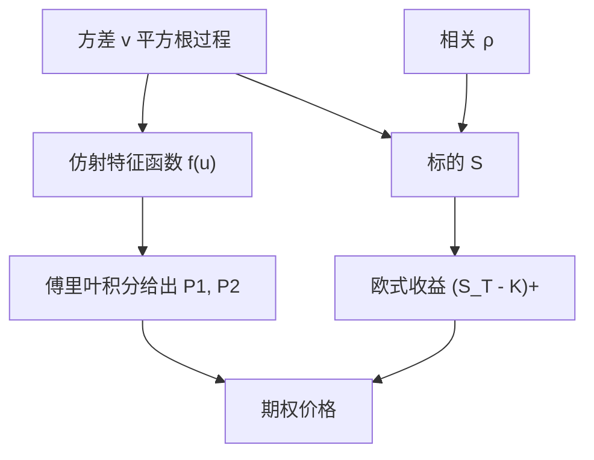

# Heston 模型

    
若瞬时方差服从均值回复的平方根过程，且与标的布朗运动相关，欧式期权价格仍可通过特征函数的傅里叶反演写成闭合形式。

    <footer>—— Heston, A Closed-Form Solution for Options with Stochastic Volatility, Review of Financial Studies, 1993</footer>

[上一课](/quant/dupire)给出扩散下局部波动与欧式价格导数的恒等式，该 $\sigma_{\mathrm{loc}}$ 重现全部欧式边际，等价于随机方差在 $S_T=K$ 上的条件期望。缺口是动态被锁死：偏斜随现货的搬迁通常与市场不符，路径产品有模型风险。若让方差自己成为状态并与收益相关，今日微笑由当前方差与参数决定，明日还可以再动——但二维扩散的欧式期望一般要 PDE 或 MC。Heston 用 CIR 平方根方差加仿射特征函数把定价收成一维积分。本课写这条随机波动，不重推 Dupire 公式。

## 问题

[Dupire](/quant/dupire)已经能精确重现今日微笑，却把未来的微笑动态钉死，对香草对冲尚可、对远期微笑敏感的产品会错。若还要让明日的微笑可以再动，至少需要让瞬时方差自己随机，并且让它与收益相关，否则偏斜只能靠跳跃或局部波动的确定性杠杆。随机波动率把方差当成状态变量，今日的微笑由当前方差与参数共同决定。

计算上的障碍是：二维扩散的欧式期望一般要做二维 PDE 或蒙特卡洛。Heston 要回答的是：在平方根方差、线性漂移、常数相关这一族里，转移特征函数是否仍有仿射解，从而欧式价格退化成一维振荡积分。若答案是肯定的，校准与希腊字母都可以建立在同一套特征函数导数上，而不必每次都解 PDE。

### 为何选平方根方差而不是对数正态方差

早期随机波动率有的让 $\sigma_t$ 本身做几何布朗运动。对数正态方差可以为正，但缺少均值回复时长期方差会发散，且与利率仿射模型不统一。CIR 平方根过程 $dv=\kappa(\theta-v)dt+\sigma\sqrt{v}\,dW$ 保证 $v=0$ 处有反射或吸收的边界分类，均值回复把期限结构的长端钉在 $\theta$ 附近，仿射结构又与债券定价里的 CIR 同源。Heston 把这一过程接到股票（以及原文中的债券、外汇）上，相关 $\rho$ 负责偏斜：$\rho\lt 0$ 时大跌伴随方差上升，虚值看跌变贵，即所谓杠杆效应。Feller 条件 $2\kappa\theta\gt \sigma^2$ 保证方差严格为正；市场校准经常违反它，数值上仍能用，但零方差附近的行为要单独检查。

Heston 的「闭合形式」指特征函数是初等加对数解析延拓，价格仍是积分，不是 Black 公式那种误差函数。工程上要把积分路径、分支切割与缓存做好，否则「有公式」比蒙特卡洛更不稳。

## 方法

风险中性测度下，标的与方差满足

$$
dS_t = r S_t\,dt + \sqrt{v_t}\,S_t\,dW_t^S,
$$

$$
dv_t = \kappa(\theta-v_t)\,dt + \sigma\sqrt{v_t}\,dW_t^v, \qquad dW^S dW^v = \rho\,dt.
$$

有股息时可把 $r$ 换成 $r-q$。欧式看涨 $C=\mathrm{e}^{-rT}\mathbb{E}[(S_T-K)^+]$。Heston 把价格写成资产或然与现金或然两项，类似 Black–Scholes 的 $S_0 N(d_1)-K\mathrm{e}^{-rT}N(d_2)$，但 $N(d_j)$ 换成由特征函数给出的概率

$$
P_j = \frac12+\frac{1}{\pi}\int_0^\infty \mathrm{Re}\left(\frac{\mathrm{e}^{-\mathrm{i}u\ln K}f_j(u)}{\mathrm{i}u}\right)du.
$$

$f_j(u)=\mathbb{E}[\mathrm{e}^{\mathrm{i}u\ln S_T}]$ 在适当的测度下满足仿射常微分方程，解的形式为 $\exp(C_j(\tau;u)+D_j(\tau;u)v_0+\mathrm{i}u\ln S_0)$，其中 $D$ 是 Riccati 的显式解。$\kappa,\theta,\sigma,\rho,v_0$ 五个参数加上利率，构成校准向量。

### 特征函数的分支与积分

Riccati 解里出现对数。主值分支在 $u$ 沿实轴走时可能跳，导致被积函数不连续、价格出现假振荡。后来的实现改用「少分支」的特征函数写法，或沿复平面上的适当轮廓积分。这不是模型经济含义的一部分，却是「闭合形式」能被用于生产的前提。短到期、深虚值时积分衰减慢，需要截断与振荡积分技巧；长到期则均值回复把方差拉回 $\theta$，微笑变平，参数 $\kappa$ 主要管期限结构的衰减速度。

## 机制

五个参数各有主导效应，但彼此相关，不能当成正交因子。$v_0$ 是即期方差，管短端水平；$\theta$ 是长期均值，管长端水平；$\kappa$ 是回复速度，管从 $v_0$ 走到 $\theta$ 有多快；$\sigma$（方差的波动率）管微笑的弯曲，即曲率；$\rho$ 管偏斜。$\sigma$ 与 $\rho$ 会竞争：很大的负相关也能制造弯曲。校准因此是非线性最小二乘，常常对 $\kappa$ 与 $\theta$ 的乘积更敏感，而对二者分开识别不足。这与仿射模型的一般教训一致：特征函数里许多组合以乘积出现。

杠杆机制是路径上的，不是局部波动率那种「波动率是现货的确定性函数」。同样跌到某一现货水平，若路径先大幅振荡，方差状态已经升高，后续期权更贵。因此 Heston 的远期微笑会打开，而 Dupire 局部波动率的远期微笑往往过快变平。这是用 Heston 为障碍、cliquet、方差互换类产品做风险的原因之一；它也是校准只拟合香草时，仍可能在奇异产品上与局部波动率给出不同价格的原因。

### 与局部波动率、跳跃的分工

局部波动率精确匹配欧式截面，随机波动率匹配截面只到五个参数能到达的程度。实务上常见做法是：用 Heston（或 Heston 加跳跃）做动态，再用一个弱的局部因子或位移去补残差微笑。纯扩散 Heston 难以同时拟合极短到期的陡峭偏斜——短端偏斜更像跳跃。Heston 原文没有跳跃；把跳跃加进仿射框架是后续工作，不应写成 1993 年论文的结果。外汇与股票上 $\rho$ 的符号惯例不同：股票通常显著为负，外汇可能接近零或随货币对变化。

把 Heston 的 $\sigma$ 叫做「vol-of-vol」时，单位是方差过程的扩散系数，不是隐含波动率本身的波动。数量级不要和 SABR 的 $\nu$ 直接横比：一个乘在 $\sqrt{v}$ 上，一个乘在即时对数正态波动上。

## 边界

Heston 是二维马尔可夫扩散，没有日内跳跃，也没有粗糙波动那种分数方差。Feller 条件在股权校准中经常不成立，模拟时要处理负方差（吸收、反射、或切换离散化）。欧式有半解析，美式、障碍、路径依赖仍要 PDE、树或蒙特卡洛；特征函数加速的是香草与部分欧式型，不是全部产品。利率若随机，原文讨论债券与货币期权时引入了第二套仿射因子，那已不是「股票 Heston」五个参数的版本。

隐含波动率对参数的映射不是全局凸的，不同初值可以落到不同拟合质量。只校准短到期会把 $\sigma$ 抬得很高以制造弯曲，长到期再失真。生产系统应同时约束期限结构，并报告参数的时间序列是否剧烈跳动——参数天天跳，说明模型在用 $v_0$ 与 $\sigma$ 硬扛无法解释的短端跳跃。Heston（1993）提供的是特征函数定价与随机波动机制，不是某一市场的官方参数表。

风险中性参数不能直接当成统计估计的物理测度参数。$\kappa,\theta$ 在定价测度下已吸收方差风险溢价；用历史方差序列去「验证」校准值，比较的是两个不同测度。

## 小结

- Heston（1993）让方差走 CIR 平方根过程，与标的以 $\rho$ 相关，欧式价格由仿射特征函数的傅里叶反演给出。
- $v_0,\theta$ 管水平，$\kappa$ 管期限结构，$\sigma$ 管曲率，$\rho$ 管偏斜；参数不可正交识别。
- 「闭合形式」是特征函数闭合，价格仍是需小心分支的振荡积分。
- 相对局部波动率，随机方差能保持远期微笑；相对短端极陡偏斜，纯扩散往往不够，需跳跃或其他因子。
- Feller 条件、负方差模拟、校准不稳，是工程边界而不是公式笔误。
- 出处：Heston, *Review of Financial Studies*, 1993；教科书语境见 Hull, *Options, Futures, and Other Derivatives*。
