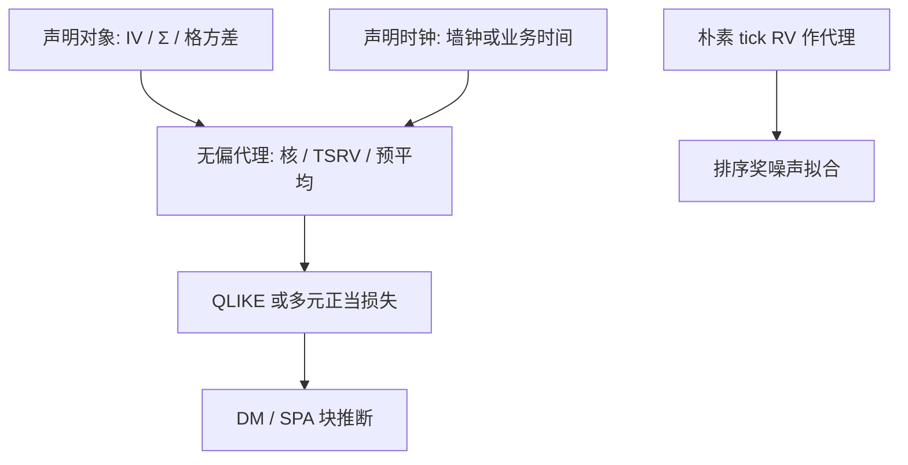

# 高频预测的损失函数

评的是哪一个对象、在哪一个时钟上、用哪一个带噪代理；损失一旦与对象错位，预平均、HAR 与 GARCH 的胜负只是在比较两种偏差。

<footer>—— Patton, Volatility Forecast Comparison Using Imperfect Volatility Proxies, Journal of Econometrics, 2011；高频应用须把代理换成噪声修正后的已实现量</footer>

[业务时间](/quant/business-time-clock) 把格重标；[QLIKE](/quant/qlike-vol-forecast-eval) 已给日频纪律。本课是「金融计量与高频统计」的收束：把 Patton 的正当损失放到 **IV / 已实现协方差 / 下一根 bar 方差** 上，并锁死代理（TSRV、核、预平均）、同步（刷新/HY）与时钟（墙钟 vs 成交量）。缺口是：高频里代理更噪、跳跃更尖、样本外切分更易泄漏（用未来 tick 定阈值）。下一课程是衍生品进阶，默认本课的对象声明已经做完——不再用 tick 平方当无偏 $IV$。

## 问题

预测 $\hat h_{t,i}$：下一格、下一小时、或次日 $IV$。代理 $x$：朴素 RV、TSRV、核、预平均、半方差。Patton：仅当损失对不完美代理稳健且 $x$ 对真对象无偏（或偏差与 $h$ 无关）时，排序才一致。高频朴素 RV **有偏**（$+2n\sigma_\varepsilon^2$），QLIKE 也不能挽救「谁更贴近噪声」。必须先用本单元的一致估计当 $x$，或接受评的是「含噪二次变差」并两边同一偏。

问题还含：多资产 Frobenius vs 多元 QLIKE；含跳 vs 连续；日历日 vs 下一 dollar bar。每一条都换对象。

### 锁定三件套

1. **对象**：连续 $IV$、总二次变差、$\Sigma$、$\beta$、下一格 $\sigma^2$。  
2. **代理**：与对象匹配的估计量（预平均 IV 评预平均预测；不要用五分钟评 tick 模型还声称评了 $IV$）。  
3. **时钟与样本外**：墙钟滚动；业务时间则阈值不得用测试段未来量。块 DM、HAC 滞后按重叠格数。

用全天核 $IV$ 去评盘中逐格预测，是用积分评瞬时，偏差系统。格内预测的代理应是后续窗的已实现量，窗宽与预测地平线一致。

## 方法

**一元格/日。** QLIKE$(h,x)$，$x$ 为噪声修正 RV。并列 MSE 作对照，但不单用 MSE 选模。跳跃日：并列 BV 代理，或声明对象含跳。

**矩阵。** Laurent、Rombouts、Violante 等讨论的多元损失；Wishart QLIKE。代理 = 同一刷新规则下的已实现协方差。不正定代理先投影再评，两边一致。

**推断。** DM + HAC；多模型 SPA。嵌套（HAR 对 AR(1) RV）用 Clark–West 或自助。高频观测数 $n$ 大不是独立信息量——长期依赖与重叠仍在，不要用 $\sqrt n$ 当功效幻想。

**校准。** MZ：$x=a+b\hat h+e$，HAC。$b<1$ 仍可能是代理噪声衰减。看 QLIKE 为主。

### 与执行、定价

执行关心成交路径方差，代理应用成交价已实现量，不是中点 IV。期权方差互换更近总二次变差含跳。对象写进损失，才能避免「核 IV 赢了所以拿去对冲成交」。这是本栏微观结构与定价的交界，不把对冲误差公式再推一遍。

## 机制

正当评分：真条件期望最小化期望损失。代理无偏时噪声平均掉。高频失败模式是代理有偏且偏依赖模型（密采样模型更贴近噪声，MSE 会奖它）。机制上必须先减偏。时钟错位：业务时间模型在墙钟 QLIKE 下像「开盘永远预测高」，那是季节，不是方差技巧。

泄漏：用测试日的成交量定 bar 阈值、用全样本估季节 $s_i$、用全天核去设盘中带宽，都会把测试信息写进 $\hat h$。每条自助或滚动路径必须重估季节与带宽，接 [bootstrap](/quant/bootstrap-finance) 课。

Hansen SPA 在高频里模型数爆炸（网格×核×时钟）。预登记少数候选，否则 SPA 的原假设「没有优于基准」在搜出来的集合上没有定义。

### 课程收束

从 [OLS 稳健标准误](/quant/ols-robust-se) 的斜率精度，到 GMM/HJ，到 VAR/长记忆，到噪声下的 IV：贯穿的是**对象与依赖结构写进推断**。高频预测损失是同一原则在最后一公里：代理、HAC、聚类、重叠、时钟。衍生品课将假定 RV/IV 已经按本单元定义，不再从 tick 平方讲起。

## 边界与工程取舍

隔夜、午休、半日市：损失按会话加总须预先规则。最小特征值噪声让矩阵损失被一个方向主导，应因子或只评组合方差。计算：逐格 QLIKE 全市场要预算，可先评指数与流动性桶。

工程：生产默认——对象日 $IV$、代理预登记核或 TSRV、损失 QLIKE、滚动样本外、DM。盘中默认——同一时钟的下一窗已实现量。不要用 tick 平方评模型。不要跨时钟比较 $R^2$。本课结束本课程。

## 小结

- 高频预测评估必须锁定对象、噪声修正代理、时钟；Patton QLIKE 在代理有偏时同样会失灵。
- 样本外重估季节、带宽、bar 阈值；DM/SPA 的块对应重叠与依赖。
- 执行路径与中点 $IV$ 是不同对象，赢的模型不能自动迁移。
- 本课程从回归推断到噪声下二次变差，纪律都是：先写对象，再写依赖，再报数字。
- 出处：Patton, *Journal of Econometrics*, 2011；Diebold and Mariano, 1995；Hansen SPA, 2005；已实现量理论见 Andersen, Bollerslev, Diebold 与 Barndorff-Nielsen–Shephard 传统。
