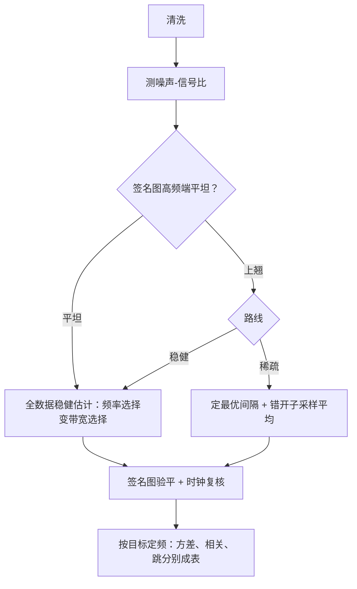

# 数据的频率选择

频率不是「越多越好」的自由参数，是偏差-方差预算表上的一行：先写下噪声与信号的比，采样格才有着落。

<footer>—— 据 Aït-Sahalia, Mykland and Zhang, Review of Financial Studies 2005 整理</footer>

[上一课](/quant/hfs-highfreq-correlation)把多元流程收拢，还剩一个贯穿全课程的旋钮没有专课：采样频率。[交易时间对成交量时间](/quant/business-time-clock)写过时钟的替换，[高频波动率与微观噪声](/quant/obd-hf-vol-noise)在簿动力学语境写过噪声预算；本课把频率选择写成决策程序：稀疏格与全数据稳健估计是两条路线，选哪条由噪声-信号比与目标对象决定，不由习惯决定。

## 问题

两条路线摆在桌面上。**稀疏采样**：五分钟格走天下，噪声未及污染、方差尚可——工程默认，但把大量观测丢掉。**全数据稳健**：tick 全进核或预平均，信息用满，代价是调参与对噪声结构的依赖。Aït-Sahalia、Mykland 与 Zhang（RFS 2005）把第一条路线做到底：给定噪声-信号比，存在使均方误差最小的采样间隔，间隔随噪声加重而变稀，其数值算例落在分钟量级。缺口是程序化：对一只具体标的、一个具体目标——方差、相关、跳还是 beta——频率怎么定、怎么验、什么时候换。

### 决策程序

第零步清洗：坏 tick 不进任何频率讨论。第一步测噪声：按上一单元的口径估 $\sigma_\varepsilon^2$ 与噪声-信号比。第二步选路线：噪声-信号比小到高频端签名图接近平坦——全数据稳健估计，频率选择退化成带宽选择；比值大——要么定最优间隔的稀疏格，要么仍走稳健估计但接受更宽的带宽。第三步验平：选定频率附近的读数不应随格距系统性漂移。第四步子采样平均：多个错开格距的平均降方差，是稀疏路线的标配。第五步按时钟复核：日内波动的 U 形季节性使等间隔格在开盘尾盘过密、午盘过稀，成交量时钟或分时段处理是标准修正。

错开子格的平均：$M$ 个错开稀疏格平均把方差大约降到 $1/M$，偏差不变——这是稀疏路线的标配，也正是 TSRV 稀疏端的构造。

## 方法

按目标分开定频。**方差**：上面的程序全套适用，五分钟是量级参考不是定理。**相关与 beta**：密度不是瓶颈，对齐才是——先定对齐方案再谈格距，慢腿决定有效频率，[高频相关的估计](/quant/hfs-highfreq-correlation)里刷新时间的信息税在这里变成频率的下限。**跳的检测**：分辨率越高定位越准，但噪声也越旺——先降噪再检验的次序不变，门限与窗口随格距重标。**执行与簿观测**：那是 $Y$ 侧的问题，频率跟撮合事件走，与估计量的渐近无关。换标的、换制度（tick 调整、交易时段变化）时程序重跑，频率结论不迁移。

## 机制

偏差-方差的形状是程序的机制基础：采样越密，噪声偏差按噪声方差与格数增长；越稀，估计方差按观测数下降。两条曲线的和有最小值，最小值的位置由噪声-信号比决定——这是 AMZ 2005 的核心结果。子采样平均降方差的机制是把一个格距的随机性平均掉：错开的子格各自有偏，平均后方差下降而偏差不动，与 TSRV 的稀疏端同一构造。季节性以异方差的方式进来：等间隔格对 U 形波动的采样密度不均，等价于一天内非均匀加权，分时段或事件时钟能把这项拉直。

## 边界

程序不产出普适频率：结论按标的、按日、按目标成立，迁移要重跑。稳健估计不消灭频率问题：带宽仍在、噪声结构仍在，只是把「选格距」换成「选带宽」，两者共享同一张预算表。事件时钟不是免费午餐：成交量时钟在量枯竭的时段会失速，隔夜与停牌另行处理。频率选择服务的是估计质量，不改变对象口径：含不含隔夜、中点还是成交价，这些决定先于任何格距。

## 小结

- 两条路线：稀疏格（AMZ 2005 的最优间隔）与全数据稳健估计；选择由噪声-信号比与目标决定。
- 程序五步：清洗、测噪、选路、验平、子采样平均；时钟复核修正 U 形季节性。
- 按目标分频：方差看格距，相关看对齐，跳看降噪后的分辨率，执行跟事件走。
- 偏差-方差的最小值位置随噪声-信号比移动；「五分钟」是量级参考不是定理。
- 结论不迁移：换标的、换制度重跑程序。
- 出处：Aït-Sahalia, Mykland and Zhang, *How Often to Sample a Continuous-Time Process in the Presence of Market Microstructure Noise*, Review of Financial Studies, 2005。
