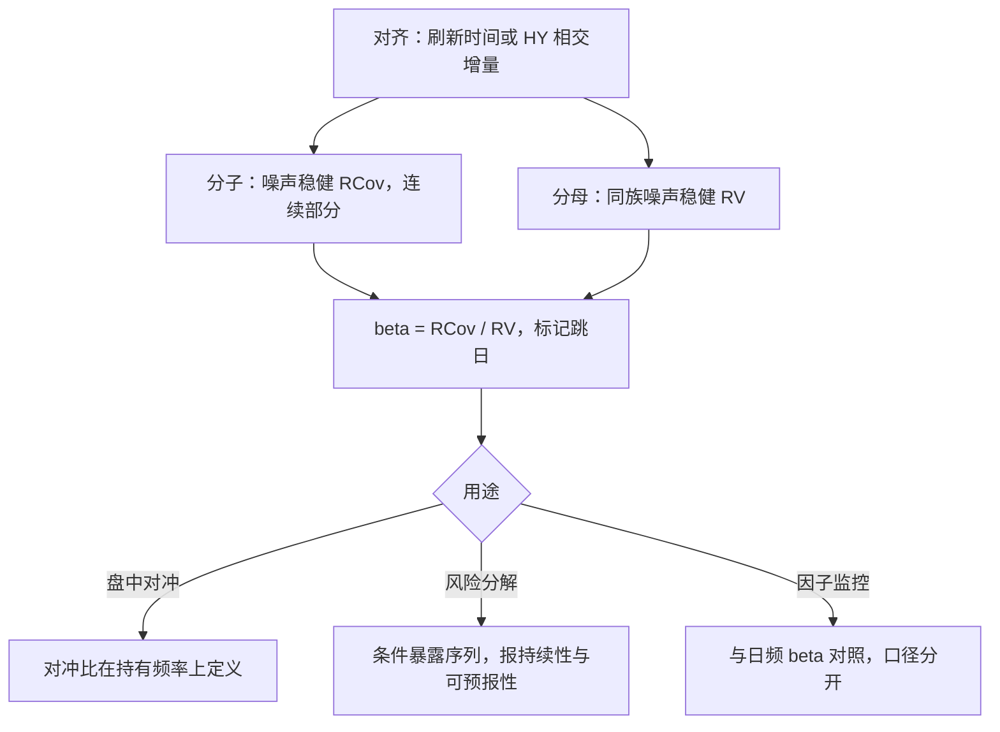

# 高频 Beta

beta 是协方差除以方差的高频版；两个估计量各自无偏，比值仍可以有偏——分母被噪声抬，分子被不同步压。

<footer>—— 据 Barndorff-Nielsen and Shephard, Econometrica 2004；Andersen, Bollerslev, Diebold and Wu, 2006 整理</footer>

[上一课](/quant/hfs-jump-detection)把跳拆成连续与瞬时两本账，单标的的读数齐了；对冲与风险要的是相对读数。日度定义在[已实现 beta](/quant/realized-beta)写过，分子上的对齐问题在[Epps 效应](/quant/epps-effect)与[Hayashi–Yoshida 相关](/quant/hayashi-yoshida)写过；本课把三者合成一台机器：高频 beta 的三条偏差渠道、修正的组装方式，以及它与日频回归 beta 各自回答的问题。

## 问题

定义是比值：$\hat\beta_t=\widehat{\mathrm{RCov}}_t/\widehat{\mathrm{RV}}_t$，当日共同变差里这只股票对市场的暴露。它与三年日收益回归的平均斜率不是同一个量：前者是「这一天」的条件暴露，后者是长窗平均。Barndorff-Nielsen 与 Shephard（Econometrica 2004）给出无噪声同步下比值的渐近分布；Andersen、Bollerslev、Diebold 与 Wu（2006）证明它持续且可预报——所以有日用价值。缺口是三条偏差渠道都作用在比值上：不同步把分子压向零（Epps 机制），噪声把分母抬高，分子分母各自的估计误差在相除后放大。三条一起错，beta 可以缩水一半。

数例：分母被噪声抬高 20%、分子被不同步压低 30%，读数是 $0.7/1.2\approx 0.58$——超过四成的暴露被系统性隐藏，对冲不足是常态而不是误差。

## 方法

组装原则是**同一家族、同一对齐**。分子分母用同一族噪声修正估计量：多元核 beta（Barndorff-Nielsen、Hansen、Lunde 与 Shephard 的多元已实现核，2011），或 HY 型分子配同族核分母——两边的偏差各自消不掉，但同族处理使比值对共同的偏差模式不敏感。对齐方案先于估计量：刷新时间，或直接用[Hayashi–Yoshida 相关](/quant/hayashi-yoshida)的相交增量做分子、同一时钟做分母。口径写死：日内 beta 通常不含隔夜收益，与含隔夜的日频 beta 差一截，比较时不可混。跳日单独标记：上一课的拆账在这里接上，$\widehat{\mathrm{RCov}}$ 与 $\widehat{\mathrm{RV}}$ 都取连续部分；跳日的 beta 是另一个条件量，不进同一条序列。

## 机制

比值放大偏差的机制在误差传播：$\hat\beta=\hat c/\hat v$，分子向下偏、分母向上偏时，读数按两者之和的幅度缩水——两条渠道**同向**，这是高频 beta 特别容易偏小的结构原因。流动性不对称是分子偏小的主渠道：慢腿的陈旧价把共同运动写成零收益格子，这与[Epps 效应](/quant/epps-effect)课里对冲比被压小、残差假平稳是同一机制。噪声渠道同样压小读数：它抬高的是分母。唯一常见的反向错误是噪声的交叉项进入分子——同一撮合事件同时污染两条腿时相关被高估——这要靠清洗与降噪处理，不靠降频掩盖。

## 边界

高频 beta 回答「今天的共同波动」，不回答贝塔是否是稳定参数：后者要用它自己的时序与日频证据对照。极端行情里市场本身在跳，连续部分的比值可能不再是想要的暴露定义，跳日的账单独看。大截面（几百只对同一市场组合）逐只算比值与一次估整块协方差不是一回事——整块的路径是下一课。最后，可预报性（Andersen 等，2006）是统计性质，把它当可交易信号之前，先过容量与换手。

## 小结

- 定义在条件口径上：$\widehat{\mathrm{RCov}}/\widehat{\mathrm{RV}}$ 是「这一天」的暴露，不是三年回归的平均斜率。
- 三条偏差渠道同向压小读数：异步压分子、噪声抬分母、误差在比值里放大。
- 组装原则：同族估计量、同一对齐时钟、连续部分口径、跳日单独标记。
- 与日频 beta 不可互换：含不含隔夜、条件与平均，回答不同的风险问题。
- 出处：Barndorff-Nielsen and Shephard, *Econometrica*, 2004；Andersen, Bollerslev, Diebold and Wu, *Realized Beta: Persistence and Predictability*, 2006；多元核见 Barndorff-Nielsen, Hansen, Lunde and Shephard, *Journal of Econometrics*, 2011。
