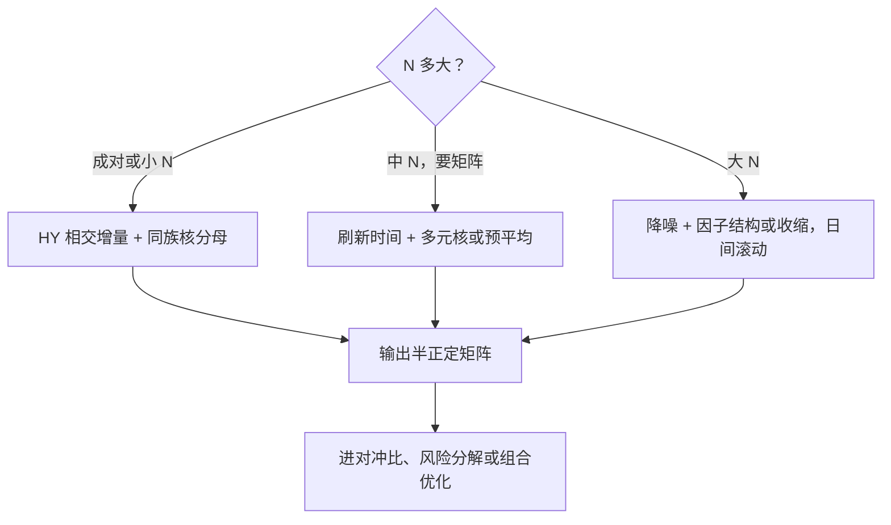
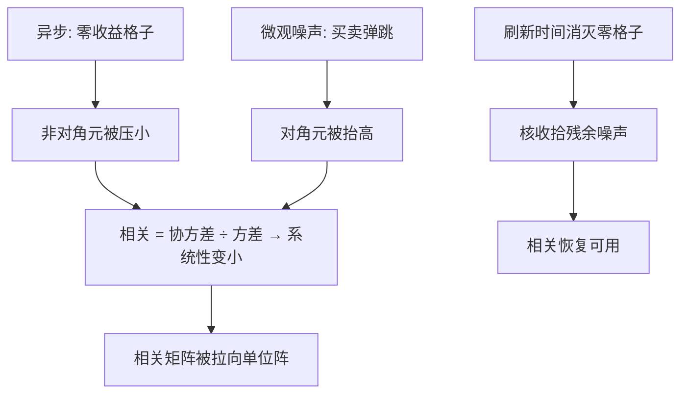

# 高频相关的估计

方差是单变量的估计问题，相关是先对齐再估计的问题；错步一分钟，共同运动就掉进残差里。

<footer>—— 据 Hayashi and Yoshida, Bernoulli 2005；Barndorff-Nielsen, Hansen, Lunde and Shephard, Journal of Econometrics 2011 整理</footer>

[上一课](/quant/hfs-micro-noise-empirics)把噪声的实证规律收拢成带宽与采样上限的输入，单标的的账齐了，多元接踵。总图在[多元已实现协方差](/quant/realized-covariance)写过，对齐的两个端点在[Epps 效应](/quant/epps-effect)与[Hayashi–Yoshida 相关](/quant/hayashi-yoshida)写过；本课写应用侧的整套流程：对齐方案怎么选、噪声怎么进多元、半正定性怎么保、维度大了怎么办。

## 问题

已实现协方差要把 $N$ 只资产放上同一张收益网格，三个麻烦同时到场。**对齐**：previous-tick 插值把陈旧价写成零收益格子，共同变差被压向零——Epps 机制；资产间流动性差越大，压得越狠。**噪声**：降噪在多元里不能逐只独立做了——单只的核是干净的，拼起来的矩阵却未必合理。**维度**：$N$ 大于日内网格数 $n$ 时样本协方差退化，特征值结构坏掉，直接进优化器会爆。缺口是一条从 tick 到可用协方差矩阵的完整流程，每一站有明确的取舍。

直觉类比：估两只股票的相关像录双人舞——两台摄像机快门不同步，回放对不上帧，看起来就像两人各跳各的。对齐方案的任务是把帧对上，而不是怀疑舞者不配合。

### 对齐方案的谱系

**刷新时间**：取每只资产都有新价的第一批时刻作网格，同步且无插值，代价是慢腿拖着全队——流动性强弱悬殊时，网格被最慢的资产抽稀。**HY 相交增量**：不对齐，只把时间上相交的增量相乘，成对场景的信息利用最好（Hayashi 与 Yoshida，Bernoulli 2005），但输出不是网格矩阵。**刷新加核**：先刷新再上多元已实现核（Barndorff-Nielsen、Hansen、Lunde 与 Shephard，J. Econometrics 2011），同时收拾残余噪声，半正定由构造保证。**多元预平均**：先滤波再叉乘，同样是外积之和，天然半正定。

数字实例（维度麻烦）：给 500 只股票估日内协方差，一天的五分钟刷新网格只有约 48 个格子，$n=48\lt N=500$——样本协方差秩至多 47，一大片特征值为零，直接交给组合优化器必然病态爆炸。这不是软件不行，是数据本身撑不起满秩估计，必须走因子结构或收缩。

刷新时间的隐性税：日均成交三百笔的慢股与五万笔的快股配对，刷新后网格由三百笔决定——快腿九成九的观测被丢弃，这是买同步付出的价。

## 方法

选择按组合形态走。**成对或小 $N$**（对冲、统计套利）：HY 分子配同族核分母，对冲比在与持有期匹配的频率上定义，接[高频 Beta](/quant/hfs-highfreq-beta) 的口径。**中 $N$、要矩阵**（风险模型、组合优化）：刷新时间加多元核，或多元预平均——半正定由构造保证，不靠事后特征值裁剪；事后裁剪既破坏估计量的性质，又把降噪偷换成任意的正则化。**大 $N$**：先降噪、再降维——已实现协方差当一日样本进收缩或因子结构约束，日间滚动；日内 $n$ 支撑不了 $N\gt n$ 的满秩估计，这是数据极限不是软件问题。领先滞后不靠对齐吸收：确有领先关系时，对齐只是把它藏进残差，要显式建模或用互协方差检查。

## 机制

为什么「先对齐后降噪」是主流次序：噪声与异步把矩阵从两个方向拉坏——异步把非对角压小（相关被低估），噪声把对角抬高（方差被高估），两者一起让相关矩阵系统性向单位阵收缩。刷新时间消灭「零收益格子」这个主要误差源，核再处理残余噪声的短滞后结构，两步各司其职。半正定由构造保证的机制在于估计量写成外积或外积加权和之和：合适的权重下，和自动落在半正定锥内——这是核与预平均相对「插值后叉乘」的结构优势。跳进多元时叉乘会把共同跳记进协方差，跳日标记要从单标的课延伸到矩阵层面。

常见误区：看到「高频估出的相关性普遍比日频低」，就总结成「短线投资者不看共同因子」之类的宏观叙事。很多时候那只是异步加噪声把矩阵拉向单位阵的测量假象——把对齐和降噪做对，相关往往会「回来」一截。

## 边界

本课的流程假设观测是价格事件；队列与订单流的联合动力学不在其内（单点见[高频波动率与微观噪声](/quant/obd-hf-vol-noise)）。刷新时间的信息税在高频对冲里可能不可接受：快腿被慢腿拖着走的场景，成对的 HY 更合适——没有免费的对齐。隔夜、涨跌停与集合竞价按[Hayashi–Yoshida 相关](/quant/hayashi-yoshida)课的口径单独处理，不进同一张矩阵。相关估计的下游是优化器：矩阵的病态会被杠杆放大，正则化的选择要与组合侧的约束一起定，本课程不替组合课做决定。

## 小结

- 三个麻烦一起到场：对齐压相关、噪声抬方差、维度坏特征值；流程逐站处理。
- 对齐谱系：刷新时间买同步付信息税，HY 用相交增量保信息，都优于 previous-tick 插值。
- 半正定靠构造：外积和的估计量天然落在锥内，事后特征值裁剪是下策。
- 大 $N$ 是数据极限：$N\gt n$ 不可能满秩，降噪、降维、日间滚动。
- 领先滞后不能靠对齐吸收；隔夜与特殊时段单列。
- 出处：Hayashi and Yoshida, *Bernoulli*, 2005；Barndorff-Nielsen, Hansen, Lunde and Shephard, *Journal of Econometrics*, 2011；Epps, *JASA*, 1979。
