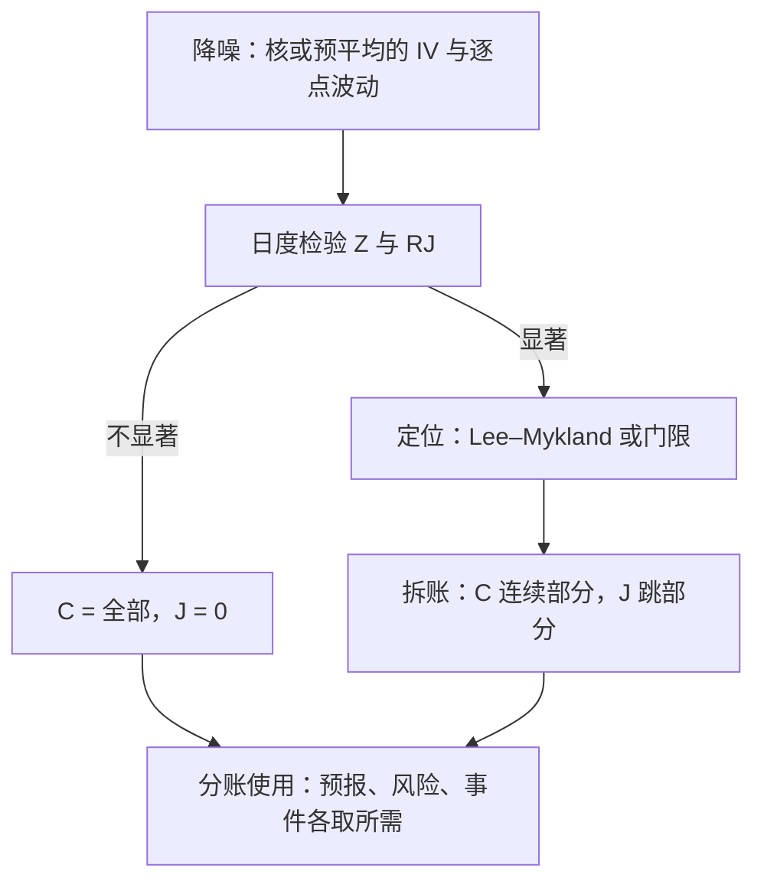
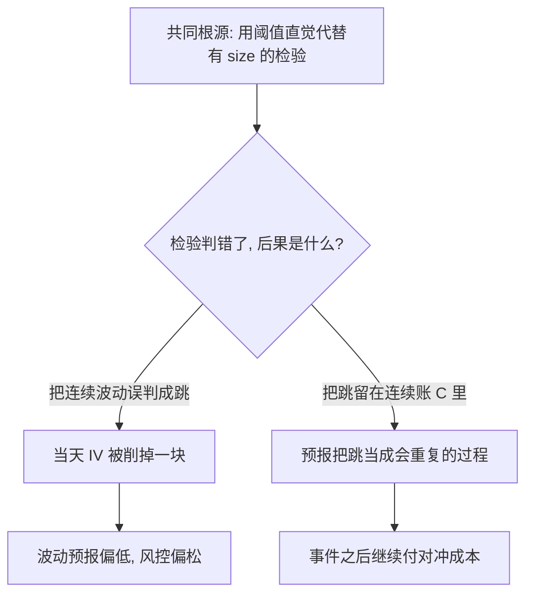

# 跳跃的检测与处理

二次变差不区分连续积累与瞬间位移；先把 RV 减去双幂次，再除以自己的波动，差值才有临界值可读。

<footer>—— Barndorff-Nielsen and Shephard, Journal of Financial Econometrics, 2006</footer>

[上一课](/quant/hfs-noise-corrected)把噪声修正支收成对照，积分波动有了在噪声下一致的估计；族谱的跳这一轴还没动。$\mathrm{RV}$ 收敛到的是总二次变差 $IV+\sum_s(\Delta X_s)^2$，而风控与对冲要的常常只是连续部分。检验地图已在[跳跃检验](/quant/jump-tests)与[Barndorff-Nielsen 跳跃检验](/quant/bn-jump-test)写过，符号拆分在[已实现半方差与符号跳跃](/quant/realized-semivariance)写过；本课收窄到**检测之后的处理**：一次显著的跳对估计量、预报与风险各改什么，噪声在场时整套流程的次序怎么排。

## 问题

日度检验统计量 $Z=(\mathrm{RV}-\mathrm{BV})/\sqrt{\theta\cdot \widehat{\mathrm{QV}}}$ 在无跳原假设下渐近标准正态：$\mathrm{BV}$ 是双幂次变差，渐近方差里的 quarticity 用多幂次估计补齐（Barndorff-Nielsen 与 Shephard，2004/2006）。日度检验只回答「今天有没有」，不回答几点、多大、对哪个量修正多少。Lee 与 Mykland（2008）用局部窗口把统计量压到日内找时点；门限法（Mancini，2001）直接比较单格收益 $|\Delta X|$ 与 $\alpha\sigma_i\Delta^{\varphi}$。缺口是把检测器接进流程：检出的跳从哪里扣、扣给谁、不扣会污染什么。

术语翻译：双幂次变差 BV 就是「相邻两个绝对收益相乘再求和」，即累加 $|r_i|\times|r_{i+1}|$。一次跳最多落在相邻的一格里，乘积的另一个因子仍是普通小收益，跳的影响被稀释成线性——所以加总后它仍能近似连续波动，这就是它「稳健」的全部秘密。

### 流水线：先降噪，再检验，后拆账

噪声在场时次序不能乱。第一步降噪：用上一课的核或预平均得到噪声稳健的 $\widehat{IV}$ 与逐点波动估计——朴素 RV 与 BV 都被 $2n\sigma_\varepsilon^2$ 量级的项污染，直接相减的检验 size 会坏。第二步日度检验：在降噪后的收益上算 $Z$ 与相对份额 $\mathrm{RJ}=(\mathrm{RV}-\mathrm{BV})/\mathrm{RV}$。第三步定位：Lee–Mykland 的局部统计量找时点，或按门限把单格收益标记为跳。第四步拆账：连续部分 $C$ 与跳部分 $J$ 分别记账，供预报与风控各取所需。

一年 252 个交易日、每天一次 99.9% 水平的检验，假阳性期望约四分之一天；开盘季节性没除净时，一天能误报出十次「跳」。误差在季节性，不在临界值。

## 方法

处理按用途分账。**估连续部分**：门限法把超限收益置零后加总，或直接用 BV——两者在有限活动跳下都一致估 $IV$；报告时声明是「每天拆」还是「仅在显著日拆」，两种口径的 $C$ 序列不可混用。**供预报**：把 $C$ 与 $J$ 分别喂进 HAR（多步口径见[HAR-RV 多尺度预测](/quant/har-rv-forecast)），跳是瞬时项、几乎不进自相关，混在一起会抬高持续性、拉坏多步预报。**供风险**：下行半方差与符号跳跃把负跳单列，尾部分析与期权对冲用的是这一路，不是无符号的 $Z$。**供事件研究**：Lee–Mykland 的时点与符号本身就是事件标记，跳幅度 $\Delta X_\tau$ 直接进事件窗。

数字实例：某日降噪后 $\mathrm{RV}=4$（%²）、$\mathrm{BV}=3$，则相对份额 $\mathrm{RJ}=(4-3)/4=25\%$——当天约四分之一的二次变差记在跳的账上；但只有 $Z$ 统计量也超过 99.9% 临界值，这笔账才被当真，否则只是普通波动。

## 机制

双幂次为什么稳健：相邻绝对收益的乘积 $|r_i|\,|r_{i+1}|$ 把一次大跳只线性地放进一个因子，其贡献是 $O(|\Delta X|\cdot\Delta)$ 量级，随 $\Delta$ 消失；于是 BV 仍收敛到 $IV$，差值 $\mathrm{RV}-\mathrm{BV}$ 收敛到跳的平方和。有限活动是前提——无穷多次小跳会让「连续与瞬时」的边界本身失效。处理错误的代价不对称：把连续波动误判成跳，当天 $IV$ 被削、波动预报偏低；把跳留在 $C$ 里，预报与对冲把它当成会重复的过程，事件之后继续付对冲成本。两种错误共享同一个根源——用阈值直觉代替有 size 的检验。

直觉类比：$|r_i|\,|r_{i+1}|$ 像两人抬杠——一格有跳，等于一个大力士搭一个普通人，总载荷被普通人封顶，大力士的力气发挥不出来（线性进账）；连续波动则是两个普通人正常抬（随格距累加）。跳因此不会像在 RV 里那样平方级炸开。

## 边界

流程不判断跳的经济成因：显著位移只说明二次变差里有一笔瞬时账，是消息还是流动性断裂，要接事件与市场状态分析。噪声极强或数据极脏时，size 修正做不干净，宁可降频到签名图平坦处再做日度检验。小跳与模糊区的功效有限：检不出不等于不存在，「未检出」要带功效口径报告，不能写成「无跳」。

## 小结

- 次序固定：先降噪，再日度检验，后定位与拆账；乱序让 size 先坏。
- BV 与门限在有限活动跳下一致估连续部分；$Z$ 给显著性，$\mathrm{RJ}$ 给份额，局部统计量给时点。
- 分账使用：预报接 HAR 用 $C$ 与 $J$，风险接半方差与符号跳，事件接时点与幅度。
- 双幂次的机制是线性进因子：单次大跳随 $\Delta$ 消失；前提是有限活动。
- 两种处理错误代价不对称：误判跳削 $IV$，漏判跳污染预报与对冲。
- 出处：Barndorff-Nielsen and Shephard, *Journal of Financial Econometrics*, 2004 与 2006；Lee and Mykland, *Review of Financial Studies*, 2008；Mancini, 2001（门限估计）。
