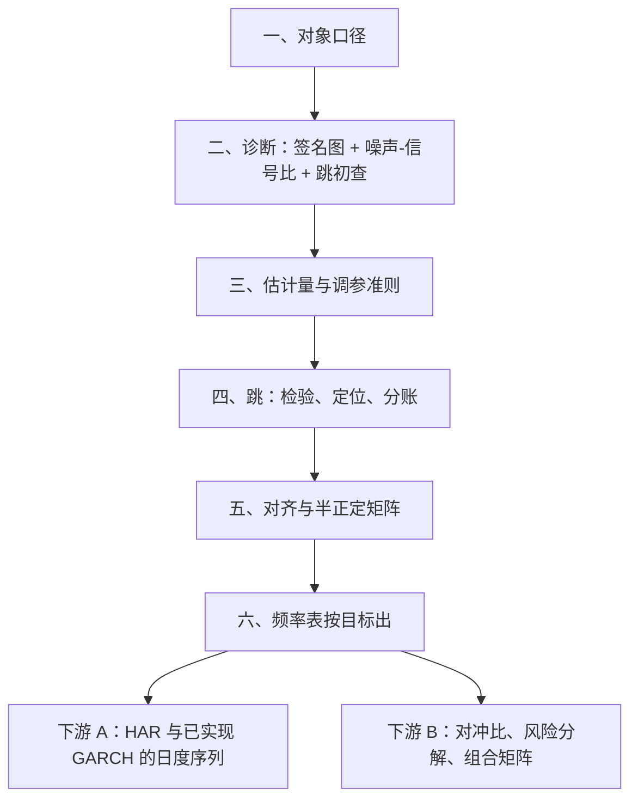
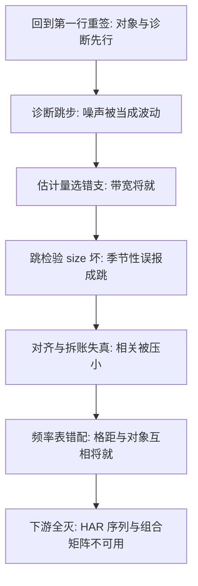

# 高频统计深化收束

估计量会更新，次序不会：对象、诊断、估计量、检验、对齐、频率——六个决定按序签字，然后才轮到预报与组合。

<footer>—— 据本课程各课与 Andersen, Bollerslev and Diebold, Econometrica 2003 的口径整理</footer>

[上一课](/quant/hfs-frequency-choice)把频率写成决策程序，八课的零件到齐。本课是本课程的收束：把族谱、噪声修正、跳、beta、噪声实证、多元相关、频率选择收成一张按序签字的检查单，把高频失败模式归成几类，并把产出接回主干——HAR 预报与已实现 GARCH 吃这里的日度序列，风险与执行吃这里的协方差矩阵与频率表。本课程到此收束。

## 问题

这套统计的失败很少死于单个估计量，几乎都死于次序：没声明对象就选估计量，没测噪声就定带宽，没降噪就检验跳，没对齐就算相关，没跑程序就迁移频率。每一步单看都有人写过；缺口是把依赖关系钉死成流程——后面的决定吃什么输入，错了又污染谁。

直觉类比：这张检查单像做菜的备料次序——火候再好，把盐当成糖放了（对象口径错），这道菜也救不回来。先确认每样料是什么，再谈怎么烹；顺序反了，手艺越好浪费越多。

### 六个决定，按序签字

**一、对象**：估总二次变差还是连续 $IV$，还是协变差；含不含隔夜、中点还是成交价、日方差还是年化——口径写死（第一课）。**二、诊断**：签名图与噪声-信号比，跳的初查（第一、五课）。**三、估计量**：按诊断选支，调参带准则（第二课）。**四、跳**：降噪后检验、定位、分账（第三课）。**五、对齐**：多元先定对齐方案，半正定靠构造（第四、六课）。**六、频率**：按目标与噪声-信号比出频率表（第七课）。顺序反了的典型事故：先定五分钟再挑对象，带宽与口径互相将就，最后报告里连「估的是什么」都说不清。

检查单上最便宜的一行是第一行：对象口径一次写错，后面五个决定做得再好，产出也接不进下游——HAR 吃不到对的日度序列，优化器吃不到对的矩阵。

## 方法

## 机制

次序的机制理由是**条件的方向**：带宽要吃噪声估计，检验要吃降噪路径，beta 要吃对齐方案，频率表要吃全部上游——下游决定无法在上游不定时独立做出。失败模式也按次序归档：**口径漂移**（对象含混，产出接不上）；**诊断跳步**（噪声当波动、季节性当跳）；**次序倒置**（先频率后对象、先检验后降噪）；**维度越权**（$N\gt n$ 强行满秩）；**结论迁移**（A 标的的频率表搬到 B 标的）。每类事故都在前面某课有一个具体的死法，收束课只做一件事：把死法挂回步骤，让检查单长出记忆。

为什么重要（一个环节错的传播）：噪声-信号比只需测错一个数量级，带宽就错、$IV$ 偏、跳检验误报、日度序列漂移、HAR 预报失真，最后波动率目标组合的仓位整体偏——溯源到头，源头只是一次诊断跳步。

## 边界

本课程的口径止于价格过程的统计读数：队列与订单流的估计、执行侧的冲击测量、把日内信息放进组合优化的正则化选择，分别归订单簿动力学、执行与组合课程。噪声与跳的模型在演进，六个决定的次序不随估计量版本变化——这是收束课敢写检查单的原因。读数之外的解释（消息、行为、市场质量的经济含义）只留接口，不在这里下结论。

常见误区：「出了新估计量，把旧流程整个换掉就行。」实际上估计量会过时，六个决定的次序不会变——升级只动第三格，前两格（对象、诊断）与后三格的接口照旧。把流程和估计量捆死重写，才是最容易引入新事故的做法。

## 小结

- 六个决定按序签字：对象、诊断、估计量、跳、对齐、频率；顺序是条件方向的倒影。
- 失败按次序归档：口径漂移、诊断跳步、次序倒置、维度越权、结论迁移。
- 产出两条下行动线：日度 $IV$ 序列接 HAR 与已实现 GARCH，矩阵与频率表接对冲、风险与组合。
- 检查单第一行最便宜也最致命：对象口径错了，后面全对不了。
- 出处：本课程各课；口径基线见 Andersen, Bollerslev and Diebold, *Econometrica*, 2003；Barndorff-Nielsen and Shephard, 2004 与 2006；Zhang, Mykland and Aït-Sahalia, *JASA*, 2005；Aït-Sahalia, Mykland and Zhang, *RFS*, 2005。
