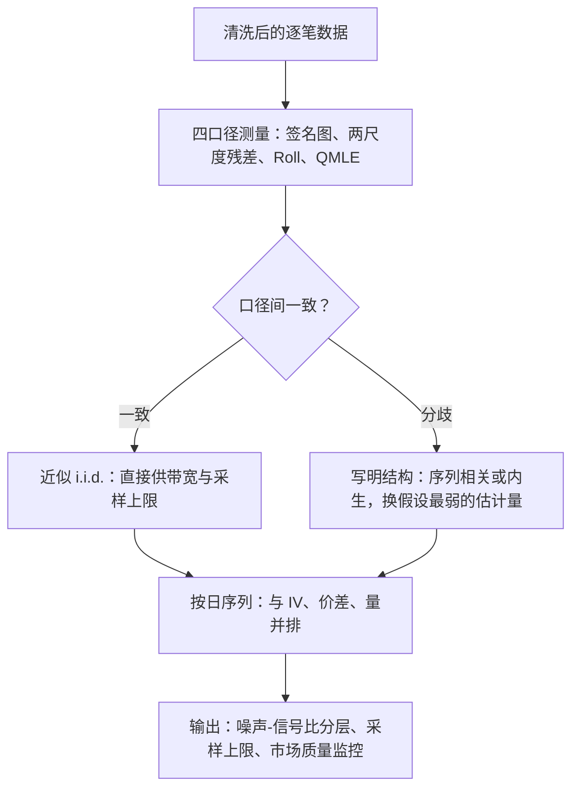

# 微观结构噪声的实证

噪声不是恒定背景，它有自己的行情：随波动起落、随价差与制度切换；把它当对象测量，既是市场质量的读数，也是一切修正估计量的输入。

<footer>—— 据 Hansen and Lunde, Journal of Business and Economic Statistics, 2006；Bandi and Russell, 同刊 2006 整理</footer>

[上一课](/quant/hfs-highfreq-beta)把相对读数合成完毕，估计侧的工具链到此齐全；应用单元从测量「自己的敌人」开始。机制在[微观结构噪声](/quant/microstructure-noise)写过，签名图斜率在[噪声方差估计](/quant/noise-variance-estimate)写过；本课写实证口径：噪声的量级怎么报、结构怎么判、横截面与时间上哪些规律是稳的，以及这些规律如何反过来约束前几课的调参。

## 问题

要测的是噪声方差 $\sigma_\varepsilon^2$，或更有用的噪声-信号比 $\sigma_\varepsilon^2/IV$。可用口径有四条：签名图高频端的斜率；两尺度估计的残差项；相邻收益的 Roll 反转；把噪声写进似然的 QMLE（Aït-Sahalia、Mykland 与 Zhang，RFS 2005）。四条口径在 i.i.d. 弹跳的世界里应当一致，实证上常常不一致——不一致本身就是信息：它说明噪声有结构。Hansen 与 Lunde（JBES 2006）对道琼斯成分股的系统研究给出两个稳的结论：噪声方差与当日波动率强相关，且远非常数；Bandi 与 Russell（同刊 2006）进一步说明最优采样频率随标的流动性移动。缺口是把「有噪声」升级成「噪声有多少、什么结构」，给下游的带宽、采样上限与市场质量监控供数。

Roll 弹跳口径把有效价差读成 $2\sigma_\varepsilon$：签名图斜率与 Roll 反转估出的 $\sigma_\varepsilon$ 若差一倍，先怀疑清洗不干净，再怀疑噪声有结构。

## 方法

实证流程四步。**先清洗后测量**：坏 tick、错价、重复报告都会伪装成噪声，把 $\sigma_\varepsilon^2$ 抬高数倍——清洗规则属于上游的数据契约，这里只钉顺序。**多口径并报**：签名图斜率、两尺度残差、Roll 反转一起报；口径间一致则接近 i.i.d.，系统性分歧则写明方向（序列相关、与价格相关）。**按日估计、按时序看**：噪声方差是日度序列，与当日 $IV$、价差、成交量并排画，相关结构一眼可见；跨年平均会抹掉带宽最需要的信息。**横截面分层**：按流动性、tick 大小分层报告噪声-信号比，采样上限的分层规则从这里出。

## 机制

噪声为什么有行情：它的来源——弹跳、圆整、存货偏离——全是交易过程的函数。波动大的日子价差宽、存货摆动大，$\sigma_\varepsilon^2$ 随 $IV$ 上涨，这是 Hansen–Lunde 的核心发现；tick 调整与市场事件让噪声序列带结构断点。这解释了前几课为什么反复强调调参随日更新：带宽是噪声的泛函，噪声自己是一个随机过程，固定参数等于用平均天气配每一天的衣服。噪声-信号比还是市场质量的相对读数：比值高的标的，价格发现被观测摩擦拖累的比例高，同样名义价差下可读性更差——接回 Hasbrouck 把定价误差方差当市场质量的口径。

## 边界

噪声方差不是交易成本：它在价格增量单位上，弹跳假设下才与价差差一个常数倍；报价口径（中点还是成交）一换，读数跟着变，报告必须写口径。i.i.d. 与内生性的检验有限样本功效有限，「未拒绝 i.i.d.」不等于「是 i.i.d.」。噪声实证界定的是已实现统计量的适用域：它不替代执行侧的价差与冲击测量——问成本要在 $Y$ 上问，[微观结构噪声](/quant/microstructure-noise)立的那条分界线在本课程全程有效。

## 小结

- 测量对象是 $\sigma_\varepsilon^2$ 与噪声-信号比；四口径并报：签名图斜率、两尺度残差、Roll 反转、QMLE。
- 口径分歧是信息：指向序列相关或内生噪声，直接改变估计量的选择。
- 稳的规律：噪声方差随当日波动上涨、非常数、有制度断点——调参必须随日更新。
- 按日估计、分层报告；跨年平均抹掉带宽最需要的信息。
- 噪声方差不是价差：问成本在 $Y$ 上问，市场质量用噪声-信号比做相对读数。
- 出处：Hansen and Lunde, *Realized Variance and Market Microstructure Noise*, JBES, 2006；Bandi and Russell, *Separating Microstructure Noise from Volatility*, JBES, 2006；Aït-Sahalia, Mykland and Zhang, *RFS*, 2005。
